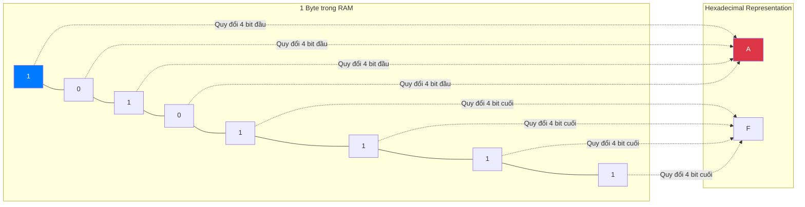

# Bài 1: Hệ nhị phân (Binary), Hệ thập lục phân (Hexadecimal) và Đơn vị lưu trữ

Mọi hệ thống máy tính hiện đại đều được xây dựng dựa trên nguyên lý xử lý tín hiệu điện tử cơ bản. Tại cấp độ phần cứng thấp nhất (Hardware), vi xử lý (CPU) và bộ nhớ (RAM) được cấu thành từ hàng tỷ bóng bán dẫn (Transistors). 

Bóng bán dẫn hoạt động như một công tắc điện, chỉ có hai trạng thái vật lý khả thi:
- **Có dòng điện đi qua (Bật):** Biểu diễn bằng giá trị `1`.
- **Không có dòng điện đi qua (Tắt):** Biểu diễn bằng giá trị `0`.

Chính vì giới hạn vật lý này, máy tính không thể trực tiếp hiểu được cơ số 10 (Hệ thập phân - Decimal) mà con người sử dụng. Thay vào đó, toàn bộ dữ liệu phải được mô hình hóa dưới dạng Hệ cơ số 2 (Hệ nhị phân - Binary).

---

## 1. Hệ Nhị phân (Binary - Base-2)

Hệ nhị phân chỉ sử dụng hai ký tự `0` và `1` để biểu diễn mọi giá trị toán học.
Mỗi chữ số nhị phân được gọi là một **Bit** (Binary Digit). Bit là đơn vị mang thông tin nhỏ nhất trong khoa học máy tính.

### Cách tính toán giá trị nhị phân
Tương tự như hệ thập phân (các hàng đơn vị, hàng chục, hàng trăm tương ứng với $10^0, 10^1, 10^2$), hệ nhị phân sử dụng trọng số theo lũy thừa của 2 ($2^0, 2^1, 2^2, \dots$).

Ví dụ, để tính giá trị thập phân của chuỗi nhị phân `1011`:
$$ 1 \times 2^3 + 0 \times 2^2 + 1 \times 2^1 + 1 \times 2^0 = 8 + 0 + 2 + 1 = 11 $$

### Đơn vị lưu trữ cơ sở (Byte)
Quản lý dữ liệu ở cấp độ từng Bit là không hiệu quả đối với cấu trúc địa chỉ bộ nhớ. Do đó, hệ thống máy tính quy ước gom nhóm các bit lại thành đơn vị lớn hơn:
- **1 Byte = 8 Bits**

Một Byte có thể chứa $2^8 = 256$ trạng thái khác nhau (từ `00000000` đến `11111111`, tương đương từ 0 đến 255 trong hệ thập phân). Byte là đơn vị địa chỉ hóa nhỏ nhất trong kiến trúc RAM.

---

## 2. Hệ Thập lục phân (Hexadecimal - Base-16)

Mặc dù máy tính xử lý tốt hệ nhị phân, việc đọc hiểu một chuỗi bit đối với kỹ sư phần mềm là rất khó khăn. Ví dụ: một địa chỉ vùng nhớ 32-bit có dạng `11010010110001011010101100111110`.

Để giải quyết vấn đề trực quan hóa dữ liệu, **Hệ thập lục phân (Hexadecimal)** được sử dụng như một phương thức biểu diễn rút gọn của hệ nhị phân. Hệ cơ số 16 sử dụng 16 ký hiệu: `0-9` và `A-F` (với A=10, ..., F=15).

### Tại sao lại là cơ số 16?
Điểm ưu việt của hệ thập lục phân là tính đối xứng hoàn hảo với hệ nhị phân: **Chính xác 4 bit (một nửa Byte, gọi là Nibble) có thể được biểu diễn bằng đúng 1 ký tự Hex.**
- $2^4 = 16$

Cách quy đổi:
- `0000` = `0`
- `1010` = `A` (10)
- `1111` = `F` (15)

Thay vì viết 1 Byte dưới dạng 8 bit (`10101111`), chúng ta có thể tách làm 2 nửa: `1010` (A) và `1111` (F), tạo thành giá trị Hex: **`0xAF`**.
(Tiền tố `0x` là quy ước tiêu chuẩn để trình biên dịch nhận diện một số là hệ Hex).

### Phân tích ứng dụng
1. **Biểu diễn địa chỉ bộ nhớ:** Bảng lỗi (Stack trace) hoặc con trỏ trong C/C++ luôn in địa chỉ RAM dưới dạng Hex (VD: `0x7ffee23b`).
2. **Mã màu sắc (Color Codes):** Trong thiết kế Web, mã màu `#FF0000` (Đỏ) thực chất là 3 Byte dữ liệu Hex, lần lượt đại diện cho cường độ các kênh màu Red (`FF`), Green (`00`), và Blue (`00`).

Tổng kết, khả năng linh hoạt chuyển đổi giữa Binary, Decimal và Hexadecimal là kỹ năng nền tảng để phân tích dữ liệu nguyên thủy (raw data) trong gỡ lỗi hệ thống.

---
**Navigation:**
[Next: Bài 1: Hệ cơ số và Bản chất Vật lý của Điện toán (Number Systems) ➡️](./01-number-systems.md)
