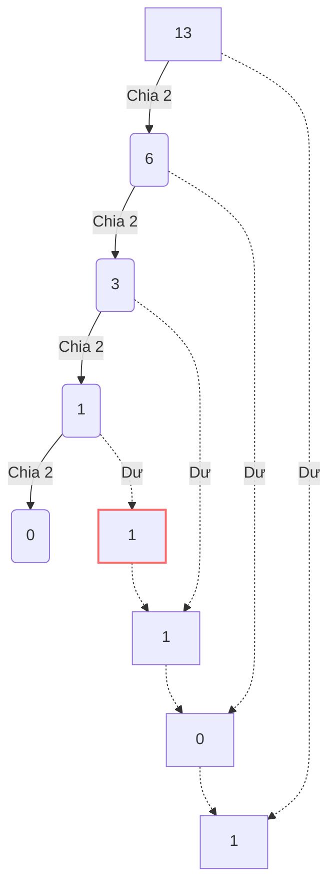

# Bài 1: Hệ cơ số và Bản chất Vật lý của Điện toán (Number Systems)

Chào mừng bạn đến với bài học đầu tiên. Trước khi chúng ta viết một dòng code Python in ra dòng chữ `"Hello World"`, chúng ta cần tự hỏi: **Cái hộp sắt vô tri vô giác trên bàn làm sao có thể hiểu được chữ "H"?**

Câu trả lời nằm ở Vật lý, Dòng điện, và Toán học cơ số.

---

## 1. Bản chất vật lý: Tại sao lại là 0 và 1? (First Principles)

> [!NOTE] 
> **Định nghĩa:** Máy tính không hiểu chữ "H", cũng không hiểu số "10". Máy tính chỉ là một tập hợp của hàng tỷ công tắc điện siêu nhỏ gọi là **Transistors**.

Một cái công tắc đèn ở nhà bạn chỉ có 2 trạng thái: **Bật** (Có điện) hoặc **Tắt** (Không có điện). Transistor cũng vậy. 
Thay vì gọi là "Bật/Tắt" hay "Có điện áp cao / Không có điện áp", các nhà khoa học máy tính quy ước:
- **Bật (ON) = 1**
- **Tắt (OFF) = 0**

Một công tắc như vậy được gọi là 1 **Bit** (Binary Digit). Nếu bạn có một chiếc máy tính 64-bit, nghĩa là CPU của bạn có thể xử lý một dãy 64 công tắc Bật/Tắt cùng một lúc trong một nhịp đồng hồ (clock cycle).

Vì chúng ta chỉ có 2 con số (0 và 1) để biểu diễn vạn vật, hệ thống đếm của máy tính được gọi là **Hệ Nhị Phân (Binary System / Base-2)**.

---

## 2. Hệ Thập phân (Hệ cơ số 10) - Cách con người tư duy

Từ nhỏ, chúng ta được dạy đếm từ 0 đến 9. Vì con người có 10 ngón tay, hệ thống đếm của chúng ta dựa trên số 10 (**Decimal System / Base-10**).
Khi bạn viết số **235**, bộ não của bạn đang tự động tính toán một công thức toán học ẩn như sau:

$235 = (2 \times 10^2) + (3 \times 10^1) + (5 \times 10^0)$
$235 = (2 \times 100) + (3 \times 10) + (5 \times 1)$

> [!TIP]
> **ELI5 (Giải thích cho trẻ 5 tuổi):** Hãy tưởng tượng bạn có các hộp đựng tiền: Hộp 1 đồng, Hộp 10 đồng, Hộp 100 đồng. Số 235 nghĩa là bạn có 5 tờ 1 đồng, 3 tờ 10 đồng, và 2 tờ 100 đồng. Mỗi lần một hộp chứa đủ 10 tờ, bạn buộc phải "nhớ 1" và gộp nó chuyển sang hộp to hơn bên trái.

---

## 3. Hệ Nhị phân (Hệ cơ số 2) - Cách máy tính tư duy

Máy tính "không có 10 ngón tay". Nó chỉ có 2 "ngón tay" (Bật/Tắt). Do đó, nó đếm bằng hệ cơ số 2.
Thay vì các hộp đựng tiền trị giá $10^0, 10^1, 10^2$ (1, 10, 100, 1000...), máy tính có các hộp đựng tiền trị giá $2^0, 2^1, 2^2, 2^3, 2^4$ (1, 2, 4, 8, 16, 32, 64, 128...).

Giả sử bạn nhìn thấy một đoạn mã nhị phân: **`1101`**. Làm sao để biết máy tính đang lưu số mấy? Áp dụng đúng công thức của hệ thập phân ở trên, nhưng thay cơ số 10 bằng cơ số 2:

$1101_2 = (1 \times 2^3) + (1 \times 2^2) + (0 \times 2^1) + (1 \times 2^0)$
$1101_2 = (1 \times 8) + (1 \times 4) + (0 \times 2) + (1 \times 1)$
$1101_2 = 8 + 4 + 0 + 1 = \mathbf{13}$

Vậy, khi CPU thấy dãy công tắc `[Bật, Bật, Tắt, Bật]`, nó hiểu đó là số **13**.

### Thuật toán chuyển từ Thập phân sang Nhị phân
Làm sao để dạy máy tính lưu số **13**? Rất đơn giản, hãy chia số đó cho 2 liên tục và lấy phần dư (Remainder) viết ngược từ dưới lên:

- 13 chia 2 = 6 (Dư **1**)
- 6 chia 2 = 3 (Dư **0**)
- 3 chia 2 = 1 (Dư **1**)
- 1 chia 2 = 0 (Dư **1**)
$\rightarrow$ Viết ngược lại: **`1101`**.

---

## 4. Hệ Thập lục phân (Hệ cơ số 16) - Ngôn ngữ của Lập trình viên

> [!WARNING]
> Nếu bạn từng thấy các địa chỉ bộ nhớ bị lỗi văng ra màn hình trông như `0x7FFA8B2C`, đó chính là hệ Thập lục phân (Hexadecimal / Base-16). Chữ `0x` ở đầu chỉ là dấu hiệu báo cho trình biên dịch biết: "Ê, đoạn sau là số Hex đấy nhé, đừng hiểu nhầm thành chữ cái!".

Tại sao chúng ta phải đẻ thêm hệ cơ số 16 làm gì cho khổ? 

Thử tưởng tượng, bạn cần viết địa chỉ của một vùng nhớ trên thanh RAM 8GB. Nếu viết bằng nhị phân, nó sẽ trông như thế này: 
`10101011110011011110111100110101`
Bạn có đọc nổi không? 100% lập trình viên sẽ hoa mắt và gõ sai. Nhưng nếu dịch nó ra hệ thập phân (Base-10), thì việc chuyển đổi từ cơ số 2 sang cơ số 10 lại khá phức tạp và mất thời gian cho CPU.

Sự kỳ diệu của toán học là **$16 = 2^4$**.
Nghĩa là **Cứ ĐÚNG 4 bits nhị phân thì có thể gộp lại thành 1 ký tự Hex**. Điều này làm cho việc chuyển đổi giữa Nhị phân và Hex cực kỳ mượt mà, cắt ngắn độ dài đi 4 lần mà không cần tính toán phức tạp.

Hệ Hex cần 16 ký tự để biểu diễn (từ 0 đến 15). Nhưng chúng ta chỉ có chữ số từ 0-9. Vì vậy, người ta mượn các chữ cái tiếng Anh:
- `0, 1, 2, 3, 4, 5, 6, 7, 8, 9`
- `A` = 10, `B` = 11, `C` = 12, `D` = 13, `E` = 14, `F` = 15.

Trở lại ví dụ dãy 32 bits ở trên: `1010 1011 1100 1101 1110 1111 0011 0101`
Thay vì phải nhớ đống 0 và 1, một Software Engineer chỉ cần nhìn nó dưới dạng:
`0xABCDEF35`
Ngắn gọn, chuyên nghiệp, và cực kỳ dễ debug!

---

## 5. Byte và Giới hạn dữ liệu

Một Bit quá nhỏ bé. Để lưu một thông tin có ý nghĩa, máy tính gom **8 Bits** lại với nhau thành **1 Byte**. 
Tại sao lại là 8? Lịch sử máy tính đã từng có những máy dùng 6 bits, 7 bits, 9 bits 1 byte. Nhưng hệ thống IBM System/360 ra đời năm 1964 đã ấn định chuẩn 8 bits (vì nó chia chẵn cho lũy thừa của 2, cực kỳ hoàn hảo cho thiết kế phần cứng). Từ đó 8 bits = 1 Byte trở thành tiêu chuẩn toàn cầu.

1 Byte có 8 công tắc. Mỗi công tắc có 2 trạng thái. Theo toán học tổ hợp, số trường hợp xảy ra là:
$2 \times 2 \times 2 \times 2 \times 2 \times 2 \times 2 \times 2 = 2^8 = \mathbf{256}$

Điều này giải thích một bí ẩn lớn trong giới lập trình:
- Tại sao màu RGB trên web lại chạy từ `0` đến `255`? (Bởi vì mỗi màu Đỏ, Xanh, Lục dùng đúng 1 Byte để lưu trữ. Từ 0 đến 255 là đúng 256 giá trị).
- Tại sao địa chỉ IP nhà bạn (`192.168.1.254`) không bao giờ có con số nào lớn hơn `255`? (Bởi vì địa chỉ IPv4 dùng 4 Bytes. Mỗi phần được ngăn cách bởi dấu chấm là 1 Byte).

---

## 🛠️ Góc nhìn Kỹ sư: Bài học rút ra
Trong Data Engineering hoặc Backend Engineering, khi bạn khai báo `TINYINT` trong MySQL, Database sẽ cấp phát đúng 1 Byte (8 bits). Nếu bạn cố lưu số 300 vào đó, Database sẽ crash hoặc báo lỗi `Out of range` vì 1 Byte chỉ chịu được tối đa số 255 (là `1111 1111` trong hệ nhị phân). Hiểu cơ số không phải để thi toán, mà là để kiểm soát bộ nhớ hệ thống một cách chủ động!

---
**Navigation:**
[⬅️ Previous: Bài 1: Hệ nhị phân (Binary), Hệ thập lục phân (Hexadecimal) và Đơn vị lưu trữ](./01-binary-and-hex.md) | [Next: Bài 2: Bảng mã ASCII, Unicode và Cơ chế của UTF-8 ➡️](./02-character-encodings.md)
