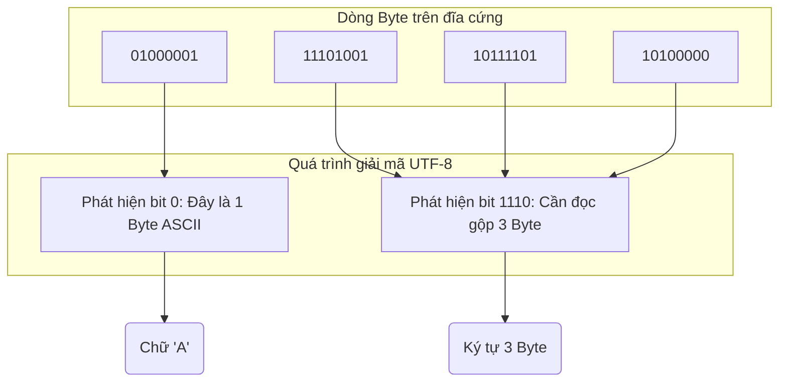

# Bài 2: Bảng mã ASCII, Unicode và Cơ chế của UTF-8

Như đã phân tích ở Bài 1, máy tính chỉ lưu trữ dữ liệu dưới dạng các giá trị số nguyên (nhị phân). Để máy tính có thể xử lý, hiển thị và lưu trữ văn bản (Text), chúng ta cần một **Bảng mã ký tự (Character Encoding)** - một hệ thống quy tắc ánh xạ mỗi ký tự ngôn ngữ sang một giá trị số định sẵn.

---

## 1. Sự khởi đầu: Bảng mã ASCII

Vào những năm 1960, Hoa Kỳ đã chuẩn hóa **Bảng mã ASCII** (American Standard Code for Information Interchange). Bảng mã này sử dụng **7 bit** (trong tổng số 8 bit của một Byte, bit cao nhất giữ giá trị 0) để mã hóa dữ liệu.

Với 7 bit, ASCII có khả năng biểu diễn $2^7 = 128$ ký tự, bao gồm:
- **Ký tự in được:** Bảng chữ cái tiếng Anh (A-Z, a-z), chữ số (0-9) và các dấu câu cơ bản.
- **Ký tự điều khiển (Control Characters):** Dùng để điều khiển thiết bị ngoại vi (ví dụ: `0x0A` cho Line Feed - Xuống dòng, `0x00` cho ký tự NUL kết thúc chuỗi).

Ví dụ ánh xạ:
- Chữ `A` (in hoa) = Mã thập phân `65` = Nhị phân `01000001`
- Chữ `a` (in thường) = Mã thập phân `97` = Nhị phân `01100001`

### Hạn chế của ASCII
Sự phát triển của công nghệ thông tin toàn cầu đã nhanh chóng chỉ ra giới hạn của không gian 128 ký tự. Các ngôn ngữ có hệ thống dấu phức tạp (như tiếng Việt, tiếng Pháp) hoặc hệ thống chữ tượng hình (tiếng Trung, tiếng Nhật) hoàn toàn không có không gian để biểu diễn trong chuẩn ASCII. Việc mở rộng thành các bảng mã địa phương (ví dụ ISO-8859, Windows-1258) dẫn đến tình trạng lỗi hiển thị (Mojibake) khi trao đổi dữ liệu giữa các quốc gia.

---

## 2. Giải pháp toàn cầu: Unicode

Để thống nhất việc biểu diễn văn bản, tổ chức **Unicode Consortium** đã thiết kế một tiêu chuẩn mã hóa duy nhất bao quát toàn bộ các ngôn ngữ và ký hiệu trên thế giới (bao gồm cả các biểu tượng cảm xúc - Emojis).

Mô hình của Unicode gán cho mỗi ký tự một định danh duy nhất được gọi là **Code Point**, biểu diễn dưới định dạng `U+xxxx` (với xxxx là giá trị Hexadecimal).
Ví dụ:
- Chữ `A` = `U+0041`
- Chữ `Đ` (tiếng Việt) = `U+0110`
- Ký tự 🍎 = `U+1F34E`

Hiện tại, không gian mã hóa của Unicode chứa hơn 140.000 ký tự. Để lưu trữ số lượng Code Point khổng lồ này, cần từ 2 đến 4 Byte cho mỗi ký tự. Tuy nhiên, nếu áp dụng cố định 4 Byte cho mọi ký tự, các tài liệu văn bản bằng tiếng Anh sẽ bị phình to gấp 4 lần dung lượng so với ASCII.

---

## 3. Kiến trúc mã hóa có độ dài khả biến: UTF-8

**UTF-8** (Unicode Transformation Format - 8-bit) ra đời để giải quyết bài toán tối ưu không gian lưu trữ cho chuẩn Unicode. Đây là một cơ chế mã hóa **khả biến (Variable-length encoding)**, cho phép số lượng Byte sử dụng dao động từ 1 đến 4 Byte tùy thuộc vào giá trị Code Point.

### Quy tắc định dạng Byte của UTF-8

1. **Ký tự ASCII (1 Byte):** Nếu Code Point nằm trong dải `U+0000` đến `U+007F`, UTF-8 sử dụng 1 Byte. Bit đầu tiên luôn là `0`. 
   $\rightarrow$ Nhờ cơ chế này, UTF-8 tương thích ngược (Backward Compatible) 100% với các tài liệu ASCII cũ.
2. **Ký tự Latinh mở rộng (2 Bytes):** Cấu trúc `110xxxxx 10xxxxxx`. Các ngôn ngữ châu Âu hoặc Ả Rập thường rơi vào nhóm này.
3. **Ký tự tượng hình & Có dấu (3 Bytes):** Cấu trúc `1110xxxx 10xxxxxx 10xxxxxx`. Tiếng Việt và các ngôn ngữ châu Á chủ yếu nằm ở nhóm này.
4. **Biểu tượng cảm xúc Emojis (4 Bytes):** Cấu trúc `11110xxx 10xxxxxx 10xxxxxx 10xxxxxx`.

### Phân tích hệ thống
Sự ra đời của UTF-8 đã trở thành chuẩn mực tuyệt đối trong giao tiếp mạng (HTTP/REST) và lưu trữ cơ sở dữ liệu. Khi thiết kế cấu trúc Database (ví dụ MySQL/PostgreSQL), kỹ sư cần cấu hình bảng mã mặc định là `utf8mb4` (chỉ định hỗ trợ đầy đủ 4 Byte) thay vì `utf8` (phiên bản cũ của MySQL chỉ hỗ trợ 3 Byte, sẽ gây lỗi khi người dùng nhập Emojis). Việc thiếu hiểu biết về Encoding thường là nguyên nhân cốt lõi gây ra lỗi dữ liệu (Data Corruption) khi thực hiện di chuyển dữ liệu (Migration) giữa các hệ thống chéo.

---
**Navigation:**
[⬅️ Previous: Bài 1: Hệ cơ số và Bản chất Vật lý của Điện toán (Number Systems)](./01-number-systems.md) | [Next: Bài 3: Biểu diễn số âm và Số bù hai (Two's Complement) ➡️](./03-negative-numbers-and-two-s-complement.md)
