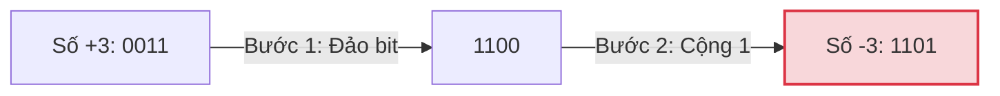

# Bài 3: Máy tính biểu diễn số âm như thế nào? (Negative Numbers & Two's Complement)

Ở bài 1, chúng ta đã biết máy tính dùng các Bit (0 và 1) để lưu một số nguyên dương, ví dụ `1101` là số 13.
Nhưng máy tính không có bàn phím đặc biệt chứa phím `-` trong bộ nhớ. Làm thế nào để lưu được số âm (Ví dụ: `-13`) vào RAM khi RAM chỉ có toàn công tắc Bật/Tắt?

Lịch sử phát triển của Khoa học máy tính đã chứng kiến 3 cách giải quyết vấn đề này. Hai cách đầu tiên là thảm họa, và cách thứ ba là một kiệt tác toán học.

---

## 1. Cách đầu tiên: Sign-Magnitude (Dấu và Độ lớn)

Cách đơn giản nhất mà một con người có thể nghĩ ra: Hãy dùng **Bit đầu tiên (Bit ngoài cùng bên trái)** để làm dấu (Sign bit).
- Nếu bit đầu là `0`: Đây là số Dương (+).
- Nếu bit đầu là `1`: Đây là số Âm (-).
Các bit còn lại biểu diễn độ lớn.

Giả sử chúng ta có hệ thống máy tính dùng **4 bits**:
- `0011` = **+3**
- `1011` = **-3** (Đổi bit đầu tiên thành 1)

> [!WARNING]
> **Thảm họa của Sign-Magnitude:**
> 1. **Vấn đề số 0 kép:** Số 0 sẽ có 2 cách viết là `0000` (+0) và `1000` (-0). Về mặt toán học, `+0` và `-0` là như nhau. Việc lãng phí 1 vùng nhớ để biểu diễn cùng một ý nghĩa, đồng thời phải viết thêm logic IF/ELSE trong CPU để kiểm tra xem `0000 == 1000` hay không làm cho vi mạch (ALU) trở nên phức tạp cồng kềnh.
> 2. **Phép cộng bị vỡ:** Thử cộng `+3` và `-3`. Về toán học nó phải bằng `0`.
> `0011` (+3) + `1011` (-3) = `1110` (Trong hệ Sign-Magnitude, `1110` là **-6**). Sai bét!

---

## 2. Cách thứ hai: One's Complement (Bù 1)

Để sửa lỗi phép cộng bị vỡ, người ta nghĩ ra cách: Để tạo ra số âm, hãy **Đảo ngược toàn bộ các bits** của số dương. (0 thành 1, 1 thành 0).

Trong hệ 4 bits:
- Số dương: `0011` (+3)
- Số âm: `1100` (-3) (Đảo ngược toàn bộ)

Hãy thử làm toán cộng `+3` và `-3`:
`0011` (+3) + `1100` (-3) = `1111`.
Trong hệ One's Complement, `1111` chính là `-0`. (Đảo ngược của `0000` là `1111`).
Phép tính đã chạy đúng!

> [!WARNING]
> **Vấn đề của One's Complement:**
> Phép cộng đã chạy đúng phần lớn thời gian, nhưng **vấn đề số 0 kép vẫn còn đó!** Chúng ta vẫn có `0000` (+0) và `1111` (-0). Hơn nữa, đôi khi phép cộng bị dôi bit ra ngoài cùng (Carry bit) phải lấy vòng lại cộng thêm 1 lần nữa, tốn thêm chu kỳ CPU.

---

## 3. Cách thứ ba: Kiệt tác Toán học Two's Complement (Bù 2)

Làm sao để máy tính vừa không có hai số 0, vừa làm được phép cộng (+) và phép trừ (-) trên CÙNG MỘT MẠCH ĐIỆN TỬ (ALU) mà không phải xây mạch đắt tiền?

John von Neumann đã phổ biến khái niệm **Two's Complement (Bù 2)** - chuẩn chung của toàn bộ máy tính hiện đại ngày nay.

### Quy tắc tạo ra số âm bằng Bù 2:
Để tạo ra số âm của một số dương, bạn làm 2 bước:
1. Đảo ngược toàn bộ các bits (Giống hệt Bù 1).
2. **Cộng thêm 1** vào kết quả đó.

Ví dụ tạo ra số **-3** trong hệ 4 bits:
- Bước 0: Bắt đầu từ số `+3` là **`0011`**.
- Bước 1 (Đảo bit): **`1100`**.
- Bước 2 (Cộng 1): `1100` + `1` = **`1101`**.
Vậy số `-3` trong máy tính được lưu là **`1101`**.

> [!TIP]
> **ELI5 (Đồng hồ đếm ngược):** Bạn có một chiếc đồng hồ đếm số xe (Odometer) xe máy cũ chỉ có 4 vòng xoay, từ 0000 đến 9999. Khi đồng hồ ở mức `0000`, nếu bạn tua lùi lại 1 đơn vị, nó sẽ quay ngược về `9999`. 
> Máy tính cũng vậy. Nếu bạn có 4 bits, max là `1111` (15). Nếu bạn đang ở `0000`, bạn trừ đi 1 (nghĩa là tua lùi 1 nấc), máy tính không biết báo lỗi thế nào, nên nó bị vặn ngược kịch kim thành `1111`. `1111` chính là -1. Trừ tiếp 1 thì `1110` là -2. `1101` là -3.

### Tại sao Two's Complement là Kiệt Tác?

**1. Chỉ có duy nhất một số 0.**
Thử tìm số `-0`:
- Bước 0: Số `+0` là `0000`.
- Bước 1 (Đảo bit): `1111`.
- Bước 2 (Cộng 1): `1111` + `1` = `1 0000`. Nhưng vì máy chỉ chứa được 4 bits, số `1` ngoài cùng bị vứt đi (Overflow tràn số). Kết quả còn lại là `0000`.
Tuyệt vời! `-0` và `+0` đều là `0000`. Không lãng phí bộ nhớ!

**2. Phép trừ bị xóa sổ hoàn toàn.**
Với Two's Complement, CPU không cần biết làm phép tính TRỪ. Nó chỉ cần mạch cộng.
Nếu con người ra lệnh: `5 - 3 = ?`
Máy tính sẽ hiểu là: `5 + (-3) = ?`
`0101` (5) + `1101` (-3 theo bù 2) = `1 0010`. Số `1` ngoài cùng bị tràn bit vứt đi. Kết quả còn lại: **`0010` (là số 2)**.
Bài toán trừ hoàn toàn biến mất, CPU trở nên đơn giản, rẻ hơn và cực kỳ nhanh.

---

## 🛠️ Góc nhìn Kỹ sư: Lỗi Tràn Số Integer Overflow kinh điển

Bởi vì bit đầu tiên vẫn được dùng để báo hiệu Dấu (0 là Dương, 1 là Âm), nên một biến `byte` (8 bits) trong Java không lưu được từ `0` đến `255`. Nó bị cưa đôi để chứa số âm.
Giới hạn của `byte` là từ **-128 đến 127**.

**Chuyện gì xảy ra nếu bạn có 127 đồng, và nhặt thêm 1 đồng?**
`0111 1111` (127) + `0000 0001` (1) = **`1000 0000`**

Nhưng khoan đã, bit đầu tiên bị biến thành `1`. Trong Two's Complement, bit đầu tiên là `1` thì đây là SỐ ÂM!
`1000 0000` dịch ra bù 2 chính là **-128**.

Kết quả: **`127 + 1 = -128`**.
Lỗi Tràn số (Integer Overflow) này đã từng đánh rơi tên lửa Ariane 5 trị giá 500 triệu USD, và biến tỷ phú Elon Musk thành con số âm tiền ảo nếu code hệ thống viết không tốt! Mọi Kỹ sư Phần mềm đều phải hiểu Two's Complement.

---
**Navigation:**
[⬅️ Previous: Bài 3: Biểu diễn số âm và Số bù hai (Two's Complement)](./03-negative-numbers-and-two-s-complement.md) | [Next: Bài 4: Tại sao 0.1 + 0.2 != 0.3? (Floating Point Math & IEEE 754) ➡️](./04-floating-point-math.md)
