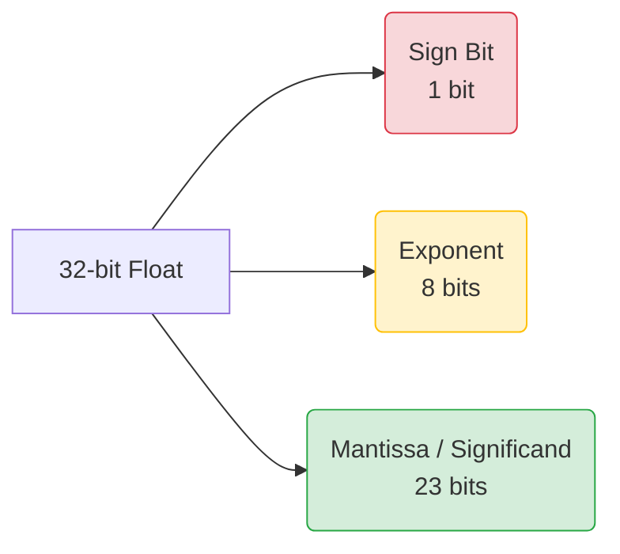

# Bài 4: Tại sao 0.1 + 0.2 != 0.3? (Floating Point Math & IEEE 754)

Nếu bạn từng mở Console trên Chrome, hoặc mở Terminal Python, và gõ lệnh sau:
`0.1 + 0.2`
Kết quả sẽ không phải là `0.3`. Kết quả bạn nhận được là:
`0.30000000000000004`

Tại sao lại có con số kỳ quặc này? Máy tính vốn nổi tiếng là cỗ máy tính toán chính xác tuyệt đối cơ mà? Bài viết này sẽ vạch trần "lời nói dối" lớn nhất trong Khoa học máy tính: Hệ thống Dấu phẩy động (Floating Point).

---

## 1. Bản chất của số thập phân (Decimals) trong hệ Nhị phân

Trong hệ cơ số 10 (Thập phân), khi chúng ta viết sau dấu phẩy, giá trị của các con số giảm dần theo lũy thừa âm của 10:
$0.125 = (1 \times \frac{1}{10^1}) + (2 \times \frac{1}{10^2}) + (5 \times \frac{1}{10^3}) = \frac{1}{10} + \frac{2}{100} + \frac{5}{1000}$

Với máy tính (Hệ cơ số 2), sau dấu phẩy, giá trị của các bit giảm theo lũy thừa âm của 2:
`0.101` (nhị phân) = $(1 \times \frac{1}{2^1}) + (0 \times \frac{1}{2^2}) + (1 \times \frac{1}{2^3}) = 0.5 + 0 + 0.125 = \mathbf{0.625}$ (Thập phân).

### Vấn đề Vô hạn Tuần hoàn
Ở hệ cơ số 10, phân số $\frac{1}{3}$ là một số vô hạn tuần hoàn `0.33333...`. Bạn không thể viết chính xác nó bằng bao nhiêu số thập phân đi nữa.
Tương tự, ở hệ cơ số 2, những số như `0.1` hay `0.2` không thể biểu diễn bằng các mảnh $\frac{1}{2}, \frac{1}{4}, \frac{1}{8}$... Nó biến thành một dải số **vô hạn tuần hoàn** trong không gian Nhị phân:
- `0.1` (Thập phân) = `0.00011001100110011...` (Nhị phân kéo dài tới vô cực).

Máy tính chỉ có thanh RAM dung lượng giới hạn (ví dụ cấp cho biến này 32 bits hay 64 bits). Nó buộc phải **Cắt cụt (Chop off)** dãy vô hạn này. Đó chính là nguồn gốc sinh ra Sai số (Rounding Error)!

---

## 2. Tiêu chuẩn IEEE 754 (Định dạng Dấu phẩy động)

Làm sao để lưu một số thực siêu lớn như Khối lượng mặt trời ($2 \times 10^{30}$ kg) hoặc siêu nhỏ như Kích thước nguyên tử ($1 \times 10^{-10}$ m) chỉ bằng 32 công tắc (32 bits)?
Viện IEEE đã tạo ra tiêu chuẩn 754, quy định cách "cắt" 32 bits này làm 3 phần, giống hệt cách chúng ta ghi **Ký pháp Khoa học (Scientific Notation)**.

Cấu trúc 32-bit (Single Precision - `float` trong Java/C++):
1. **Sign bit (1 bit):** Xác định dấu (0 là dương, 1 là âm).
2. **Exponent (8 bits):** Lưu số mũ (quyết định độ to/nhỏ của số).
3. **Mantissa / Significand (23 bits):** Lưu độ chính xác (các chữ số đằng sau dấu phẩy).

> [!TIP]
> **ELI5 (Ký pháp khoa học):** Thay vì viết `123,000,000,000`, nhà khoa học viết $1.23 \times 10^{11}$. 
> - `1.23` là phần Mantissa.
> - `11` là phần Exponent. 
> Bằng cách này, dấu phẩy có thể trượt lên trượt xuống (Nổi - Floating), giúp biểu diễn dải số cực rộng. Máy tính xài chiêu y chang nhưng ở hệ cơ số 2: $M \times 2^{E}$.

Với cấu trúc này, khi ép số `0.1` vô hạn tuần hoàn vào giới hạn 23 bits của Mantissa, nó bị cắt gọt. Kết quả khi ghép các bits lại để in ra màn hình, nó lệch đi một tỷ lệ cực nhỏ: `0.30000000000000004`.

---

## 3. Các giá trị "Bất thường" (Special Values)

Nhờ tách Exponent riêng ra, chuẩn IEEE 754 định nghĩa được những trạng thái đặc biệt mà số nguyên bình thường không làm được:
- Nếu chia một số cho 0, thay vì Crash máy tính, IEEE 754 trả về **`Infinity`** (Vô cực) hoặc **`-Infinity`**.
- Nếu làm một phép tính vô nghĩa toán học như $\sqrt{-1}$, kết quả là **`NaN` (Not a Number)**. Một đặc tính kinh khủng của `NaN` là: `NaN == NaN` luôn luôn trả về `False`!

---

## 🛠️ Góc nhìn Kỹ sư: Hậu quả trong Đời thực & Cách khắc phục

1. **Thảm họa Tên lửa Patriot (1991):** Hệ thống tên lửa Patriot của Mỹ tính toán thời gian bay bằng biến Floating Point (nhân với 0.1). Sai số tích lũy liên tục qua nhiều giờ do không biểu diễn được số 0.1 chính xác đã làm lệch tọa độ, khiến tên lửa xịt và 28 lính Mỹ thiệt mạng.
2. **Trong Game Development:** Khi bản đồ game quá rộng, vị trí nhân vật xa mốc tọa độ trung tâm (Exponent lớn), phần Mantissa sẽ mất độ chi tiết. Hiện tượng này gọi là **"Jittering"** (nhân vật bị giật lag, bay xuyên tường) khi đi xa điểm xuất phát. Giải quyết bằng cách chuyển tọa độ địa phương khi qua khu mới.
3. **Trong Hệ thống Ngân hàng / E-commerce:** **TUYỆT ĐỐI KHÔNG DÙNG FLOAT/DOUBLE ĐỂ LƯU TIỀN**.
   Bạn đang trừ tiền `100.0` - `99.9`. Nếu xài Float, kết quả có thể là `0.099999999998`. Ngân hàng sẽ đánh mất hàng triệu đô vì sai số làm tròn.

**Cách giải quyết:**
- **Giải pháp 1 (Nhanh nhất):** Nhân tiền với 100 để biến thành số nguyên (Integers/Long). Thay vì lưu `15.99 $`, hãy lưu `1599 cents`. Số nguyên không bao giờ có sai số.
- **Giải pháp 2 (Chính xác cao):** Sử dụng các kiểu dữ liệu chuyên biệt cho tiền tệ được thiết kế bằng Software (tự implement phép cộng/trừ chuỗi string hoặc mảng) như `BigDecimal` trong Java, `decimal` trong Python. Nó chậm hơn phép tính Float của CPU, nhưng nó chính xác tuyệt đối.

---
**Navigation:**
[⬅️ Previous: Bài 3: Máy tính biểu diễn số âm như thế nào? (Negative Numbers & Two's Complement)](./03-negative-numbers.md) | [Next: Bài 4: Số thực dấu phẩy động (Floating-Point) và Chuẩn IEEE 754 ➡️](./04-floating-point-numbers.md)
