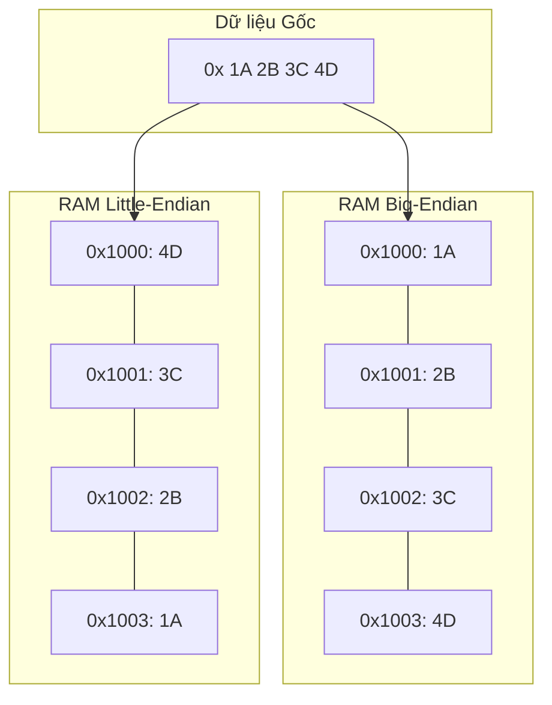

# Bài 5: Thứ tự Byte (Endianness) và Định dạng Dữ liệu Mạng

Trong kiến trúc máy tính, đơn vị nhỏ nhất có thể định địa chỉ riêng biệt trên bộ nhớ (RAM) là một Byte (8 bits). Khi một dữ liệu yêu cầu dung lượng lớn hơn 1 Byte để biểu diễn (ví dụ: một số nguyên 32-bit cần 4 Bytes), hệ thống phải có quy ước về thứ tự sắp xếp các Byte thành phần này trên chuỗi địa chỉ vật lý của bộ nhớ.

Quy ước này được gọi là **Endianness**, với hai trường phái thiết kế kiến trúc chính: **Big-Endian** và **Little-Endian**.

---

## 1. Bản chất của Endianness

Giả sử chúng ta có một số nguyên hệ thập lục phân 32-bit: `0x1A2B3C4D`.
Số này được cấu thành từ 4 Byte, xếp theo thứ tự trọng số từ cao đến thấp:
- Byte có trọng số cao nhất (Most Significant Byte - MSB): `1A`
- ...
- Byte có trọng số thấp nhất (Least Significant Byte - LSB): `4D`

Cần lưu trữ giá trị này vào bộ nhớ, bắt đầu từ địa chỉ `0x1000`.

### Kiến trúc Big-Endian (MSB lưu trước)
Trong mô hình Big-Endian, Byte chứa dữ liệu quan trọng nhất (MSB) được lưu vào địa chỉ vùng nhớ thấp nhất.
- Địa chỉ `0x1000`: `1A`
- Địa chỉ `0x1001`: `2B`
- Địa chỉ `0x1002`: `3C`
- Địa chỉ `0x1003`: `4D`

*Nhận xét:* Cách sắp xếp này rất trực quan và thuận lợi cho con người đọc các luồng dữ liệu (Data dumps), vì chuỗi giá trị trên RAM hiển thị theo đúng thứ tự con người viết trên giấy (`1A 2B 3C 4D`). Các bộ vi xử lý dòng Motorola hay IBM truyền thống áp dụng cấu trúc này.

### Kiến trúc Little-Endian (LSB lưu trước)
Ngược lại, mô hình Little-Endian ưu tiên lưu trữ Byte có trọng số thấp nhất (LSB) vào địa chỉ vùng nhớ thấp nhất.
- Địa chỉ `0x1000`: `4D`
- Địa chỉ `0x1001`: `3C`
- Địa chỉ `0x1002`: `2B`
- Địa chỉ `0x1003`: `1A`

*Nhận xét:* Dù làm dữ liệu hiển thị ngược ngạo (`4D 3C 2B 1A`), cấu trúc Little-Endian được các kỹ sư Intel chọn làm tiêu chuẩn cho dòng vi xử lý x86/x64 hiện đại. Lý do là vì mạch cộng số học (ALU) của CPU thường tính toán bắt đầu từ cột trọng số thấp nhất sang cao nhất (như phép tính cộng cột có nhớ của con người). Việc đặt LSB ở địa chỉ đầu tiên giúp mạch đọc RAM và mạch ALU đồng bộ ngay từ chu kỳ xung nhịp đầu tiên, tối ưu hiệu năng tính toán cấp thấp.

---

## 2. Vấn đề Truyền tải Mạng (Network Byte Order)

Sự phân mảnh kiến trúc giữa Big-Endian và Little-Endian không gây ra lỗi nội bộ vì một CPU xử lý thống nhất quá trình Ghi (Write) và Đọc (Read) vào bộ nhớ. Tuy nhiên, khi hệ thống giao tiếp qua môi trường Mạng (Network), sự bất đồng chuẩn mực có thể làm hỏng định dạng dữ liệu (Data Corruption).

Nếu một máy chủ Little-Endian gửi số `0x1A2B3C4D` qua mạng lưới dưới dạng chuỗi byte `[4D, 3C, 2B, 1A]`, một máy trạm Big-Endian khi nhận được chuỗi này sẽ tiến hành ghép lại tuần tự theo luật của nó và diễn giải kết quả thành `0x4D3C2B1A`. Giá trị bị sai lệch hoàn toàn.

**Tiêu chuẩn Network Byte Order:**
Để chuẩn hóa viễn thông, hệ thống giao thức mạng (bao gồm cả chuẩn TCP/IP) đã thông qua quy ước chung: **Mọi dòng dữ liệu lưu thông trên Internet phải được mã hóa theo chuẩn Big-Endian**. Chuẩn này được gọi chính thức là Network Byte Order.

### Phân tích hệ thống
Quy chuẩn TCP/IP yêu cầu mọi nhà phát triển phần mềm và phần cứng tuân thủ giao thức biến đổi:
- Kỹ sư lập trình C/C++ cho hệ thống mạng khi viết các socket giao tiếp phải gọi các hàm thư viện `htonl()` (Host To Network Long) và `ntohl()` (Network To Host Long) để chuyển đổi qua lại giữa Endianness của hệ thống hiện tại và quy chuẩn chung của mạng.
- Nếu bạn thiết kế một giao thức tệp tùy chỉnh (ví dụ: thiết kế định dạng file hình ảnh `*.bmp` hay file cơ sở dữ liệu nội bộ), bạn phải xác định và ghi chú tài liệu rõ ràng (Documentation) về chuẩn Endianness của file đó để hệ thống bên thứ 3 có thể đọc đúng luồng bit.

---
**Navigation:**
[⬅️ Previous: Bài 4: Số thực dấu phẩy động (Floating-Point) và Chuẩn IEEE 754](./04-floating-point-numbers.md) | [Next: Bài 6: Toán tử Thao tác Bit (Bitwise Operations) ➡️](./06-bitwise-operations.md)
