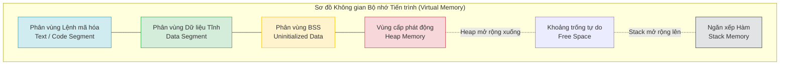

# Bài 7: Tổng quan Mô hình Bộ nhớ (Memory Layout) của Tiến trình

Khi chúng ta lập trình và biên dịch mã nguồn thành một tệp thực thi (ví dụ: `app.exe` trên Windows hoặc một ELF binary trên Linux), tệp đó ở trạng thái tĩnh, nằm yên trên ổ cứng. 
Khi tệp thực thi được Hệ điều hành gọi vào bộ nhớ RAM để tiến hành thực thi, một thực thể động được tạo ra, gọi là **Tiến trình (Process)**.

Để quản lý và duy trì tiến trình đó, Hệ điều hành và Trình biên dịch đã thiết lập một kiến trúc **Không gian Bộ nhớ Ảo (Virtual Memory Space)**, phân chia RAM thành các phân vùng riêng biệt (Memory Segments) dựa trên đặc tính chức năng và thời gian tồn tại của dữ liệu.

---

## 1. Phân vùng Mã lệnh (Text / Code Segment)

**Đặc điểm:** Chứa toàn bộ các tập lệnh máy (Machine Instructions) đã được dịch từ mã nguồn do CPU thực thi trực tiếp.
- Các hằng số ký tự chuẩn (String Literals) như `"Hello World"` thường được đính kèm ở khu vực này hoặc phân vùng `.rodata`.
- **Cơ chế bảo vệ (Read-only):** Hệ điều hành phân mảnh vùng nhớ này dưới chế độ chỉ đọc để chống lại sự ghi đè ngẫu nhiên, giúp ngăn chặn lỗi tham chiếu bộ nhớ sai và chống lại một số chiến dịch khai thác mã độc lây nhiễm trực tiếp trên bộ nhớ tiến trình (như kỹ thuật Buffer Overflow).
- Vùng này có thể được chia sẻ (Shared) giữa nhiều bản sao tiến trình giống nhau (ví dụ: khi mở 10 tab trình duyệt, mã lệnh thực thi trình duyệt chỉ tải vào RAM một lần duy nhất).

## 2. Phân vùng Dữ liệu Khởi tạo (Initialized Data Segment)

**Đặc điểm:** Khu vực này lưu trữ các biến toàn cục (Global Variables) và biến tĩnh (Static Variables) đã được Lập trình viên cấp phát trị số rõ ràng từ trước thời điểm thực thi.
- Ví dụ trong C/C++: `int max_users = 100;` hoặc `static float target = 3.14;`
- Những giá trị này có thời gian tồn tại (Lifetime) bao phủ toàn bộ vòng đời của tiến trình. Dữ liệu sẽ tự động được thu hồi khi và chỉ khi ứng dụng đóng lại.

## 3. Phân vùng BSS (Block Started by Symbol)

**Đặc điểm:** Lưu trữ biến toàn cục và biến tĩnh chưa được gán giá trị khởi tạo, hoặc khởi tạo bằng `0`.
- Thay vì ghi trước các bit số `0` dài hàng MB vào tệp thực thi (gây phình to kích thước tệp tải trên đĩa), hệ thống tách biệt chúng vào BSS. Trình nạp (OS Loader) sẽ tự động làm trống (zero-out) bộ nhớ của phân vùng này tại thời điểm đưa tiến trình lên RAM.
- Ví dụ: Mảng `int data_pool[10000];` nằm ở file khai báo toàn cục sẽ được đặt tại BSS.

---

## 4. Hệ thống Cấp phát Động (Heap Memory)

- Nằm ở ranh giới phía dưới, ngay sau BSS và mở rộng hướng về các vùng địa chỉ cao.
- **Tính năng:** Heap được sử dụng khi kích thước và vòng đời của dữ liệu không thể dự đoán tĩnh trước trong giai đoạn biên dịch. Đây là nơi các toán tử từ khóa `new` (Java/C++), hoặc `malloc()` (C) tạo ra không gian và duy trì những cấu trúc dữ liệu khổng lồ (Object, List, Tree).
- Chi tiết cơ chế của Heap sẽ được phân tích sâu ở Bài 9 và các thuật toán quản lý ở Bài 10.

## 5. Ngăn xếp Gọi hàm (Stack Memory)

- Nằm ở trên đỉnh không gian bộ nhớ ảo và mở rộng dần về hướng các vùng địa chỉ thấp (tiến gần về phía Heap).
- **Tính năng:** Phân vùng này hỗ trợ mô hình cấu trúc lệnh của phương pháp Lập trình Thủ tục. Nó chịu trách nhiệm cấp phát bộ nhớ cho các biến cục bộ (Local Variables), các tham số điều hướng luồng dữ liệu (Function Arguments) và địa chỉ hàm quay lui (Return Pointers). Dữ liệu trong Stack tuân theo cơ chế quản lý hoàn toàn tự động bởi phần cứng thông qua các con trỏ chuyên biệt (Stack Pointer).
- Chi tiết hoạt động và lỗi tràn Stack sẽ được thảo luận ở Bài 8.

Sự sắp xếp đối đỉnh giữa Stack (phát triển ngược) và Heap (phát triển thuận) tạo ra một khoảng trống tự do ở giữa, tối ưu khả năng thích ứng động với giới hạn địa chỉ RAM. Khi Heap và Stack va chạm vào nhau, hoặc gặp giới hạn kích thước trần do hệ điều hành cấu hình (như Ulimit), chương trình sẽ ném ngoại lệ hết dung lượng (Out of Memory).

---
**Navigation:**
[⬅️ Previous: Bài 6: Toán tử Thao tác Bit (Bitwise Operations)](./06-bitwise-operations.md) | [Next: Bài 8: Cơ chế Ngăn xếp (Call Stack) và Lỗi tràn Stack ➡️](./08-call-stack-and-stack-overflow.md)
