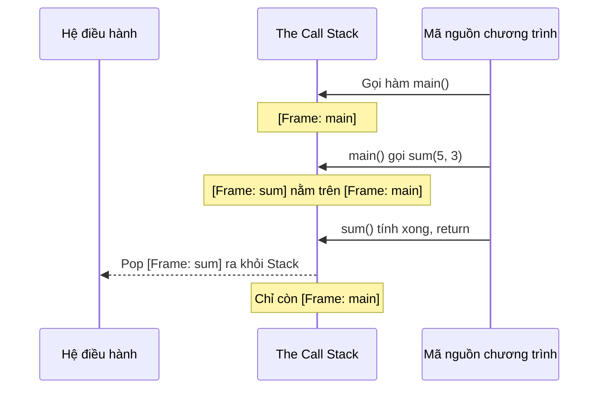
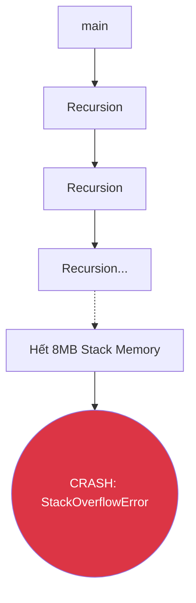

# Bài 8: Ngăn xếp Gọi hàm (The Call Stack)

Khi bạn viết code, bạn tạo ra Hàm A gọi Hàm B, Hàm B gọi Hàm C. 
Khi Hàm C chạy xong, làm sao CPU biết đường "quay về" đúng chỗ đang chạy dở của Hàm B? 
Và biến `int x` của Hàm B có bị lẫn lộn với `int x` của Hàm C không?

Hệ điều hành dùng một cấu trúc dữ liệu kinh điển để giải quyết việc đi lại trong code: **The Stack (Ngăn xếp)**.

---

## 1. Bản chất của Stack (LIFO)

> [!TIP]
> **ELI5:** Stack giống như việc bạn xếp chồng những cái đĩa lên bàn. Bạn chỉ có thể bỏ cái đĩa mới lên trên cùng (Push). Và khi lấy ra, bạn buộc phải lấy cái đĩa ở trên cùng ra trước (Pop). Đĩa nào vào cuối cùng, sẽ được lấy ra đầu tiên (Last In - First Out / LIFO).

Khi chạy chương trình, mỗi khi một hàm được gọi, CPU sẽ tạo ra một "Cái đĩa" mới và ném nó lên Stack. Cái đĩa này được gọi là **Stack Frame (Khung ngăn xếp)**.

---

## 2. Cấu tạo của một Stack Frame (Bí mật bên trong "Cái đĩa")

Khi hàm `sum(int a, int b)` được ném lên Stack, bên trong cái Stack Frame đó chứa 3 thứ cực kỳ quan trọng:

1. **Local Variables (Biến cục bộ):** Nếu trong hàm `sum` bạn khai báo `int total = a + b`, thì biến `total` nằm vật lý ở đây. Khi hàm kết thúc (Frame bị Pop ra), biến `total` **bị phá hủy và biến mất vĩnh viễn** khỏi thanh RAM. Đây là lý do bạn không thể truy cập biến cục bộ từ bên ngoài hàm!
2. **Parameters (Tham số truyền vào):** Các biến `a = 5` và `b = 3` sẽ được copy và cất vào đây. Vì nó là bản copy (Truyền tham trị - Pass by Value), nên dù trong hàm `sum` bạn có sửa `a = 10`, biến gốc ở ngoài cũng không bị ảnh hưởng.
3. **Return Address (Địa chỉ trả về):** Đây là mấu chốt! Trước khi nhảy sang hàm `sum`, CPU ghi lại dòng code hiện tại (Ví dụ: Dòng số 42). Nó nhét số 42 này vào Stack Frame. Nhờ vậy, khi hàm `sum` chạy xong, CPU mở Frame ra nhìn số 42 và tự động nhảy về đúng dòng 42 để chạy tiếp.

---

## 3. Tại sao Stack lại CHỚP NHOÁNG (Siêu nhanh)?

Nếu bạn đi phỏng vấn và được hỏi: *"Nên lưu biến trên Stack hay trên Heap?"*. Câu trả lời luôn là: *"Nếu biến nhỏ và xác định trước kích thước (như int, boolean), luôn luôn lưu trên Stack vì nó cực kỳ nhanh"*.

Tại sao nó nhanh?
1. **Không có bộ thu gom rác (No GC):** CPU không phải dùng thuật toán đi tìm dọn rác. Đơn giản là khi hàm `return`, con trỏ Stack (Stack Pointer) chỉ cần lùi lại một nấc. Bùm! Toàn bộ biến cục bộ bị "xóa" (thực ra là bị bỏ qua để ghi đè lần sau) chỉ tốn 1 chu kỳ máy (1 clock cycle).
2. **Bộ nhớ liền kề (Memory Locality):** Mọi thứ trong Stack nằm sát sàn sạt nhau. Khi CPU đọc biến này, nó bốc luôn được biến kia đưa thẳng vào bộ đệm L1 Cache của vi xử lý. Tốc độ đọc từ L1 Cache nhanh gấp 100 lần so với việc đọc từ thanh RAM.

---

## 4. Ác mộng StackOverflowError

Vì Stack nằm sát trên cùng của RAM và mọc dần xuống dưới, nó có **kích thước giới hạn rất nhỏ** (Trong Windows/Linux thường chỉ cấu hình từ 1MB đến 8MB cho mỗi luồng - Thread).

Chuyện gì xảy ra nếu bạn gọi một hàm Đệ quy (Recursion) mà quên viết điều kiện dừng (Base case)?
Hàm A gọi Hàm A $\rightarrow$ Gọi Hàm A $\rightarrow$ Gọi Hàm A...
CPU điên cuồng ném hàng triệu cái "đĩa" (Stack Frames) lên bàn. Cuối cùng, chồng đĩa cao đụng trần, bộ nhớ cấp cho Stack cạn kiệt. Hệ điều hành tức giận và văng ra lỗi kinh điển đã làm nên tên tuổi của diễn đàn lập trình lớn nhất thế giới: **`Stack Overflow`**.

---

## 🛠️ Góc nhìn Bảo mật: Tấn công Tràn bộ đệm (Buffer Overflow)

Đây là kỹ thuật hack vĩ đại nhất lịch sử C/C++.
Nhớ lại phần cấu trúc: **Local Variables** và **Return Address** nằm sát nhau trong cùng một Stack Frame.

Giả sử bạn khai báo một mảng chứa tên user: `char name[10];` (Chứa được 10 chữ cái).
Nếu user nhập tên là một chuỗi 100 chữ cái, và bạn xài hàm `gets()` của C (hàm này không kiểm tra độ dài), điều gì xảy ra?

- 10 chữ cái đầu lấp đầy biến `name`.
- 90 chữ cái sau tiếp tục tràn ra ngoài, **Ghi đè luôn lên Return Address** nằm ngay cạnh đó.

Hacker sẽ cố tình nhập vào 90 chữ cái đó là những **Mã lệnh độc hại (Malicious Machine Code)**, đồng thời ghi đè Return Address trỏ ngược về đúng đoạn mã độc đó.
Khi hàm kết thúc, thay vì quay về chạy code của bạn, CPU lấy Return Address (đã bị sửa) và ngoan ngoãn nhảy vào chạy mã độc của Hacker. Hacker chiếm toàn quyền điều khiển hệ thống!

> *Note: Ngày nay các hệ điều hành đã thêm cơ chế Stack Canaries và ASLR để chặn lỗ hổng này, nhưng hiểu nó là yêu cầu bắt buộc để thiết kế hệ thống C/C++ an toàn.*

---
**Navigation:**
[⬅️ Previous: Bài 8: Cơ chế Ngăn xếp (Call Stack) và Lỗi tràn Stack](./08-call-stack-and-stack-overflow.md) | [Next: Bài 9: Cấp phát động, Bộ nhớ Heap và Con trỏ ➡️](./09-heap-memory-and-pointers.md)
