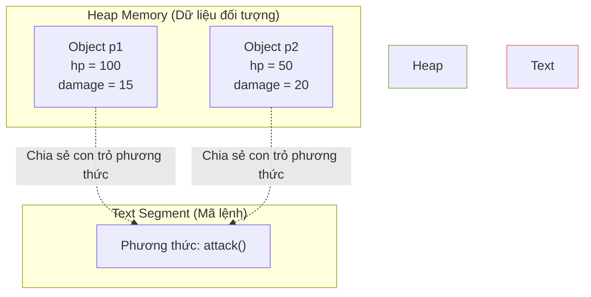

# Bài 11: Bản chất của Class và Cơ chế hoạt động của con trỏ "this"

Trong Lập trình Hướng đối tượng (Object-Oriented Programming - OOP), cách tiếp cận phổ biến để giải thích lớp (Class) là ví nó như một "bản vẽ thiết kế", và đối tượng (Object) là một "ngôi nhà" được xây dựng từ bản vẽ đó. Mặc dù cách diễn đạt này hữu ích ở mức độ tư duy trừu tượng, nó chưa phản ánh chính xác cấu trúc và cơ chế phân bổ bộ nhớ ở cấp độ hệ thống.

Dưới góc độ tổ chức bộ nhớ của hệ điều hành và CPU, khái niệm "Class" không tồn tại ở thời điểm thực thi (Runtime). Kiến trúc hướng đối tượng thực chất là một lớp trừu tượng hóa (abstraction) do trình biên dịch (Compiler) cung cấp để tổ chức mã nguồn có cấu trúc hơn so với lập trình thủ tục (Procedural Programming).

---

## 1. Từ Lập trình Thủ tục (C) đến Hướng đối tượng (C++)

Trong lập trình thủ tục (ví dụ ngôn ngữ C), dữ liệu và các hàm xử lý dữ liệu được tách biệt hoàn toàn. Cấu trúc dữ liệu được gom nhóm bằng `struct`, và các hàm phải nhận tham số là con trỏ chỉ đến `struct` đó để thao tác.

```c
// Mã nguồn ngôn ngữ C
struct Player {
    int hp;
    int damage;
};

// Hàm xử lý độc lập, yêu cầu truyền con trỏ struct
void attack(struct Player* p) {
    p->hp -= 10;
}

int main() {
    struct Player p1;
    p1.hp = 100;
    attack(&p1); // Phải truyền tham chiếu của p1 vào hàm
}
```

Để nâng cao khả năng đóng gói (Encapsulation), ngôn ngữ C++ ra đời với cải tiến cho phép gắn kết các phương thức (methods) trực tiếp vào trong khai báo của cấu trúc dữ liệu, và gọi đó là Class.

```cpp
// Mã nguồn ngôn ngữ C++ / Java
class Player {
public:
    int hp;
    int damage;

    void attack() {
        hp -= 10;
    }
};

int main() {
    Player p1;
    p1.hp = 100;
    p1.attack(); // Cú pháp gắn kết đối tượng với hành vi
}
```

Tuy nhiên, việc thay đổi cú pháp này không làm thay đổi bản chất hoạt động của bộ nhớ máy tính.

---

## 2. Phân bổ bộ nhớ: Phân tách Dữ liệu và Chỉ thị (Instructions)

Một hiểu lầm phổ biến là khi khởi tạo hai đối tượng `p1` và `p2`, mỗi đối tượng trong bộ nhớ Heap sẽ chứa cả dữ liệu (các biến thành viên) và các tập lệnh (mã nguồn của hàm `attack`). Cách tổ chức này sẽ gây lãng phí bộ nhớ nghiêm trọng.

Trên thực tế, mã lệnh của các phương thức được lưu trữ tại phân vùng Text Segment (Phân vùng mã lệnh) và chỉ tồn tại **một bản sao duy nhất** dùng chung cho tất cả các đối tượng thuộc Class đó. Bộ nhớ Heap cấp phát cho đối tượng chỉ chứa các biến thành viên (dữ liệu).



---

## 3. Cơ chế hoạt động của con trỏ "this"

Vì phương thức `attack()` chỉ có một bản sao duy nhất trong Text Segment, vấn đề kỹ thuật đặt ra là: Khi gọi `p1.attack()`, làm cách nào phương thức này nhận diện được nó cần giảm giá trị `hp` của đối tượng `p1` chứ không phải của `p2`?

Giải pháp nằm ở cơ chế biến đổi mã nguồn của Trình biên dịch. Khi biên dịch, lời gọi phương thức `p1.attack()` được ngầm định chuyển đổi thành một lời gọi hàm thủ tục tương đương với C:
`Player_attack( &p1 );`

Trình biên dịch tự động thêm một tham số ẩn vào định nghĩa của phương thức. Tham số này chứa địa chỉ bộ nhớ của đối tượng đang thực hiện lời gọi hàm. Trong C++ và Java, con trỏ ẩn này được định danh là **`this`**; trong Python, nó được định danh tường minh bằng tham số **`self`**.

Hình thái thực sự của phương thức `attack` ở cấp độ Assembly hoặc biên dịch:
```cpp
void Player_attack(Player* this) {
    this->hp -= 10; // Thay đổi dữ liệu dựa trên địa chỉ được truyền vào
}
```

> [!NOTE]
> **Thiết kế của ngôn ngữ Python:**
> Khác với C++ hay Java (ẩn con trỏ `this`), Python yêu cầu khai báo tham số `self` một cách rõ ràng ở vị trí đầu tiên trong mọi phương thức của lớp.
> ```python
> class Player:
>     def attack(self):     # Tham số self bắt buộc khai báo
>         self.hp -= 10
> ```
> Thiết kế này tuân theo nguyên lý cốt lõi của Python: "Tường minh tốt hơn ngầm định" (Explicit is better than implicit).

---

## 4. Phân tích thực tiễn

Việc hiểu rõ sự phân tách giữa trạng thái đối tượng (Dữ liệu) và hành vi (Mã lệnh) có giá trị quan trọng trong việc phân tích hệ thống:

1. **Mất Context (Ngữ cảnh) trong JavaScript:**
   Khi truyền một phương thức làm tham số cho sự kiện (Callback), ví dụ: `button.addEventListener('click', p1.attack);`, lỗi `undefined` thường xuất hiện. Lý do là chúng ta chỉ truyền con trỏ hàm, nhưng không truyền kèm theo đối tượng tham chiếu (`this` bị mất ngữ cảnh). Khắc phục điều này yêu cầu sử dụng hàm `bind()` để cố định con trỏ `this`, hoặc sử dụng Arrow Functions.

2. **Căn chỉnh bộ nhớ (Memory Alignment và Padding):**
   Kích thước thực sự của một đối tượng trong RAM không chỉ đơn giản là tổng dung lượng các biến thành viên. Nhằm tối ưu hóa tốc độ nạp dữ liệu từ RAM lên vi xử lý (CPU Cache), hệ điều hành thường tự động chèn thêm các byte đệm (Padding) để căn lề bộ nhớ. Do đó, kỹ sư cần phải nắm rõ kích thước dữ liệu khi thực hiện tuần tự hóa (Serialization) hoặc tối ưu bộ nhớ cấp thấp trong C/C++.

Tóm lại, Class là một cơ chế trừu tượng giúp gom nhóm trạng thái và tự động hóa quy trình quản lý con trỏ ngữ cảnh (`this`). Các tài nguyên xử lý vẫn được quản lý tách biệt để đảm bảo hiệu năng tính toán.

---
**Navigation:**
[⬅️ Previous: Bài 10: Quản lý Bộ nhớ tự động (Garbage Collection)](./10-garbage-collection.md) | [Next: Bài 12: Tính Đóng gói (Encapsulation) và Cơ chế Truy cập ➡️](./12-encapsulation-and-properties.md)
