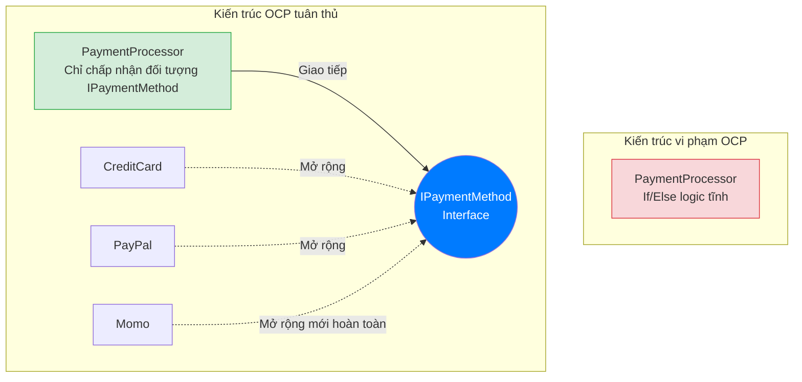

# Bài 17: OCP - Nguyên lý Đóng/Mở (Open/Closed Principle)

Nguyên lý thứ hai của chuỗi SOLID, đại diện bởi chữ O, định hình cấu trúc khả năng mở rộng của một hệ thống ứng dụng: **Nguyên lý Đóng/Mở (Open/Closed Principle - OCP)**.

Định nghĩa cốt lõi: *"Các thực thể phần mềm (Class, Module, Hàm) nên được MỞ để mở rộng thêm chức năng (Open for extension), nhưng phải ĐÓNG đối với việc sửa đổi mã nguồn bên trong (Closed for modification)."*

---

## 1. Vấn đề hệ thống khi phụ thuộc Điều kiện rẽ nhánh

Một đặc tính sai lầm trong quá trình kiến tạo kiến trúc phần mềm là khuynh hướng khai thác các hệ thống rẽ nhánh kiểm tra quá độ (`if-else` / `switch-case`) khi định tuyến quy trình.

Xét một hàm xử lý thanh toán:
```java
class PaymentProcessor {
    public void processPayment(String type, double amount) {
        if (type.equals("CreditCard")) {
            System.out.println("Processing credit card: " + amount);
        } 
        else if (type.equals("PayPal")) {
            System.out.println("Processing PayPal: " + amount);
        }
        // Thất bại mở rộng: Nếu cần thanh toán Momo, VNPay?
    }
}
```

Khối mã này vi phạm nghiêm trọng giới hạn OCP: Khi các nhà hoạch định chiến lược (Business Team) cung cấp thêm một định dạng cổng thanh toán mới, kỹ sư duy trì nền tảng bắt buộc phải mở tệp mã nguồn nguyên thủy `PaymentProcessor.java` và trực tiếp thêm các đoạn mã xử lý ở nhánh `else if`. 
Việc bẻ gãy mã cũ đã qua quy trình phân tích và kiểm thử (QA Tested) mang lại rủi ro làm sập quy trình chạy ổn định hiện tại, đồng thời khối điều kiện có nguy cơ gia tăng phức tạp phi tuyến tính thành hàng chục ngàn dòng phân đoạn logic.

---

## 2. Thiết kế Cơ sở dựa trên Tính Đa hình (Polymorphism)

Giải pháp khắc phục cơ chế này xoay quanh cơ sở lý thuyết Tính Đa Hình thông qua việc chuyển hóa các khối nhánh logic rời rạc thành dạng các đối tượng hoạt động độc lập (Strategy Pattern sẽ triển khai sâu trong Bài 25).



Quá trình cấu hình đa hình:
1. Tạo một Hợp đồng giao tiếp trung gian (Interface).
```java
interface IPaymentMethod {
    void pay(double amount);
}
```

2. Các logic xử lý cổng thanh toán hoàn thiện cấu trúc Interface. Lập trình viên thiết lập riêng biệt mà không thay đổi bất kỳ ký tự nào trên logic phân hệ cổng chính.
```java
class CreditCard implements IPaymentMethod {
    public void pay(double amount) { /* Logic thẻ tín dụng */ }
}

// Bổ sung luồng tính năng mới không đụng tới file cũ
class MomoWallet implements IPaymentMethod {
    public void pay(double amount) { /* Logic mã QR */ }
}
```

3. Modun điều phối giao tiếp thông qua Interface.
```java
class PaymentProcessor {
    // Hệ thống Đóng với sửa đổi: Không còn switch-case
    // Hệ thống Mở với mở rộng: Chấp nhận mọi phương thức miễn là có implement IPaymentMethod
    public void process(IPaymentMethod method, double amount) {
        method.pay(amount); // Tính đa hình tại thời điểm động (Runtime Dispatch)
    }
}
```

---

## 3. Kiến trúc Plugin (Plugin Architecture)

Một minh họa xuất sắc chứng minh cho triết lý Mở/Đóng là nền tảng quản trị các công cụ mở rộng (Extensions / Plugins), điển hình là sự hoạt động của mã nguồn ứng dụng VS Code hay Google Chrome.

Nhóm kỹ sư gốc của VS Code không bao giờ thực hiện việc cập nhật vào lõi cấu trúc khi có yêu cầu thêm một bộ định dạng biên dịch hỗ trợ ngôn ngữ Python hay C++. Nhân ứng dụng chính đã bị "Đóng kín" sau khi triển khai, hoàn toàn ẩn dật trước tương tác bên ngoài.
Thay vào đó, hệ thống cung cấp sẵn các móc liên kết API mã nguồn theo chuẩn trừu tượng (Interface). Bất kỳ kỹ sư ngoài luồng nào cũng có quyền xây dựng các module xử lý (Plugin) độc lập rồi cài đặt, nhúng ngầm định (Inject) trực tiếp vào bộ não trung tâm. Việc tháo rời (Gỡ cài đặt) hoặc thêm chức năng không bao giờ tạo rủi ro hệ thống bị thiếu hụt logic lõi. Đó chính là cảnh giới của Nguyên lý Đóng/Mở.

---
**Navigation:**
[⬅️ Previous: Bài 16: SRP - Nguyên lý Đơn trách nhiệm (Single Responsibility Principle)](./16-srp-single-responsibility.md) | [Next: Bài 18: LSP - Nguyên lý Thay thế Liskov (Liskov Substitution Principle) ➡️](./18-lsp-liskov-substitution.md)
