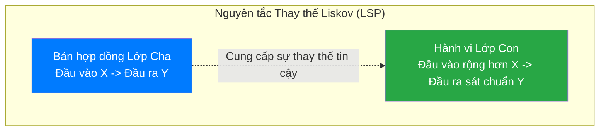

# Bài 18: LSP - Nguyên lý Thay thế Liskov (Liskov Substitution Principle)

Nguyên lý Liskov Substitution (đại diện bởi chữ L trong SOLID), được công bố bởi Tiến sĩ Khoa học Máy tính Barbara Liskov. Đây là hệ quy chiếu cơ bản để đảm bảo Tính Kế thừa (Inheritance) được kiến trúc hợp lệ về mặt luồng thao tác học thuật (Behavioral Subtyping).

Định nghĩa toán học của Liskov: *"Nếu $S$ là lớp con của $T$, thì mọi đối tượng kiểu $T$ trong chương trình có thể bị thay thế bởi đối tượng kiểu $S$ mà không làm sai lệch tính đúng đắn của chương trình."*

Hiểu một cách thực tiễn: **Lớp con bắt buộc phải mô phỏng lại hoàn thiện hành vi của Lớp cha mà không ném lỗi ngẫu nhiên và không làm người dùng Lớp cha gặp phản ứng thao tác bất ngờ.**

---

## 1. Vi phạm cấu trúc kinh điển: Hình vuông và Hình chữ nhật

Trong hình học cơ sở, Hình vuông (Square) thỏa mãn tính chất hoàn toàn là một Hình chữ nhật (Rectangle) đặc biệt có các cạnh bằng nhau. Do đó, theo nguyên lý hướng đối tượng, rất tự nhiên khi kỹ sư triển khai thiết kế `Square` kế thừa từ `Rectangle`.

```java
class Rectangle {
    protected int width, height;

    public void setWidth(int w) { this.width = w; }
    public void setHeight(int h) { this.height = h; }
    public int getArea() { return width * height; }
}

class Square extends Rectangle {
    // Ghi đè cấu trúc: Đảm bảo hình vuông luôn có 4 cạnh bằng nhau
    @Override
    public void setWidth(int w) {
        this.width = w;
        this.height = w;
    }

    @Override
    public void setHeight(int h) {
        this.width = h;
        this.height = h;
    }
}
```

Kiến trúc này nhìn qua không có lỗi logic cú pháp, nhưng bị phá vỡ hoàn toàn nguyên tắc hành vi nếu phân tích sâu qua Module điều phối độc lập (Test Client):

```java
void checkArea(Rectangle rect) {
    rect.setWidth(5);
    rect.setHeight(4);
    // Toán học kỳ vọng của Rectangle là 5 * 4 = 20
    assert rect.getArea() == 20; 
}

// Kiểm thử
Rectangle r1 = new Rectangle();
checkArea(r1); // Thành công

Rectangle r2 = new Square(); // Đa hình: Lớp con thay thế Lớp cha
checkArea(r2); // THẤT BẠI (Assertion Error). Kết quả ra 16.
```

Bản chất của lỗi là Lớp con `Square` đã phá vỡ những đặc tính kỳ vọng của Lớp cha. Khi người dùng thiết lập tham số cho hình chữ nhật, họ không hề mong đợi hàm `setHeight(4)` lại làm thay đổi biến đổi cả tham số `Width` một cách tự động. 
Luồng chương trình bị đánh sập chỉ vì Lớp con đã có cấu trúc sai lệch (Behavioral mismatch), điều này vi phạm trực diện Tiêu chuẩn Thay thế Liskov.

---

## 2. Chế định Tiền điều kiện (Preconditions) và Hậu điều kiện (Postconditions)

Để tuân thủ hoàn toàn LSP trong môi trường thiết kế cấu trúc phân nhánh, kỹ sư buộc phải thỏa mãn 2 nguyên lý kiểm thử theo Phương pháp Hợp đồng phần mềm (Design by Contract):

1. **Preconditions (Tiền điều kiện không được khắt khe hơn):** Lớp con không được quyền từ chối tiếp nhận các đầu vào dữ liệu mà Lớp cha vẫn tiếp nhận xử lý bình thường.
   - Ví dụ: Nếu Lớp cha có phương thức tiếp nhận tham số số nguyên (Từ âm đến dương), mà Lớp con tiến hành ghi đè rồi phát sinh ném ngoại lệ (`throw Error`) nếu nhận tham số số âm. Điều này vi phạm LSP.

2. **Postconditions (Hậu điều kiện không được nới lỏng hơn):** Lớp con phải đảm bảo các giá trị đầu ra đúng chuẩn và đúng kiểu tương đương với ràng buộc đầu ra của Lớp cha.



### Phương án Tái cấu trúc
Khi vấp phải lỗi Liskov đối với những hệ đối tượng mang cấu trúc chung nhưng dị biệt điều kiện hành vi (như mô hình Hình vuông và Hình chữ nhật), giải pháp hợp lý nhất là rỡ bỏ mối liên kết kế thừa trực tiếp (IS-A) giữa chúng. Cả hai lớp cần được nâng cấp kiến trúc trỏ vào chung một Interface chung nhất (`Shape`), mỗi hình tự định nghĩa quá trình lưu trữ chiều dài và tính diện tích độc lập, củng cố tính trừu tượng hệ thống.

---
**Navigation:**
[⬅️ Previous: Bài 17: OCP - Nguyên lý Đóng/Mở (Open/Closed Principle)](./17-ocp-open-closed.md) | [Next: Bài 19: ISP - Nguyên lý Giao diện Phân tách (Interface Segregation Principle) ➡️](./19-isp-interface-segregation.md)
