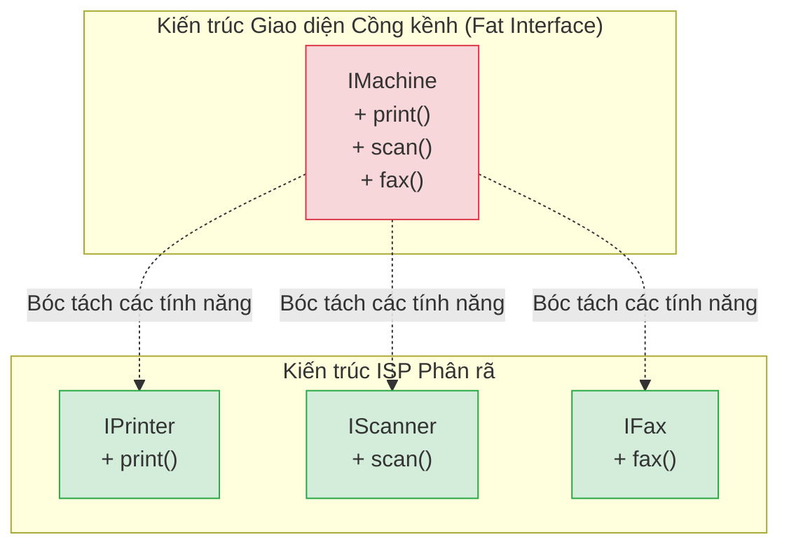

# Bài 19: ISP - Nguyên lý Giao diện Phân tách (Interface Segregation Principle)

Trọng tâm của chữ I trong bộ cấu trúc SOLID xoay quanh cách định hình và giảm thiểu kích thước của một bộ phận liên kết module (Interface). Định nghĩa của **Nguyên lý Giao diện Phân tách (ISP)** như sau:

*"Khách hàng (các lớp module phân nhánh) không nên bị ép buộc phụ thuộc vào các phương thức giao diện mà chúng không cần dùng đến."*

Nói cách khác, tạo nhiều giao diện thu gọn và chuyên biệt (Client-specific interfaces) có cấu trúc ưu việt hơn là việc áp đặt một giao diện chung chứa đựng quá nhiều thuộc tính (Fat / Polluted Interface).

---

## 1. Cấu trúc Interface phình to (Fat Interface)

Vấn đề kỹ thuật diễn ra khi một kỹ sư phân tích các nghiệp vụ và gom nhóm toàn bộ khả năng tương thích vào cùng một bản thiết kế tập trung.

Xét quy trình quản lý hoạt động in ấn và văn phòng số:
```java
// Bản thiết kế Đa chức năng bị ô nhiễm chức năng (Fat Interface)
interface IMachine {
    void printDocument();
    void scanDocument();
    void faxDocument();
}
```

Nhược điểm bộc lộ khi một nhà tích hợp triển khai sản phẩm thông qua giao diện này.
```java
// Thiết bị máy in dòng cấp thấp (Chỉ in, không trang bị mô-đun quét)
class BasicPrinter implements IMachine {
    @Override
    public void printDocument() {
        System.out.println("Printing...");
    }

    // Các hàm không dùng nhưng vẫn phải triển khai với thông báo lỗi
    @Override
    public void scanDocument() {
        throw new UnsupportedOperationException("Tính năng không được hỗ trợ");
    }

    @Override
    public void faxDocument() {
        throw new UnsupportedOperationException("Tính năng không được hỗ trợ");
    }
}
```

Tại thời điểm vận hành, Lớp `BasicPrinter` vi phạm nghiêm trọng tính cơ sở LSP, khi bất kỳ người dùng nào phát động yêu cầu hàm `scanDocument()` thông qua bản thiết kế Interface, hệ thống sẽ ném lỗi Crash. Một giao thức thiết kế tồi đẩy các đoạn cấu trúc chức năng giả mạo (Dummy code) lan truyền qua không gian dữ liệu phần mềm.

Ngoài ra, về mặt Cấu trúc Biên dịch, trong các ngôn ngữ hiệu năng như C++, mỗi khi một phương thức thuộc nhóm `IMachine` bị thay đổi nguyên tắc chữ ký, Trình biên dịch bắt buộc phải tải và tái hợp biên dịch cho mọi đối tượng liên kết tới Interface này, kể cả những đối tượng như `BasicPrinter` hoàn toàn không liên quan đến chức năng thay đổi đó, làm đình trệ thời gian phát triển.

---

## 2. Phân tách Cấu trúc Giao thức (Interface Segregation)

Giải pháp của ISP tuân theo tiêu chuẩn chia nhỏ cấu trúc dựa trên công năng sử dụng (Role-based design). Thay vì thiết lập một kết cấu hỗn hợp trung tâm, kỹ sư bóc tách chúng ra thành từng giao diện phân biệt.



Áp dụng phương án chia nhỏ vào mã nguồn:
```java
interface IPrinter { void printDocument(); }
interface IScanner { void scanDocument(); }
interface IFax     { void faxDocument(); }

// Thiết bị đa năng: Kết hợp các Module theo cấu trúc đa triển khai
class AdvancedCopier implements IPrinter, IScanner, IFax {
    public void printDocument() { /* ... */ }
    public void scanDocument() { /* ... */ }
    public void faxDocument() { /* ... */ }
}

// Thiết bị cơ bản: Cấu trúc gọn nhẹ và an toàn
class BasicPrinter implements IPrinter {
    public void printDocument() { /* ... */ }
    // Hoàn toàn không còn đoạn mã ném lỗi rác rưởi nào.
}
```

Kết luận, nguyên tắc ISP hạn chế tối đa rủi ro liên kết gượng ép. Các Lớp tham gia vào cấu trúc hệ thống đều được hoạt động với độ liên kết cao (Cohesive) trên các module nhỏ gọn, bảo vệ tính trừu tượng nguyên thủy.

---
**Navigation:**
[⬅️ Previous: Bài 18: LSP - Nguyên lý Thay thế Liskov (Liskov Substitution Principle)](./18-lsp-liskov-substitution.md) | [Next: Bài 20: DIP - Nguyên lý Đảo ngược Phụ thuộc (Dependency Inversion Principle) ➡️](./20-dip-dependency-inversion.md)
