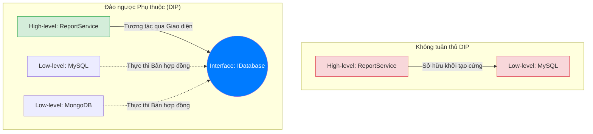

# Bài 20: DIP - Nguyên lý Đảo ngược Phụ thuộc (Dependency Inversion Principle)

Chữ cái D khép lại quy chuẩn SOLID, mô tả phương thức tái tổ chức luồng liên kết cấu trúc để đạt được giới hạn tách rời triệt để: **Nguyên lý Đảo ngược Phụ thuộc (Dependency Inversion Principle - DIP)**.

Nền tảng của DIP phát biểu hai mệnh đề:
1. Module cấp cao không được phụ thuộc vào Module cấp thấp. Cả hai đều phải phụ thuộc vào lớp Trừu tượng (Abstractions).
2. Lớp Trừu tượng không được phụ thuộc vào Chi tiết triển khai (Details). Chi tiết triển khai phải phụ thuộc vào Lớp Trừu tượng.

---

## 1. Phân tích Mô hình Phụ thuộc Trực tiếp (Tight Coupling)

Trong tư duy thiết kế luồng quy trình (Procedural), ứng dụng thường triển khai gọi lệnh từ cao xuống thấp (Top-down dependency). Module cốt lõi ở trung tâm phụ thuộc vào các thư viện ngoại vi tĩnh để kết thúc vòng lặp hành động.

Ví dụ Hệ thống Lưu trữ báo cáo:
```java
// Lớp Hạ tầng cơ sở: Khối Cấp thấp (Low-level module)
class MySQLDatabase {
    public void insert(String data) {
        System.out.println("Kết nối cổng 3306, lưu: " + data);
    }
}

// Lớp Nghiệp vụ: Khối Cấp cao (High-level module)
class ReportService {
    // Sự phụ thuộc cấu trúc trực tiếp! (Khởi tạo kết nối cứng)
    private MySQLDatabase database = new MySQLDatabase();

    public void saveReport(String report) {
        database.insert(report);
    }
}
```

**Sự cố khi tiến hành mở rộng:**
Khối nghiệp vụ báo cáo (`ReportService`) dính chặt vật lý với cơ sở dữ liệu nền MySQL. Nếu kiến trúc trưởng yêu cầu thay thế bộ lưu trữ sang kho lưu trữ tệp tin hoặc MongoDB, lập trình viên sẽ phải đập bỏ và tái kiến trúc đối tượng `ReportService`. Vòng xoáy tái cấu hình sẽ làm phá vỡ Nguyên lý OCP, hệ thống thiếu đi phương án kiểm thử đơn vị độc lập (Unit Test) vì không thể loại bỏ tham số truyền tới nền tảng cơ sở.

---

## 2. Inversion of Control (IoC) và Cầu nối Đảo ngược

DIP tiến hành giải mã liên kết cấu trúc bằng cách thiết lập một Giao diện cầu nối. Luồng tương tác bị bẻ ngoặt: Cả module Cấp cao lẫn Cấp thấp đều bắt buộc trỏ liên kết về Interface.



### Triển khai thông qua Dependency Injection (Tiêm Dữ Liệu)

Sau khi định nghĩa lại bản mẫu cầu nối, đối tượng cấp cao không còn năng lực tự khởi tạo chi tiết triển khai nội sinh bằng hàm định nghĩa `new` nữa. Mọi biến phân hệ đều được nhường quyền quản lý (Inversion of Control) cho hệ thống ngoại vi và chủ thể bên ngoài chuyển các tham chiếu vào thông qua Constructor. Quy trình này gọi là **Dependency Injection (DI)**.

```java
// Lớp Trừu tượng (Giao diện cấu trúc chung)
interface IDatabase {
    void save(String data);
}

// Triển khai cấu trúc Cấp thấp
class MongoDBDatabase implements IDatabase {
    public void save(String data) { /* ... */ }
}

// Triển khai Khối Cấp cao
class ReportService {
    private IDatabase database; 

    // Dependency Injection: Nhận sự hỗ trợ cơ sở thông qua Constructor
    public ReportService(IDatabase db) {
        this.database = db;
    }

    public void saveReport(String report) {
        this.database.save(report); // Xử lý qua lớp trung gian, an toàn 100%
    }
}
```

Ứng dụng trong môi trường Unit Testing (Kiểm thử đơn vị), ta hoàn toàn có thể xây dựng một lớp giả danh `MockDatabase` trong bộ nhớ RAM, truyền nó vào `ReportService` mà không bị kẹt ở các giới hạn truyền thông (Network I/O) thực tế, tối đa hóa năng lực tự động hóa phần mềm. Đây là cấu trúc lý luận cho sự phát triển của các bộ Framework khổng lồ sau này như Spring Boot, Angular và .NET Core.

---
**Navigation:**
[⬅️ Previous: Bài 19: ISP - Nguyên lý Giao diện Phân tách (Interface Segregation Principle)](./19-isp-interface-segregation.md) | [Next: Bài 21: Singleton Pattern và Rủi ro Đa luồng (Multi-threading) ➡️](./21-pattern-singleton.md)
