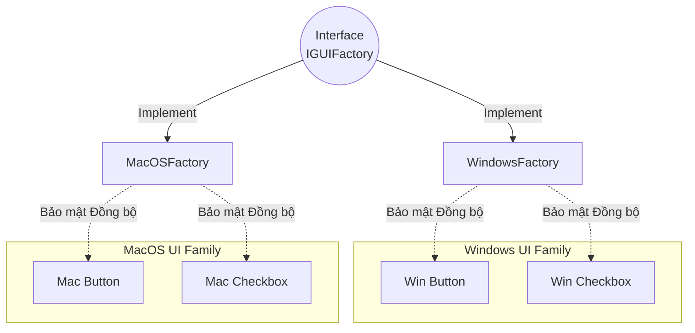

# Bài 22: Nhóm Khởi tạo: Factory Method và Abstract Factory

Việc sử dụng toán tử khởi tạo trực tiếp (ví dụ: `new Object()`) rải rác khắp mã nguồn gây ra sự gắn kết phần mềm chặt chẽ (Tight Coupling) và vi phạm nguyên tắc Dependency Inversion. Để khắc phục, nhóm Mẫu thiết kế Khởi tạo (Creational Patterns) đề xuất giao quyền quản lý khởi tạo cho các hệ thống trung gian mang tên **Factory (Nhà máy)**.

---

## 1. Factory Method (Mẫu Phương thức Khởi tạo)

**Mục tiêu:** Cung cấp một giao diện trừu tượng để tạo ra đối tượng trong lớp cha, nhưng cho phép các lớp con quyết định kiểu (loại) của đối tượng được tạo ra.

Xét một hệ thống quản lý giao thông. Nếu hàm nghiệp vụ xử lý khởi tạo phương tiện thông qua chuỗi lệnh rẽ nhánh tĩnh:
```java
public void dispatchVehicle(String type) {
    Vehicle v = null;
    if (type.equals("Truck")) {
        v = new Truck();
    } else if (type.equals("Ship")) {
        v = new Ship();
    }
    v.deliver();
}
```
Luồng điều phối này vi phạm Nguyên lý Đóng/Mở (OCP), vì mọi cấu trúc yêu cầu mở rộng phương tiện (ví dụ: thêm máy bay `Airplane`) đều buộc nhà phát triển phải sửa đổi trực tiếp vào hàm phân phối cốt lõi.

**Giải pháp Factory Method:**
Di chuyển khối lệnh khởi tạo vào một phân hệ chuyên trách quản lý việc sản sinh đối tượng.

```mermaid
graph TD
    User["Module Xử lý: dispatchVehicle(")] -->|Yêu cầu Object dựa trên Type| Factory[VehicleFactory]
    Factory -->|Phân tích và Khởi tạo| C1(new Truck)
    Factory --> C2(new Ship)
    Factory -->|Trỏ tham chiếu về| User
    
    style User fill:#d1ecf1,stroke:#17a2b8
    style Factory fill:#fff3cd,stroke:#ffc107
```

```java
// Lớp Trung tâm sản xuất (Chứa trọn vẹn logic rẽ nhánh)
class VehicleFactory {
    public static Vehicle createVehicle(String type) {
        if (type.equals("Truck")) return new Truck();
        if (type.equals("Ship")) return new Ship();
        throw new IllegalArgumentException("Unknown vehicle type");
    }
}

// Lớp Nghiệp vụ (Sạch sẽ và Đóng kín)
public void dispatchVehicle(String type) {
    Vehicle v = VehicleFactory.createVehicle(type);
    v.deliver();
}
```
Kiến trúc này đảm bảo quy trình bảo trì dễ dàng. Mọi chỉnh sửa về cấu trúc phương tiện được khoanh vùng cục bộ tại lớp `VehicleFactory`.

---

## 2. Abstract Factory (Mẫu Siêu Nhà máy)

Trong khi Factory Method tập trung trả về một sản phẩm đơn lẻ dựa trên cấu hình, **Abstract Factory** giải quyết bài toán phức tạp hơn: **Khởi tạo một Nhóm (Family) các đối tượng có quan hệ logic chặt chẽ với nhau, nhằm đảm bảo tính tương thích đồng bộ hệ thống.**

Ví dụ: Phát triển thư viện Giao diện Đồ họa (GUI) hoạt động đa nền tảng.
- Họ nền tảng Windows cung cấp bộ cặp: `WinButton` và `WinCheckbox`.
- Họ nền tảng MacOS cung cấp bộ cặp: `MacButton` và `MacCheckbox`.

Nếu sử dụng Factory Method thông thường hoặc khởi tạo tĩnh, có khả năng hệ thống sẽ bị lỗi khi lập trình viên trộn lẫn cấu trúc đối tượng (`WinButton` chạy trên nền macOS), gây đứt gãy tương thích.

**Kiến trúc Abstract Factory:**



Triển khai cấu trúc:
1. Thiết lập Cấu trúc Giao diện Trung tâm:
```java
interface IGUIFactory {
    Button createButton();
    Checkbox createCheckbox();
}
```

2. Cài đặt các Nhà máy phân nhánh:
```java
class WinFactory implements IGUIFactory {
    public Button createButton() { return new WinButton(); }
    public Checkbox createCheckbox() { return new WinCheckbox(); }
}

class MacFactory implements IGUIFactory {
    public Button createButton() { return new MacButton(); }
    public Checkbox createCheckbox() { return new MacCheckbox(); }
}
```

3. Gắn kết trong module luồng xử lý chính:
```java
IGUIFactory factory;
if (OS_NAME.equals("Windows")) {
    factory = new WinFactory();
} else {
    factory = new MacFactory();
}

// Kỹ sư tiến hành thao tác trên giao diện ảo mà không cần biết định dạng nền tảng vật lý.
// Tính đồng bộ của cặp đối tượng được nhà máy bảo đảm tuyệt đối.
Button btn = factory.createButton();
Checkbox chk = factory.createCheckbox();
btn.render();
```

> [!NOTE]
> **Phân tích Kiến trúc:**
> Abstract Factory cung cấp mức độ Trừu tượng hóa tối đa cho cơ sở hạ tầng. Nó thường được thiết lập ngay tại giai đoạn Bootstrapping của ứng dụng để tiêm (Inject) toàn bộ các dịch vụ phụ thuộc theo ngữ cảnh nền tảng, giúp luồng nghiệp vụ lõi độc lập với các thư viện thứ ba.

---
**Navigation:**
[⬅️ Previous: Bài 21: Singleton Pattern và Rủi ro Đa luồng (Multi-threading)](./21-pattern-singleton.md) | [Next: Bài 23: Builder Pattern và Rủi ro Telescoping Constructor ➡️](./23-pattern-builder.md)
