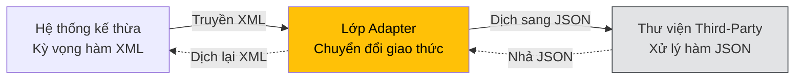
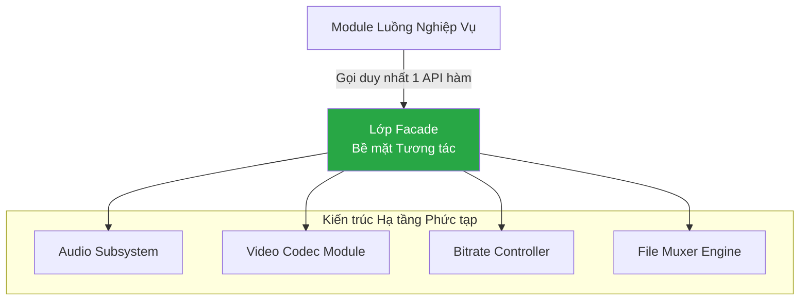

# Bài 24: Nhóm Cấu trúc: Adapter và Facade Pattern

Mục tiêu cốt lõi của các Mẫu thiết kế Cấu trúc (Structural Patterns) là giải quyết bài toán kết nối, mở rộng và thiết lập tương thích giữa các thành phần phần mềm có cấu trúc nội tại khác biệt. Hai mẫu phổ biến nhất đóng vai trò tối ưu hóa sự tương tác là **Adapter** và **Facade**.

---

## 1. Adapter Pattern (Mẫu Tích hợp Chuyển đổi)

**Mục đích:** Đóng vai trò là một lớp vỏ bọc trung gian chuyển đổi nguyên tắc giao thức (Interface) của một thành phần sang định dạng tương thích với chuẩn giao thức mà khối mã điều phối (Client) yêu cầu, cho phép các cấu trúc bất đồng bộ có thể tích hợp mà không can thiệp mã nguồn nội tại.

Trong chu trình tích hợp hệ thống, kỹ sư thường xuyên phải liên kết dự án với các thư viện đóng gói của bên thứ ba (Third-party SDK) sử dụng định dạng truyền tải dữ liệu hoặc giao thức không tương thích với module kế thừa hiện hữu. Ví dụ: Hệ thống cũ xử lý qua XML, trong khi SDK mới chuyên cung cấp dữ liệu định dạng JSON.

Việc viết lại hệ thống nguyên thủy để tương thích thư viện mới hoặc sửa mã nguồn thư viện thương mại đều là rủi ro làm sụp đổ kiến trúc toàn vẹn. Lớp **Adapter** ra đời để thiết lập đường dẫn chuyển hướng giữa hai phân hệ độc lập.



**Mã nguồn triển khai:**
```java
// 1. Giao thức hiện tại của ứng dụng
interface XMLProcessor {
    void process(String xmlData);
}

// 2. Thư viện độc lập bên ngoài (Không thể tùy chỉnh)
class JsonAnalyticsLib {
    public void analyzeJSON(String jsonData) { /* Thuật toán xử lý Json */ }
}

// 3. Adapter giải quyết giới hạn bất tương thích
class XMLToJsonAdapter implements XMLProcessor {
    private JsonAnalyticsLib lib;
    
    public XMLToJsonAdapter(JsonAnalyticsLib lib) {
        this.lib = lib;
    }
    
    @Override
    public void process(String xmlData) {
        // Thuật toán trung gian biên dịch định dạng
        String jsonConverted = convertXmlToJson(xmlData);
        // Ủng hộ luồng đi vào hệ thống đích
        lib.analyzeJSON(jsonConverted);
    }
}
```

---

## 2. Facade Pattern (Mẫu Bề mặt / Tiền sảnh)

**Mục đích:** Cung cấp một giao diện điều phối bậc cao, hợp nhất và đơn giản hóa việc thao tác lên một phân hệ chứa nhiều cấu trúc lớp lồng ghép phức tạp.

Trong mô hình kiến trúc có chiều sâu, quá trình kích hoạt một tiến trình hệ thống đôi khi yêu cầu kỹ sư điều phối chuỗi khởi tạo hàm và thông số tùy chỉnh đan chéo từ hàng chục thư viện chuyên biệt (ví dụ: các công cụ chuyển mã FFmpeg video hoặc bộ điều khiển động cơ trò chơi cấp thấp). Khởi tạo luồng logic phức tạp này rải rác khắp ứng dụng sẽ tạo ra hiệu ứng Lệ thuộc chéo (Coupling), cản trở việc tái sử dụng.

Giải pháp **Facade** thiết lập một phân hệ bọc ở mặt tiền, cung cấp các khối lệnh tóm lược, ẩn đi chuỗi phức tạp của hạ tầng.

```java
// Cấu trúc Facade tập trung chuỗi xử lý độ phức tạp lớn
class VideoConverterFacade {
    public File convertVideo(String fileName, String format) {
        // Toàn bộ logic giao tiếp hạ tầng bậc thấp được ẩn giấu trong lớp tiền sảnh
        AudioExtractor audio = new AudioExtractor();
        VideoCodec codec = new VideoCodec(format);
        BitrateManager bitrate = new BitrateManager(1024);
        
        return FileStreamer.combine(audio.extract(fileName), codec.init(), bitrate);
    }
}

// Tương tác tại khối logic điều phối cấp cao trở nên tối giản
VideoConverterFacade converter = new VideoConverterFacade();
File output = converter.convertVideo("demo.mp4", "avi");
```



### Phân tích hệ thống: Adapter và Facade
Hai khuôn mẫu trên đều áp dụng cơ chế Thiết lập Vỏ bọc (Wrapper), nhưng giải quyết hai hướng rủi ro khác nhau.
- **Adapter** thực hiện chức năng Bọc một thực thể với mục đích **Thay đổi đặc điểm phân phối tín hiệu (Giao thức - Protocol)**, biến đổi từ trạng thái bất tương thích thành đồng thuận tương tác.
- **Facade** thực hiện chức năng Bọc một cụm cấu trúc kiến trúc với mục đích **Thay đổi bề mặt tương tác**, ẩn giấu sự phức tạp mà không can thiệp vào định dạng tín hiệu. Việc ứng dụng linh hoạt Facade cũng là tiêu chuẩn triển khai nguyên tắc trừu tượng hoá phân tầng hệ thống (N-Tier Architecture).

---
**Navigation:**
[⬅️ Previous: Bài 23: Builder Pattern và Rủi ro Telescoping Constructor](./23-pattern-builder.md) | [Next: Bài 25: Strategy Pattern và Cơ chế Tách rời Thuật toán ➡️](./25-pattern-strategy.md)
