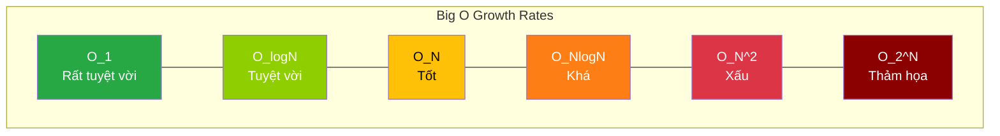

# Bài 2: Phân tích Ký pháp Big O (Big O Notation)

Sau khi thiết lập hệ quy chiếu đo lường độ phức tạp (Thời gian và Không gian) không lệ thuộc vào phần cứng, Khoa học Máy tính cần một chuẩn biểu diễn toán học cho sự đo lường này. Tiêu chuẩn được áp dụng thống nhất toàn cầu là **Ký pháp Big O (Big O Notation)**.

Ký pháp Big O định hình **Giới hạn trên tiệm cận (Asymptotic Upper Bound)** của một hàm số. Trong kỹ thuật phần mềm, nó đại diện cho kịch bản rủi ro nhất (Worst-case scenario) – tức số lượng thao tác tối đa mà thuật toán phải tiêu tốn khi dữ liệu đầu vào $N$ lớn đến mức tiệm cận vô cực.

---

## 1. Nguyên tắc cốt lõi của Big O

Quá trình chuyển hóa một hàm thời gian thực thi toán học sang ký pháp Big O tuân thủ hai quy tắc lược bỏ chặt chẽ nhằm giữ lại yếu tố tác động chủ chốt duy nhất đến hiệu năng hệ thống:

1. **Loại bỏ Hằng số (Drop Constants):**
   Nếu thuật toán yêu cầu $3N$ hoặc $5N$ vòng lặp thao tác cơ sở, hệ thống vẫn quy chung nó về $O(N)$. Ở mức độ tiệm cận tỷ phần tử, hệ số $3$ hay $5$ là vô nghĩa trước gia tốc tăng trưởng tĩnh. Tương tự, $O(1000)$ hay $O(1)$ đều được chuẩn hóa về $O(1)$ (Thời gian hằng số).
   
2. **Loại bỏ các Hạng tử không biểu thị (Drop Non-Dominant Terms):**
   Nếu hàm thời gian là $f(N) = N^2 + 5N + 100$. Khi $N = 1,000,000$, thành phần $N^2$ mang giá trị $10^{12}$, trong khi $5N$ chỉ là $5,000,000$. Hạng tử cấp thấp không đủ khả năng thay đổi biểu đồ tăng trưởng tổng thể. Hệ thống loại bỏ chúng và quy về ký pháp $O(N^2)$.

---

## 2. Phân loại các cấp độ Hiệu năng Big O Cơ bản

Việc nhận diện hình thái vòng lặp để phán đoán Big O là yêu cầu bắt buộc của mọi kỹ sư xây dựng hệ thống phần mềm. Dưới đây là hệ thống phân loại từ ưu việt nhất đến kém hiệu quả nhất.

### 2.1. Khối lượng Hằng số - $O(1)$ (Constant Time)
Thuật toán luôn thực hiện một số lượng lệnh tính toán không đổi, bất chấp lượng dữ liệu đầu vào có là 10 phần tử hay 1 tỷ phần tử.

**Đặc điểm nhận diện:** 
- Truy xuất mảng qua Index (`array[5]`).
- Thao tác gán dữ liệu.
- Bảng băm (Hash Table) xử lý dữ liệu.

```java
int getFirstElement(int[] array) {
    return array[0]; // Chỉ mất 1 chu kỳ CPU, hoàn toàn độc lập với kích thước mảng
}
```

### 2.2. Khối lượng Logarit - $O(\log N)$ (Logarithmic Time)
Một mô hình tuyệt vời trong khoa học máy tính. Cấu trúc đặc trưng của thuật toán này là: Sau mỗi chu kỳ tính toán, **nó loại bỏ đi được một nửa khối lượng công việc còn lại**. 

**Đặc điểm nhận diện:**
- Thuật toán Tìm kiếm nhị phân (Binary Search).
- Các thao tác tìm kiếm trên cấu trúc Cây cân bằng (Balanced Trees).

*Cường độ hiệu năng:* Nếu bạn có 1 triệu tài khoản ($N = 10^6$), thay vì mất 1 triệu lần tìm kiếm, hệ thống chỉ mất tối đa xấp xỉ $\log_2(1,000,000) \approx 20$ chu kỳ tìm kiếm để tìm ra dữ liệu. Đây là sức mạnh đằng sau công nghệ Database Indexing.

### 2.3. Khối lượng Tuyến tính - $O(N)$ (Linear Time)
Thời gian thực thi tăng trực tiếp theo hệ số tỷ lệ 1:1 với kích thước dữ liệu $N$. Dữ liệu tăng gấp đôi, thời gian cấp phát CPU tăng gấp đôi.

**Đặc điểm nhận diện:**
- Vòng lặp `for/while` duyệt tuyến tính qua toàn bộ danh sách cấu trúc dữ liệu.

```java
void printAllItems(int[] items) {
    for (int item : items) {
        System.out.println(item); // N thao tác in cho N phần tử
    }
}
```

### 2.4. Khối lượng Đa thức - $O(N^2)$ (Quadratic Time)
Thời gian thực thi gia tăng theo cấp số mũ cơ số 2 dựa trên lượng dữ liệu. Đây là cấu trúc cảnh báo đỏ đối với khả năng chịu tải của máy chủ.

**Đặc điểm nhận diện:**
- Hai vòng lặp lồng nhau (Nested loops), mỗi vòng đều duyệt qua $N$ phần tử.
- Các thuật toán sắp xếp sơ cấp như Bubble Sort, Insertion Sort.

```java
void printAllPairs(int[] items) {
    for (int i = 0; i < items.length; i++) {           // Lặp N lần
        for (int j = 0; j < items.length; j++) {       // Mỗi lần lại lặp N lần
            System.out.println(items[i] + items[j]);   // Tổng số thao tác: N * N = N^2
        }
    }
}
```
*Sự nguy hiểm:* Nếu $N = 10,000$, vòng lặp tuyến tính $O(N)$ chỉ tốn 10,000 thao tác (micro giây). Khối lồng lặp $O(N^2)$ tiêu thụ 100,000,000 thao tác, có khả năng làm đình trệ toàn bộ luồng xử lý Web Server.

### 2.5. Khối lượng Hàm mũ - $O(2^N)$ (Exponential Time)
Đây là thảm họa kiến trúc cho các quá trình đồng bộ thời gian thực. Mỗi khi lượng đầu vào tăng thêm 1 đơn vị, số lượng tính toán lại được nhân đôi. Chỉ với $N = 50$, khối lượng tính toán đã vượt khỏi năng lực của hệ thống phần cứng hiện đại.

**Đặc điểm nhận diện:**
- Các phép quy hoạch chuỗi Đệ quy nhánh (như dãy Fibonacci cơ bản).
- Tổ hợp giải bài toán người bán hàng bằng thuật toán vét cạn (Brute force).

---

## 3. Biểu đồ So sánh Hiệu năng Tiệm cận

Sơ đồ thể hiện tốc độ tăng của khối lượng tính toán (Trục tung) khi dữ liệu N (Trục hoành) ngày càng lớn.



*Nhận định Kỹ thuật:* Trong phát triển hệ thống cơ sở (Database Systems, Web APIs), kiến trúc sư luôn cố gắng cấu trúc lại luồng thuật toán từ $O(N^2)$ xuống $O(N \log N)$ (thông qua Chia để trị - Divide and Conquer) hoặc hạ cấp hẳn xuống $O(N)$ (thông qua Bảng băm - Hashing) để đáp ứng giới hạn chịu tải. Đánh giá tính chất Big O là công đoạn bắt buộc trước khi phê duyệt một Pull Request trên môi trường sản xuất (Production).

---
**Navigation:**
[⬅️ Previous: Bài 1: Khái niệm Độ phức tạp Thời gian và Không gian (Time & Space Complexity)](./01-time-and-space-complexity.md) | [Next: Bài 3: Phân tích Thời gian Khấu hao (Amortized Analysis) ➡️](./03-amortized-analysis.md)
