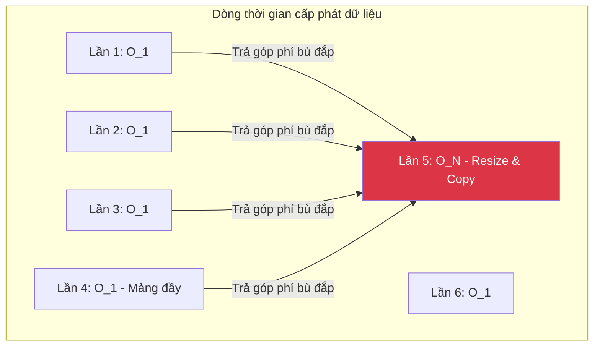

# Bài 3: Phân tích Thời gian Khấu hao (Amortized Analysis)

Khi đánh giá hiệu suất hệ thống bằng Big O (Worst-case), một lỗ hổng phân tích có thể xảy ra: **Có những thuật toán sở hữu một viễn cảnh rủi ro $O(N)$ tồi tệ, nhưng biến cố này xảy ra với một tỷ lệ xác suất cực kỳ nhỏ**. Hầu như toàn bộ chu kỳ sống của nó chỉ tiêu tốn khối lượng tính toán là $O(1)$.

Việc gắn chặt thuật toán đó với cái mác thảm họa $O(N)$ là khiên cưỡng và khiến người kỹ sư thiết kế đưa ra kết luận từ bỏ sai lầm. Để thiết lập bộ quy chuẩn tính toán chính xác trong trường hợp này, Khoa học Máy tính giới thiệu nguyên lý **Phân tích Khấu hao (Amortized Analysis)**.

---

## 1. Bài toán Mở rộng Mảng Động (Dynamic Array)

Khái niệm Khấu hao thể hiện rõ nhất qua cấu trúc **Mảng động** (ví dụ: `ArrayList` trong Java, `std::vector` trong C++ hay `List` trong Python).

Mảng (Array) mặc định trong hệ điều hành là một khối bộ nhớ tĩnh. Nó phải được cấp phát một dung lượng cố định ngay khi khai báo. Tuy nhiên, `ArrayList` che giấu sự bất tiện này, cho phép lập trình viên chèn thêm phần tử liên tục bằng hàm `add()` mà không phải quan tâm tới giới hạn.

Cơ chế hoạt động hệ thống nội ẩn của `ArrayList`:
1. Ban đầu, hệ thống phân bổ một mảng nội bộ (Backing array) tĩnh có sức chứa nhất định (ví dụ: `Capacity = 4`).
2. Khi hệ thống tiến hành thao tác gọi hàm `add()`, chỉ mất $O(1)$ thao tác để chèn trực tiếp tham số vào một ô nhớ chưa được điền.
3. Khi mảng đầy (Kích thước hiện tại chạm tới sức chứa - `Size == Capacity`), cấu trúc bị "Tràn".
4. Để mở rộng, Hệ thống khởi tạo một mảng động bộ trong không gian mới với **Gấp đôi sức chứa** (`Capacity = 8`).
5. Vòng lặp cấp thấp thực thi quá trình **sao chép (Copy) toàn bộ $N$ phần tử cũ** từ dải RAM cũ sang dải mảng mới. Thao tác sao chép này tiêu tốn $O(N)$ độ phức tạp tuyến tính.
6. Hủy bỏ mảng cũ thông qua cơ chế Garbage Collection.

```java
// Logic mô phỏng ArrayList.add()
public void add(int element) {
    if (size == capacity) {
        resize(); // Tiêu tốn O(N) do phải duyệt và copy
    }
    data[size] = element; // Xử lý O(1)
    size++;
}
```

---

## 2. Phân tích Khấu hao (Amortized Analysis)

Nếu đánh giá hàm `add()` trên bằng hệ quy chiếu Big O thông thường, kịch bản tồi tệ nhất (Worst-case) khi hàm kích hoạt lệnh `resize()` sẽ biến hiệu năng chèn mảng thành $O(N)$. 
Nhưng nếu đánh giá sâu xa dựa trên tiến trình luồng sự kiện:
- Phải qua 4 lần chèn mảng nhẹ nhàng $O(1)$, hệ thống mới phải đối mặt với một lần mở rộng kích thước 4 phần tử (Chi phí 4).
- Phải qua 8 lần chèn mảng nhẹ nhàng nữa, hệ thống mới phải đánh trả bằng chi phí 8 thao tác sao chép.

**Thuật toán Kế toán học (Accounting Method):**
Thay vì để 1 chu kỳ gánh toàn bộ chi phí nặng của hàm sao chép, ta "trả góp" (Amortize) chi phí đó chia đều cho các lần vận hành trước đó. Mọi lần gọi hàm `add()` thay vì tốn 1 thao tác, ta giả thiết chúng tốn 3 thao tác ảo (1 thao tác gán trị, và cất đi 2 thao tác "tiền tiết kiệm" để bù đắp sau này dùng để resize).

Khi tính gộp trung bình qua chuỗi thao tác, tổng khối lượng thời gian tiêu tốn tiến tiệm cận về một hằng số giới hạn.

**Kết luận kỹ thuật:** 
Độ phức tạp Khấu hao (Amortized Time Complexity) của việc đẩy dữ liệu vào cuối danh sách Mảng động được công nhận toàn cầu là **$O(1)$ (Hằng số Khấu hao - Amortized Constant Time)**.



---

## 3. Vai trò của Phân tích Khấu hao trong Thiết kế Hệ thống

Khái niệm Khấu hao cung cấp cho kỹ sư góc nhìn hệ thống tổng thể thay vì các số liệu đo lường rời rạc:
- Một thuật toán dù tồn tại một pha xử lý $O(N)$ chậm chạp vẫn hoàn toàn khả thi cho môi trường Sản xuất (Production) nếu tần suất diễn ra biến cố đó rất loãng và dễ dự đoán trong quá trình thiết lập.
- Khi triển khai thuật toán Mảng động, nếu dự đoán trước được dữ liệu sắp tải về từ Database là 100,000 bản ghi, một Lập trình viên cấp cao sẽ luôn khởi tạo ngay sức chứa ban đầu của cấu trúc: `new ArrayList(100000)`. Phương thức này triệt tiêu hoàn toàn sự rủi ro của các pha Resize ẩn $O(N)$, duy trì tiến trình chạy với tốc độ tuyệt đối $O(1)$. 

Đây là một điểm cấu trúc minh họa cho sự thiết lập tinh tế giữa Hiệu năng Hệ điều hành và Thiết kế Cấu trúc Dữ liệu.

---
**Navigation:**
[⬅️ Previous: Bài 2: Phân tích Ký pháp Big O (Big O Notation)](./02-big-o-notation.md) | [Next: Bài 4: Cấu trúc Bộ nhớ Mảng (Arrays) và Danh sách liên kết (Linked Lists) ➡️](./04-arrays-and-linked-lists.md)
