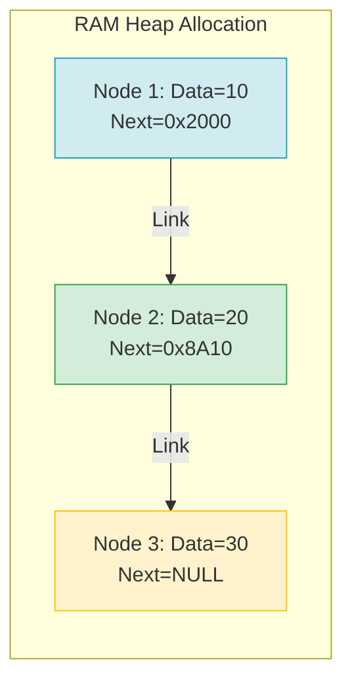

# Bài 4: Cấu trúc Bộ nhớ Mảng (Arrays) và Danh sách liên kết (Linked Lists)

Mảng (Arrays) và Danh sách liên kết (Linked Lists) là hai cấu trúc dữ liệu nền tảng nhất của Khoa học Máy tính. Chúng đại diện cho hai trường phái đối lập trong việc giải quyết bài toán cốt lõi của Hệ điều hành: **Phương pháp phân bổ không gian nhớ (Memory Allocation)**.

Sự khác biệt giữa hai phương pháp này định hình hiệu năng của tất cả các hệ thống dữ liệu tuyến tính phát sinh sau này.

---

## 1. Mảng (Array): Phân bổ Kế tiếp (Contiguous Allocation)

Khi khởi tạo một mảng cơ bản (tĩnh) trong bộ nhớ, Hệ điều hành tìm kiếm một dải không gian RAM **hoàn toàn liên tục và không bị gián đoạn** để cấp phát cho chương trình.

Ví dụ, nếu cấp phát một mảng số nguyên `int A[5]`, trong môi trường Java/C++, mỗi số nguyên chiếm 4 Bytes. Hệ thống sẽ cấp một dải liên tục 20 Bytes (Ví dụ từ địa chỉ `0x1000` đến `0x1013`).

### Hiệu suất của Mảng (Array Performance)

Nhờ đặc tính liên tục vật lý, việc thao tác truy cập trên Mảng sở hữu hiệu năng xuất sắc thông qua **Công thức Tính toán Độ dời (Offset)**:
`Địa chỉ phần tử A[i] = Địa chỉ gốc (Base Address) + i * Kích thước phần tử`

Nếu cần lấy `A[3]`, CPU chỉ cần tính $0x1000 + 3 \times 4 = 0x1012$, rồi dịch chuyển thẳng tới địa chỉ đó để lấy dữ liệu. Quá trình này **không đòi hỏi vòng lặp** mà là một thao tác tính toán số học trực tiếp do Đơn vị Xử lý Số học (ALU) của vi xử lý thực thi.
- **Truy xuất ngẫu nhiên (Random Access):** $O(1)$. Tốc độ cực nhanh.
- **Tối ưu Cache (Cache Locality):** Vi xử lý hiện đại được thiết kế để nạp từng khối dữ liệu liên tiếp vào Cache (L1, L2). Các cấu trúc mảng nhờ ở sát nhau nên được tận dụng sức mạnh phần cứng tối đa.

**Nhược điểm:**
- **Thao tác Chèn/Xóa ở giữa:** Khi chèn phần tử vào vị trí $K$, mọi phần tử từ $K$ đến $N$ bắt buộc phải được dịch chuyển sang phải (hoặc trái nếu xóa) nhằm tạo ô trống, gây tiêu tốn lượng tính toán khổng lồ $O(N)$.
- **Giới hạn Không gian:** Kích thước cố định. Để tăng kích thước, buộc phải phân bổ lại toàn bộ dữ liệu mới (Amortized $O(N)$ đã phân tích ở Bài 3).

---

## 2. Danh sách Liên kết (Linked List): Phân bổ Rời rạc (Dynamic Allocation)

Danh sách liên kết loại bỏ sự phụ thuộc vào khối bộ nhớ liên tục. Dữ liệu được phân bổ một cách rời rạc tại bất kỳ ô trống nào hiện hữu trong Heap Memory.

Để duy trì tính thứ tự tuyến tính, mỗi đối tượng dữ liệu được bọc lại trong một khái niệm trừu tượng gọi là **Nút (Node)**. Mỗi Node không chỉ chứa dữ liệu mà còn mang theo một con trỏ định hướng (Pointer) chứa địa chỉ không gian vật lý của Node kế tiếp.

### Hiệu suất của Linked List

- **Truy xuất dữ liệu (Access):** Do các khối phân bố rời rạc, CPU không thể thực thi phép tính cấp số cộng. Bắt buộc luồng tính toán phải bắt đầu từ khối gốc (Head), đọc địa chỉ rồi dịch chuyển đến Node thứ hai, đọc tiếp, cho đến khi đến vị trí thứ $i$. Độ phức tạp tiệm cận tuyến tính: $O(N)$.
- **Tốn kém Tài nguyên bộ nhớ (Memory Overhead):** Tốn thêm tài nguyên 4-8 bytes trên mỗi Node để duy trì cấu trúc con trỏ, giảm hiệu suất không gian tiệm cận.

**Ưu điểm bù trừ:**
- **Thao tác Chèn/Xóa đầu cực nhanh:** Khi cần chèn một phần tử lên đầu chuỗi danh sách, ta chỉ việc cấp phát một khối mới và nối lại mũi tên trỏ vào nút Head hiện tại. Tốc độ chèn đỉnh tuyệt đối với $O(1)$ mà không cần di dời dữ liệu. Khả năng tương tự khi xóa phần tử ở đầu mút.

---

## 3. Ứng dụng Thiết kế Hệ thống Thực tiễn

Sự đánh đổi (Trade-off) hiệu suất giữa thời gian tính toán và thời gian cấp phát dẫn đến quy hoạch kiến trúc:

1. **Sử dụng Mảng (Arrays/ArrayLists):** Áp dụng trong 90% tình huống truy vấn hệ thống thông thường khi luồng dữ liệu ít biến động kích thước, tỷ lệ tra cứu ngẫu nhiên (Read-heavy) cao. Ví dụ: Các chỉ mục hiển thị bảng điều khiển.
2. **Sử dụng Danh sách Liên kết (Linked Lists):** Dùng trong các môi trường luồng xử lý biến đổi kích thước liên tục (Write/Delete-heavy) ở hai đầu mút giới hạn. Kiến trúc cốt lõi định hình nên các hệ thống dữ liệu mở rộng như Ngăn xếp (Stack), Hàng đợi (Queue), Đồ thị cạnh và Bảng Băm chuỗi (Chaining Hash Table). Tương tác phím (Undo/Redo) hay Lịch sử điều hướng Browser cũng dựa trên nền tảng cấp phát nút rời rạc (Doubly Linked List).

---
**Navigation:**
[⬅️ Previous: Bài 3: Phân tích Thời gian Khấu hao (Amortized Analysis)](./03-amortized-analysis.md) | [Next: Bài 5: Cấu trúc Trạng thái: Ngăn xếp (Stack) và Hàng đợi (Queue) ➡️](./05-stack-and-queue.md)
