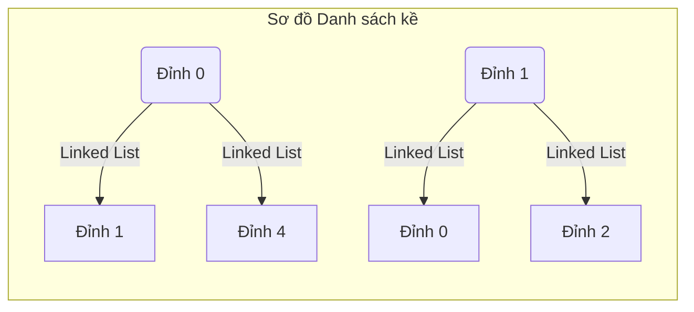

# Bài 9: Phi Tuyến tính Bậc cao: Đồ thị (Graphs)

Nếu Cấu trúc Cây (Tree) mô phỏng giới hạn khắt khe của Hệ phân cấp Tổ chức (Mỗi nút cha có thể có nhiều nhánh con, nhưng mọi nút con chỉ được nối duy nhất với một nút cha), thì môi trường thế giới thực lại sở hữu hình thái tương tác tự do hỗn loạn hơn. 

Mô hình định tuyến hàng không, mạng máy tính Internet, mạng lưới quan hệ xã hội trên Facebook là minh họa của Cấu trúc Dữ liệu Đỉnh cao của Khoa học Máy tính: **Đồ thị (Graphs)**.

---

## 1. Bản chất Cấu trúc Đồ thị

Đồ thị là một cấu trúc dữ liệu lưới mạng (Mesh) Phi tuyến tính, cấu thành từ hai đặc tính hình học cơ bản:
- Tập hợp các **Đỉnh (Vertices - V)**: Các điểm nút biểu thị thực thể (Thành phố, Router mạn, Tài khoản mạng xã hội).
- Tập hợp các **Cạnh (Edges - E)**: Sự nối kết biểu thị mối tương tác giữa các V.

Một Node trong Đồ thị có thể kết nối với 0, 1 hoặc $N$ Node khác biệt, thậm chí kết nối ngược vòng với chính bản thân nó. Không có quy định về Node Rễ (Root Node) hay Nút Lá.

### Định dạng Tính chất Cạnh (Edge Typology)
1. **Có hướng (Directed) vs Vô hướng (Undirected):**
   - Đồ thị Vô hướng: Kết nối tương đồng song phương (Quan hệ Bạn bè trên Facebook - Nếu A là bạn B thì B cũng là bạn A).
   - Đồ thị Có hướng (Digraph): Mạng lưới luồng một chiều (Follower trên Twitter - A theo dõi B không có nghĩa B theo dõi A). Tín hiệu đường truyền một chiều của Router mạng.

2. **Có trọng số (Weighted) vs Không trọng số (Unweighted):**
   - Trọng số có thể coi là đại lượng vật lý đặc tính: Khoảng cách Kilomet giữa 2 đỉnh thành phố, hoặc chi phí thông lượng (Bandwidth) qua mạng Cáp.
   - Ứng dụng để thiết lập bài toán tìm đường đi tối ưu (Dijkstra).

---

## 2. Kiến trúc Biểu diễn Đồ thị trong Bộ Nhớ

Vấn đề cốt lõi của Đồ thị đối với CPU là **Bằng cách nào cấp phát hệ nhị phân Đồ thị trong RAM một cách tối ưu?** Máy tính không thể "nhìn" bằng bản đồ. Hai kiến trúc nền tảng được đề xuất: **Ma trận kề (Adjacency Matrix)** và **Danh sách kề (Adjacency List)**.

### A. Biểu diễn Ma trận Kề (Adjacency Matrix)
Dữ liệu được sắp xếp thẳng dưới dạng một Mảng đa chiều vuông (2D Array) với kích thước $V \times V$.
Tại lưới giao điểm hàng $i$ và cột $j$, Hệ thống ghi vào giá trị `1` (hoặc Trọng số) nếu tồn tại kết nối giữa Đỉnh $i$ và Đỉnh $j$, ghi `0` nếu cô lập.

**Phân tích hiệu năng bộ nhớ:**
Do khởi tạo bằng cấu hình Array liền kề (Contiguous Allocation):
- Điểm mạnh: Kỹ sư có thể xác thực việc tồn tại kết nối $i$ đến $j$ chỉ trong một vi giây toán học cực ngắn $O(1)$ (`matrix[i][j] == 1`).
- **Điểm chết (Fatal flaw):** Độ phức tạp Không gian lưu trữ là $O(V^2)$. Một mạng xã hội 1 triệu tài khoản sẽ yêu cầu cấu trúc Mảng đa chiều 1000 tỷ ô phần tử, ngốn hàng ngàn Gigabyte RAM để biểu diễn một tập hợp chằng chịt các số 0 (Zero Sparse Matrix) khổng lồ không giá trị. 

### B. Biểu diễn Danh sách Kề (Adjacency List)
Phương án tiêu chuẩn phổ quát khắc phục vấn đề của Ma trận là triển khai danh sách dựa trên nền tảng Array phân lớp kết hợp với Linked List hoặc Hash Tables cục bộ. 

Mô hình: Thiết lập một Mảng lõi đại diện cho $V$ Đỉnh. Mỗi khối tại Mảng lõi đó sẽ chứa một con trỏ định vị khởi tạo Chuỗi Linked List rời rạc chứa những đỉnh *có kết nối thực tế*.

**Phân tích hiệu năng bộ nhớ:**
- Điểm mạnh: Không phân bổ bộ nhớ cho các kết nối trống. Không gian lưu trữ tối ưu giới hạn ở mức tổng quát $O(V + E)$ (Số đỉnh cộng số cạnh). Quá trình bổ sung 1 đỉnh mới tiến hành trơn tru $O(1)$.
- Hạn chế: Việc tra soát kết nối phải lặp $O(E)$ để dò trên dải Linked List con.

**Khái quát Ứng dụng:** Với mạng lưới dữ liệu thưa thớt (Mạng giao thông, Lưới tương tác web) kỹ sư mặc định chỉ sử dụng Danh sách kề. Ma trận kề chỉ khả dụng với dạng Đồ thị Dày đặc (Dense Graph - Mọi nốt đều móc nối với tất cả các nút).

Các thuật toán quy hoạch đường đi cho hai dạng Cấu trúc Đồ thị này sẽ được triển khai tại Chương 5 (Kỹ thuật Duyệt BFS/DFS).

---
**Navigation:**
[⬅️ Previous: Bài 8: Cây Tự cân bằng (Self-Balancing Trees) và Quản trị Rủi ro O(N)](./08-balanced-trees.md) | [Next: Bài 10: Tìm kiếm Nhị phân (Binary Search) ➡️](./10-binary-search.md)
