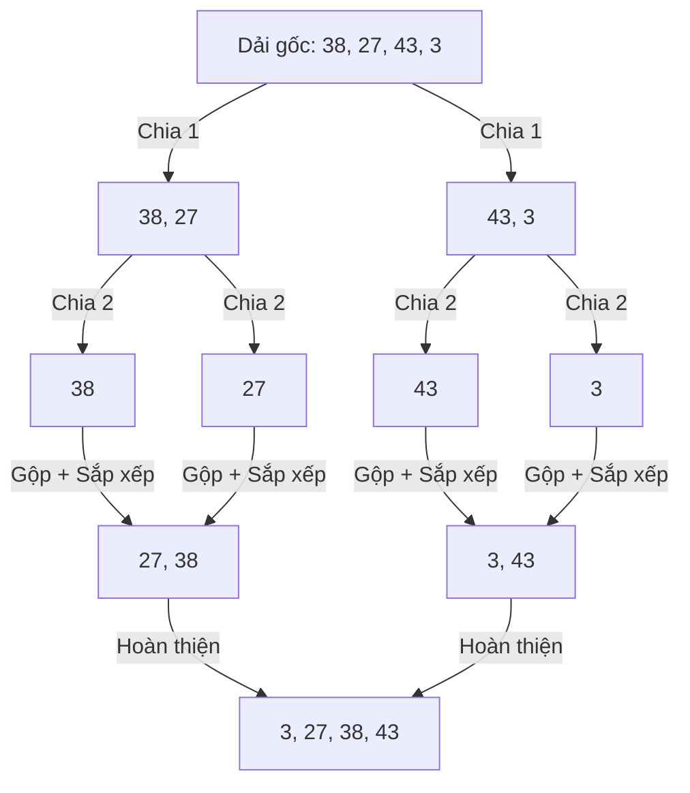

# Bài 12: Kỹ thuật Phân chia để trị (Merge Sort và Quick Sort)

Giới hạn lớn nhất của nhóm Thuật toán Sắp xếp cơ sở là độ trễ thực thi tăng vọt theo cấp số bậc hai $O(N^2)$ khi lượng dữ liệu lớn. Để giải bài toán sắp xếp 1 tỷ bản ghi trên các hệ thống Big Data, kỹ sư máy tính ứng dụng chiến lược thiết kế **Chia để trị (Divide and Conquer)** nhằm đập nát khối lượng tính toán thành nhiều khối rời rạc.

Nguyên lý của Divide and Conquer: Chia nhỏ vấn đề lớn thành nhiều bài toán vi mô, xử lý cục bộ rồi gộp lại kết quả thành mô hình hoàn chỉnh. Đại diện nổi bật nhất của kiến trúc này là **Merge Sort** và **Quick Sort**.

---

## 1. Merge Sort - Thuật toán Gộp Nhất quán

Merge Sort áp dụng phương pháp chia đôi thuần túy, đảm bảo hiệu suất tính toán cực kỳ ổn định bất kể biến cố dữ liệu đầu vào.

**Cơ chế luồng thực thi:**
1. **Divide (Chia phân rã):** Liên tục sử dụng đệ quy để cắt đôi mảng dữ liệu cho đến khi mỗi dải mảng chỉ còn chứa chính xác 1 phần tử. (Theo định nghĩa toán học, mảng 1 phần tử được xem là đã sắp xếp).
2. **Conquer (Gộp đồng thuận):** Gộp từng cặp mảng con nhỏ lại với nhau thành mảng mới đồng thời sắp xếp trật tự các phần tử. Do 2 mảng con đã luôn ở trạng thái được sắp xếp ở bước gộp trước, quá trình chắp nối (Merge) diễn ra cực kỳ nhanh chóng bằng cách dùng 2 con trỏ so sánh lần lượt 2 khối phần tử đầu.

**Phân tích kỹ thuật (Trade-offs):**
- **Thời gian (Time Complexity):** Do chia nhánh nhị phân, cây chia cắt có chiều sâu là $\log N$. Tại mỗi bậc độ sâu, quá trình duyệt và chèn vào mảng đệm mất $O(N)$. Gộp chung lại, khối lượng thời gian luôn bảo đảm ở mức giới hạn tuyệt đối **$O(N \log N)$**. Đây là kết quả tuyệt vời.
- **Không gian (Space Complexity):** Điểm yếu cốt lõi của Merge Sort là tốn RAM. Nó không thể thực thi hoán đổi trực tiếp trong mảng cũ, mà yêu cầu phân bổ mảng Tạm thời (Temporary Buffer) có kích thước tương đương dữ liệu gốc nhằm nhả dữ liệu gộp. Độ phức tạp không gian phụ trợ là **$O(N)$**. 
- Là một **Thuật toán Ổn định (Stable)**, duy trì nguyên vẹn bản ghi định danh song song.

---

## 2. Quick Sort - Tối ưu Bộ nhớ Tĩnh (In-place Sorting)

Để xử lý giới hạn lãng phí RAM của Merge Sort, Quick Sort thiết lập một giải pháp sắp xếp ngầm định sử dụng các khoảng trống sẵn có của mảng gốc (In-place mechanism).

**Cơ chế luồng thực thi:**
1. Cấu trúc Chọn một phần tử bất kỳ trong mảng làm điểm **Trục Cốt lõi (Pivot)**.
2. Xây dựng **Quá trình Phân vùng (Partitioning):** Hệ thống duyệt cấu trúc, dồn tất cả các phần tử nhỏ hơn Pivot về phía bên Trái của nó, và dồn tất cả các phần tử lớn hơn Pivot về phía bên Phải.
3. Khi kết thúc bước 2, Pivot đã yên vị vĩnh viễn đúng tọa độ thực tế của nó trên dải dữ liệu.
4. Triển khai nhánh đệ quy độc lập cho danh sách Bên trái Pivot và danh sách Bên phải Pivot, lặp lại quy trình tái tạo Trục mới.

**Phân tích kỹ thuật:**
- **Không gian (Space Complexity):** Thuật toán hoán đổi (Swap) trực tiếp trên dải biến cũ, nên không yêu cầu khởi tạo vùng Array Tạm thời. Chi phí phụ trợ được nén về $O(\log N)$ (do bộ nhớ cấp phát đệ quy Call Stack), gần đạt giới hạn hằng số tuyệt đối.
- **Thời gian (Time Complexity):** 
  - Kịch bản Lạc quan/Trung bình: Nếu thao tác phân vùng chọn ra điểm Pivot tương đối chuẩn tâm, nó chẻ mảng làm 2 nửa đồng đều, dẫn tới chiều sâu chia nhánh là $\log N$. Khối lượng tổng hợp là **$O(N \log N)$**.
  - **Sự cố Kịch bản Xấu nhất (Worst-case):** Nếu Mảng gốc không may đã được sắp xếp sẵn từ trước (Ví dụ: `1, 2, 3, 4, 5`), và hệ thống mù quáng lấy điểm cuối làm Pivot. Mảng sẽ bị chặt thành 2 nhánh hoàn toàn lệch (Nhánh dài N-1, Nhánh không có). Quá trình bị suy thoái thẳng thành một vòng lặp tuyến tính $O(N^2)$.
- **Độ ổn định:** Quick Sort là một cấu trúc **Không ổn định (Unstable)**.

> [!TIP]
> **Ứng dụng thực tế của Hệ điều hành:**
> Vì rủi ro $O(N^2)$ của Quick Sort, hệ thống lõi thường áp dụng **Randomized Quick Sort** (chọn ngẫu nhiên một biến trong phạm vi làm Pivot) hoặc cấu trúc **Introsort** (Sự kết hợp giữa Quick Sort tốc độ cao ở giai đoạn đầu, nhưng có gắn kèm hệ thống tự giám sát đệ quy, nếu độ sâu vượt quá hàm lượng nhất định, nó lập tức tự phanh luồng và kích hoạt thuật toán Heap Sort nhằm trung hòa rủi ro bùng nổ thời gian).

---
**Navigation:**
[⬅️ Previous: Bài 11: Phân tích Thuật toán Sắp xếp Cơ bản (Basic Sorting Algorithms)](./11-basic-sorting.md) | [Next: Bài 13: Vượt qua Rào cản O(N log N) - Cây Tiền tố (Trie) và Sắp xếp Tuyến tính ➡️](./13-trie-and-radix-sort.md)
