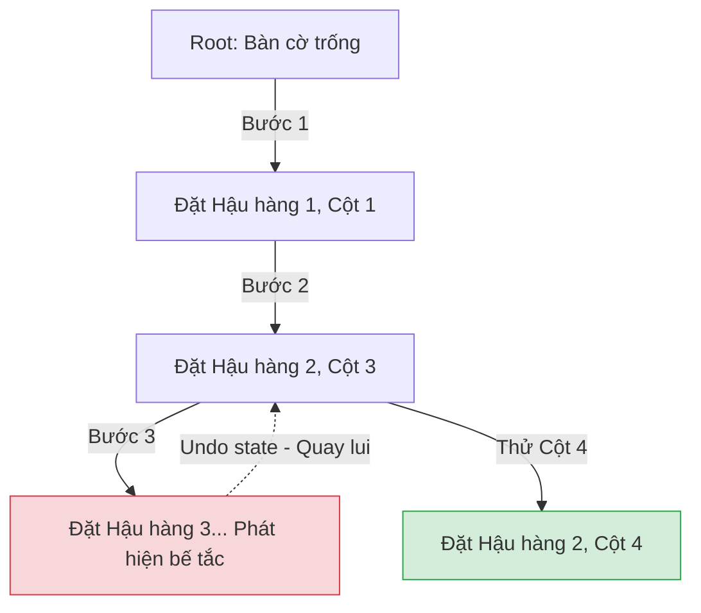

# Bài 14: Tư duy Cấu trúc Phân rã - Đệ quy (Recursion) và Quay lui (Backtracking)

Bước vào nhóm Chương cuối - Các Chiến lược Thiết kế Thuật toán Nâng cao. 
Trong kiến trúc phần mềm, có những bài toán không thể được giải bằng các vòng lặp tuyến tính (For/While) thông thường. Lấy ví dụ việc cấp phát một thuật toán quét toàn bộ hệ thống File trên hệ điều hành Windows: Cấu trúc số lượng thư mục lồng nhau là Vô định, không thể biết trước sâu bao nhiêu tầng để cấu hình số lượng vòng For tương ứng.

Công cụ duy nhất để duyệt qua không gian cấu trúc bất định là **Đệ quy (Recursion)** và kỹ thuật mở rộng của nó: **Quay lui (Backtracking)**.

---

## 1. Bản chất Đệ quy (Recursion)

**Định nghĩa:** Đệ quy là hành vi một phương thức/chương trình tự phân tách bài toán lớn, và tiến hành gọi lại chính bản thân nó trên một phạm vi phân tách nhỏ hơn, liên tục như vậy cho tới khi chạm đáy.

Một cấu trúc Đệ quy hợp lệ toán học và an toàn hệ thống bắt buộc phải sở hữu hai nhân tố thiết kế:
1. **Trường hợp Cơ sở (Base Case):** Mốc ranh giới điểm mù, nơi bài toán đã đủ nhỏ gọn để giải quyết trực tiếp bằng 1 lệnh $O(1)$. Base Case đóng vai trò là Lệnh Hãm Phanh (Brake).
2. **Trường hợp Đệ quy (Recursive Case):** Quá trình phân rã trạng thái tham số để điều hướng nó dần dần hội tụ về Base Case.

**Sự cố Cấu trúc:** Nếu thiết kế thiếu Base Case, Đệ quy sẽ rơi vào vòng xoáy Vô hạn. Vì mỗi lần gọi hàm, hệ điều hành phải trích xuất cấp phát một vùng nhớ nhỏ trên cấu trúc RAM ảo là **Call Stack** (Bài 8 - Part 1), sự tuần hoàn vô hạn sẽ nhanh chóng đánh sập máy tính bằng thông báo lỗi rò rỉ: **Stack Overflow Error**.

### Mô phỏng tính giai thừa
```java
int factorial(int n) {
    if (n <= 1) return 1; // 1. Base Case: Đáy của chuỗi phân rã
    return n * factorial(n - 1); // 2. Recursive Case: Gọi lại chính nó trên không gian n-1
}
```

---

## 2. Kỹ thuật Quay lui (Backtracking)

Khi áp dụng đệ quy cho các bài toán phân nhánh tổ hợp, kỹ thuật **Quay lui (Backtracking)** là hình thái khai thác mạnh mẽ nhất. Backtracking là quá trình xây dựng từng phần của nghiệm, và lập tức hủy bỏ luồng đi nếu phát hiện nhánh đó không thể thỏa mãn ràng buộc tổng thể.

Bài toán kinh điển: **Xếp 8 Quân Hậu trên bàn cờ Vua (8-Queens Problem)** sao cho không quân nào khống chế quân nào.



**Nguyên lý vận hành Backtracking:**
Kỹ thuật này giống như một robot đi vào mê cung. Tại mỗi ngã ba, robot đánh dấu và rẽ vào nhánh đầu tiên. 
- Nếu đến ngõ cụt (Constraint Violation), robot **Khôi phục trạng thái (Backtrack / Undo State)**: Nó lùi lại ngã ba trước đó, xóa bỏ các bước đi lầm đường, và rẽ sang nhánh thứ hai.
- Quá trình "Thử và Lỗi" (Trial and Error) này được lập trình tinh tế, bảo đảm duyệt kiệt quệ 100% không gian cấu trúc nghiệm (State Space Tree).

### Phân tích Hiệu suất
Vì bản chất là Thuật toán Vét cạn (Brute-force) có định hướng, thời gian chạy của Backtracking đối mặt với độ phức tạp cực hạn $O(N!)$ (Giai thừa) hoặc $O(2^N)$ (Hàm mũ). Mặc dù cơ chế "Cắt tỉa nhánh sai" (Pruning) giúp loại bỏ sớm các vòng lặp vô ích, thuật toán này chỉ khả thi trên môi trường lượng phần tử $N$ cực nhỏ (Thường $N < 20$).

Khi khối lượng bài toán vươn ra khỏi năng lực của Backtracking, Khoa học Máy tính cần một kỹ thuật lưu trữ ghi nhớ nhằm tránh việc tính toán lại những nhánh đã đi qua, đó chính là **Quy hoạch động**.

---
**Navigation:**
[⬅️ Previous: Bài 13: Vượt qua Rào cản O(N log N) - Cây Tiền tố (Trie) và Sắp xếp Tuyến tính](./13-trie-and-radix-sort.md) | [Next: Bài 15: Quy hoạch động (Dynamic Programming) ➡️](./15-dynamic-programming.md)
