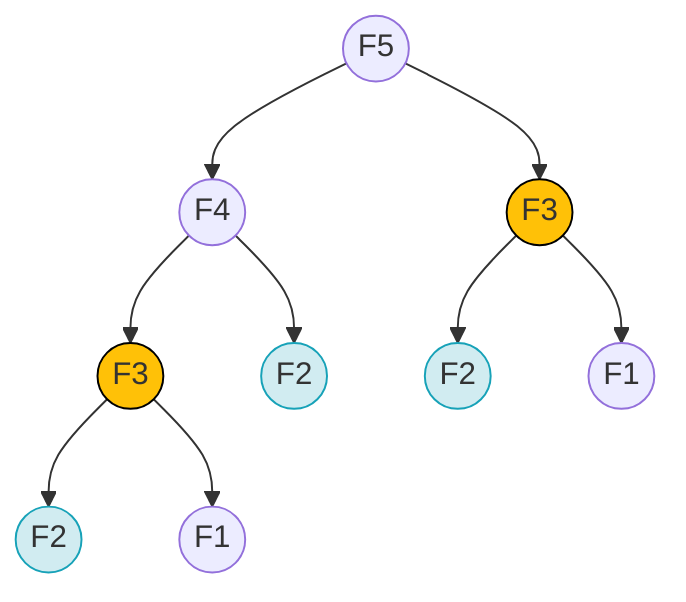

# Bài 15: Quy hoạch động (Dynamic Programming)

Tại những bài toán phân rã cấu trúc phức tạp bằng Đệ quy (Recursion), một điểm nghẽn hiệu suất cực kỳ phổ biến xuất hiện: **Sự Chồng chéo Bài toán con (Overlapping Subproblems)**. 

Quy hoạch động (Dynamic Programming - DP) là phương pháp tối ưu hóa đột phá, giúp biến một hệ thống thuật toán hàm mũ $O(2^N)$ chậm chạp trở thành một thuật toán chạy mượt mà ở mức độ đa thức $O(N)$ hoặc $O(N^2)$.

---

## 1. Rủi ro của Overlapping Subproblems

Hãy xem xét cấu trúc toán học của chuỗi số Fibonacci: `F(n) = F(n-1) + F(n-2)`.

Nếu triển khai nó bằng một Đệ quy truyền thống:
```java
int fib(int n) {
    if (n <= 1) return n;
    return fib(n - 1) + fib(n - 2);
}
```



Trong sơ đồ gọi hàm trên để tính $F(5)$, vi xử lý phải tính toán giá trị của $F(3)$ hai lần hoàn toàn riêng biệt. $F(2)$ bị gọi lại đến 3 lần. Nếu tính $F(50)$, hệ thống sẽ gọi các hàm lặp lại hàng nghìn tỉ lần, triệt tiêu toàn bộ chu kỳ xung nhịp CPU và không bao giờ xuất ra được kết quả trong một thời gian thực.
Sự thảm họa này được gọi là sự phung phí tài nguyên tính toán lặp (Redundant calculations).

---

## 2. Dynamic Programming: Kỹ thuật Bàn nhớ (Memoization - Top-down)

Triết lý của Quy hoạch động là: **"Những gì đã tính toán rồi, tuyệt đối không tính lại lần thứ hai"**. 
Kỹ thuật **Memoization** (Không phải Memorization) tích hợp một kho lưu trữ cục bộ (Bộ nhớ đệm/Cache) như Array hoặc Hash Table gắn kèm vào luồng đi của đệ quy.

1. Trước khi bắt tay vào tính $F(X)$, hệ thống gọi lệnh `Lookup` kiểm tra trong Kho lưu trữ. Nếu đã có dữ liệu, trả kết quả ngay tức khắc ($O(1)$) cắt đứt chuỗi đệ quy con.
2. Nếu chưa có, tiến hành tính toán.
3. Khi tính xong $F(X)$, lập tức cất kết quả đó vào Kho lưu trữ, rồi mới trả về.

```java
// Mảng lưu bộ nhớ đệm (Cache)
int[] memo = new int[100]; 

int fibDP(int n) {
    if (n <= 1) return n;
    if (memo[n] != 0) return memo[n]; // Đã có sẵn thì trả về
    
    memo[n] = fibDP(n - 1) + fibDP(n - 2); // Lưu kết quả trước khi Return
    return memo[n];
}
```
Nhờ Memoization, hệ thống chặt đứt mọi nhánh cây lặp lại, biến không gian gọi đệ quy $O(2^N)$ xuống còn đúng một đường tuyến tính $O(N)$.

---

## 3. Dynamic Programming: Kỹ thuật Bảng phương án (Tabulation - Bottom-up)

Kỹ thuật Memoization giải quyết triệt để tốc độ thời gian, nhưng lại bảo lưu một điểm nghẽn về Không gian (Space): Kỹ thuật này vẫn phải phụ thuộc đệ quy, tức nó vẫn tốn thêm bộ nhớ Call Stack của hệ điều hành.

Thay vì gọi ngược từ đỉnh xuống đáy (Top-down), ta có thể lật ngược tư duy bằng phương pháp **Tabulation (Bottom-up)**.
Ta khởi tạo một mảng Bảng phương án, bắt đầu tính các mốc ranh giới cơ sở $F(0), F(1)$ rồi duyệt vòng `For` tuyến tính để cộng dồn lên dần $F(N)$.

```java
int fibTabulation(int n) {
    int[] dp = new int[n + 1];
    dp[0] = 0; dp[1] = 1;
    
    for (int i = 2; i <= n; i++) {
        dp[i] = dp[i - 1] + dp[i - 2]; // Giải quyết bài toán trên mảng tuần tự
    }
    return dp[n];
}
```
Phương án này loại trừ hoàn toàn Đệ quy, giải tỏa hoàn toàn áp lực lên Ngăn xếp bộ nhớ của hệ thống (Zero Stack Overflow Risk). Trong các hệ thống Production, Tabulation là hướng tối ưu hóa dữ liệu số 1 cho các bài toán phân rã.

> [!NOTE]
> **Nhận diện Quy hoạch động:** Bài toán có thể giải quyết bằng DP phải thỏa mãn hai yếu tố. Thứ nhất: *Có cấu trúc bài toán con chồng chéo*. Thứ hai: *Cấu trúc con tối ưu (Optimal Substructure)* - Kết quả của bài toán lớn được tạo thành trực tiếp từ sự kết hợp kết quả của các bài toán nhỏ bên trong nó.

---
**Navigation:**
[⬅️ Previous: Bài 14: Tư duy Cấu trúc Phân rã - Đệ quy (Recursion) và Quay lui (Backtracking)](./14-recursion-and-backtracking.md) | [Next: Bài 16: Thuật toán Tham lam (Greedy Algorithms) ➡️](./16-greedy-algorithms.md)
