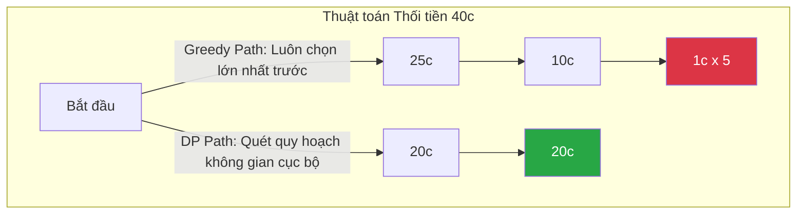

# Bài 16: Thuật toán Tham lam (Greedy Algorithms)

Trong phổ kỹ thuật Thiết kế thuật toán, nếu Quy hoạch động (Dynamic Programming - DP) là sự phân tích hoàn mỹ và tính toán thận trọng dựa trên nền tảng quá khứ để đưa ra quyết định tổng thể cuối cùng, thì **Thuật toán Tham lam (Greedy Algorithms)** lại hoạt động theo nguyên tắc tiếp cận thiển cận nhưng cực kì nhanh chóng.

Định nghĩa cốt lõi: Thuật toán Tham lam luôn thực hiện sự lựa chọn **tốt nhất ở khoảnh khắc hiện tại (Local Optimum)**, với một niềm hy vọng toán học rằng sự tập hợp của hàng loạt các lựa chọn cục bộ xuất sắc sẽ dẫn đến **Kết quả tối ưu toàn cục (Global Optimum)**.

---

## 1. Bản chất và Kịch bản Vận hành

Để thấy rõ sự khác biệt giữa Greedy và DP, hãy xem bài toán thối tiền (Coin Change Problem).
Giả sử có bộ đồng xu với mệnh giá chuẩn của Mỹ: `25c`, `10c`, `5c`, `1c`. Cần thối lại số tiền `36c` bằng ít đồng xu nhất có thể.

**Tiếp cận Greedy:**
1. Thuật toán cố gắng lấy mệnh giá lớn nhất có thể trước (Ưu tiên cục bộ cao nhất).
2. Lấy được 1 xu `25c` (Còn nợ 11c).
3. Lấy tiếp xu `10c` lớn nhất (Còn nợ 1c).
4. Lấy 1 xu `1c` (Đủ).
*Kết quả:* Trả về 3 đồng xu. Đây là đáp án đúng và thời gian xuất kết quả ngay lập tức $O(N)$.

Tuy nhiên, **Greedy sẽ sụp đổ (Fail)** khi hệ thống số đếm thay đổi.
Giả sử hệ thống phát hành bộ tiền ảo có mệnh giá: `25c`, `20c`, `10c`, `1c`. Cần thối lại `40c`.
1. Luồng Greedy tiếp tục bị thu hút bởi số lớn nhất: Lấy 1 xu `25c` (Còn nợ 15c).
2. Lấy 1 xu `10c` (Còn nợ 5c).
3. Buộc phải lấy thêm 5 xu `1c`.
*Kết quả Greedy:* 7 đồng xu. 
*Kết quả Thực tế (DP):* Khách hàng chỉ cần 2 đồng xu mệnh giá `20c + 20c`.

**Nhận định kỹ thuật:** Thuật toán Tham lam cực nhanh và cấu trúc mã nguồn ngắn gọn, nhưng nó bị giới hạn tính khả thi. Kỹ sư chỉ được phép triển khai luồng Greedy khi đã chứng minh được mặt toán học rằng Bài toán sở hữu *Tính chất Lựa chọn Tham lam (Greedy Choice Property)* - nơi sự lựa chọn hiện tại không bao giờ hối hận hoặc làm triệt tiêu các cơ hội tốt hơn ở tương lai.

---

## 2. Ứng dụng Giải thuật Mạng lưới Thực tiễn

Mặc dù rủi ro tính toán sai số, Greedy vẫn là xương sống của rất nhiều thuật toán Mạng phân tán nổi tiếng thế giới do tốc độ cấu trúc bậc nhất:

1. **Thuật toán Cây Khung Nhỏ nhất (Minimum Spanning Tree):** 
   Các mạng lưới viễn thông (Điện lực, Mạng Lan) cấu hình cáp sử dụng thuật toán Prim hoặc Kruskal. Chúng tuân thủ triệt để tính Tham lam: "Cứ chọn đoạn cáp gần nhất có chi phí thấp nhất mà không tạo thành vòng lặp, hệ thống cuối cùng sẽ kết nối được mọi thành phố với tổng chi phí cáp rẻ nhất toàn cầu".
2. **Nén dữ liệu Huffman (Huffman Coding):**
   Giao thức nén File ZIP và định dạng ảnh JPEG sử dụng Cây Huffman để nén ký tự. Thuật toán Tham lam ở đây là: Ký tự nào xuất hiện với tần suất nhiều nhất trong văn bản, sẽ được mã hóa bằng chuỗi bit ngắn nhất. 
3. **Các bài toán Lập lịch (Task Scheduling):**
   Trong hệ điều hành, OS phân bổ tài nguyên cho hàng loạt các ứng dụng (Tiến trình đang chờ). Để giải quyết tối đa số tác vụ trong 1 giây, OS dùng quy tắc Greedy: Ưu tiên nhặt tiến trình có "Thời gian kết thúc sớm nhất" chạy trước.

Với môi trường mạng Mesh phức tạp, đôi khi kết quả tối ưu 90% (Sub-optimal) với thời gian thực thi 1 mili-giây của Tham lam đáng giá hơn kết quả hoàn hảo 100% nhưng phải chạy mất 10 phút của Quy hoạch động/Backtracking. Lựa chọn nằm ở khả năng phân tích Trade-off của Kỹ sư Cấu trúc Phần mềm.

---
**Navigation:**
[⬅️ Previous: Bài 15: Quy hoạch động (Dynamic Programming)](./15-dynamic-programming.md) | [Next: Bài 17: Thuật toán Duyệt Đồ thị (BFS, DFS) và Đường đi Ngắn nhất ➡️](./17-graph-traversal-and-shortest-path.md)
