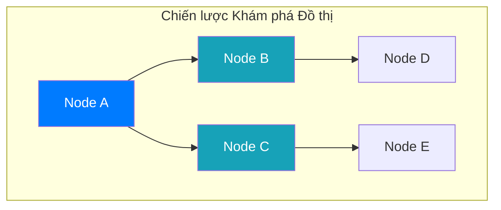

# Bài 17: Thuật toán Duyệt Đồ thị (BFS, DFS) và Đường đi Ngắn nhất

Chuyên đề cuối cùng khép lại lộ trình DSA tập trung vào lĩnh vực phức tạp nhất của Phi tuyến tính: **Trích xuất thông tin Đồ thị (Graphs)**. Hệ thống Mạng Internet, hệ thống Bản đồ số (Google Maps) vận hành trơn tru đều dựa trên nền tảng của 3 hạt nhân thuật toán cốt lõi.

---

## 1. Duyệt Đồ thị theo Chiều rộng (Breadth-First Search - BFS)

BFS mô phỏng cách lan truyền của một gợn sóng nước. Từ tâm chấn (Đỉnh rễ gốc), sóng lan dần ra tất cả các đỉnh lân cận ở độ sâu cấp độ 1, sau đó mới tràn tiếp sang độ sâu cấp độ 2.

**Cấu trúc dữ liệu Vận hành:** 
Hệ điều hành sử dụng một **Hàng đợi (Queue - Cơ chế FIFO)** để duy trì trật tự lan truyền. Khi một đỉnh được khám phá, toàn bộ các đỉnh kề với nó được đẩy xuống cuối Hàng đợi. Đỉnh đầu hàng đợi được xử lý và vứt bỏ, quy trình lặp lại.

**Đặc tính Kỹ thuật & Ứng dụng:**
- Vì tính chất lan tỏa đều ra các lớp không gian, BFS được ứng dụng trực tiếp trong bài toán **Tìm đường đi ngắn nhất trên Đồ thị Không Trọng số**. Điểm nào sóng chạm đến đầu tiên chắc chắn là đường rẽ qua ít cạnh kết nối nhất.
- Khám phá mạng xã hội (Peer-to-Peer): Thuật toán "Những người bạn có thể biết" trên Facebook sử dụng BFS để đề xuất bạn bè của bạn bè ở Cấp độ 2.
- Hiệu suất Thời gian: $O(V + E)$ (với V là số đỉnh, E là số cạnh kết nối).

---

## 2. Duyệt Đồ thị theo Chiều sâu (Depth-First Search - DFS)

DFS sở hữu cơ chế hoàn toàn đối lập: Trực tiếp đi sâu xuống tận cùng của một nhánh, gặp ngõ cụt mới tiến hành Quay lui (Backtracking) để đi tiếp nhánh khác.

**Cấu trúc dữ liệu Vận hành:**
Thay vì Hàng đợi, DFS ứng dụng nền tảng của **Ngăn xếp (Stack - Cơ chế LIFO)** hoặc dựa thẳng vào Ngăn xếp Hàm của Hệ điều hành (Call Stack / Recursion).

*Ghi chú Cấu trúc:* 
- Nếu luồng chạy ưu tiên trình tự A -> B -> C -> D -> E, đó là sóng loang BFS.
- Nếu luồng chạy ưu tiên đâm thủng A -> B -> D rồi mới vòng lại C -> E, đó là mũi khoan DFS.

**Đặc tính Kỹ thuật & Ứng dụng:**
- Vì khả năng vạch luồng đi triệt để, DFS là nòng cốt để phát hiện Đồ thị có chứa chu trình tuần hoàn (Cycle Detection) nhằm phá hủy các bế tắc Deadlock của cơ sở dữ liệu (Database Deadlocks).
- Giải toán Mê cung, Phân tích Cấu trúc Liên thông (Connected Components) của đồ thị.

---

## 3. Thuật toán Dijkstra: Con đường Tối ưu (Shortest Path)

Đối với các hệ thống bản đồ (Google Maps), đồ thị giao thông là một cấu trúc **Có Trọng số (Weighted Graph)** - các con đường ngắn về mặt vật lý nhưng có độ kẹt xe cao sẽ bị gán điểm chi phí (Trọng số) rất lớn. BFS không thể đối phó với dữ liệu trọng số này, thay vào đó là vị vua của Định tuyến: **Thuật toán Dijkstra** (Sáng lập bởi Edsger W. Dijkstra năm 1956).

**Bản chất Hoạt động:**
Dijkstra là sự thăng hoa của **Thuật toán Tham lam (Greedy)** kết hợp cấu trúc **Hàng đợi Ưu tiên (Priority Queue / Min-Heap)**.
1. Từ điểm xuất phát, hệ thống phát tán khoảng cách dự kiến đến tất cả các đỉnh lân cận và tống chúng vào một Hàng đợi Ưu tiên.
2. Tại mỗi bước lặp, hệ thống sử dụng lòng "Tham lam": Luôn "nhặt" cái Đỉnh đang có khoảng cách tổng tạm thời là Ngắn nhất nằm trên Đỉnh cấu trúc Heap để duyệt.
3. Từ đỉnh ngắn nhất này, rà soát tiếp các đỉnh kết nối. Nếu phát hiện một con đường nối tiếp giúp đường đi đến đỉnh tiếp theo rẻ hơn khoảng cách kỷ lục đã ghi nhận, hệ thống **Ghi đè nới lỏng (Relaxation)** điểm kỷ lục đó.
4. Thuật toán dừng lại khi Mạng lưới Ưu tiên hoàn toàn cạn kiệt. Lộ trình tối ưu toàn cầu đã được thiết lập.

**Ranh giới Kỹ thuật:**
Sức mạnh truy quét quy mô hành tinh của Dijkstra duy trì cực độ nhờ vào cấu trúc Min-Heap của RAM, nén thời gian vận hành xuống $O(E \log V)$. 
Tuy nhiên, yếu huyệt cấu trúc của Dijkstra là nó **Sụp đổ hoàn toàn trước các Đồ thị Trọng số Âm (Negative Weights)**. Nếu đường đi bị cấu hình âm, lòng tham của Dijkstra sẽ mắc kẹt vào các vòng lặp Vô cực (Infinite Loop). Tại phân khúc khắc nghiệt này, Khoa học Máy tính cần triệu hồi biến thể Bellman-Ford để xử lý an toàn hệ thống.

---
**Navigation:**
[⬅️ Previous: Bài 16: Thuật toán Tham lam (Greedy Algorithms)](./16-greedy-algorithms.md)
