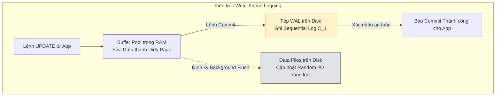

# Bài 3: Giao dịch ACID và Nhật ký Ghi trước (WAL)

Sau khi giải quyết bài toán Truy vấn, Hệ quản trị cơ sở dữ liệu (DBMS) phải đối mặt với thách thức khắc nghiệt nhất của việc Lưu trữ: **Làm thế nào để đảm bảo tính toàn vẹn của dữ liệu trong các tình huống máy chủ bị sập đột ngột do mất nguồn (Crash/Power Failure)?**

Đây là nhiệm vụ mà File System của hệ điều hành thông thường không thể xử lý. CSDL được thiết kế với chuẩn mực **ACID** và cơ chế **Write-Ahead Logging (WAL)**.

---

## 1. Cơ sở lý thuyết: Mô hình ACID

ACID là tiêu chuẩn bảo hộ trạng thái của một Giao dịch (Transaction). Một Transaction là một khối gộp gồm nhiều lệnh thao tác CSDL mang ý nghĩa nghiệp vụ không thể chia nhỏ. (Ví dụ: Việc chuyển tiền gồm thao tác: Trừ 100$ của A, và Cộng 100$ cho B).

1. **A - Atomicity (Tính Nguyên tử):** "Tất cả hoặc Không gì cả". Nếu giao dịch có 5 bước, và bước 3 gặp lỗi, DBMS có trách nhiệm thu hồi (Rollback) toàn bộ kết quả của 2 bước trước đó, đảm bảo DB trở lại trạng thái sạch như chưa từng có lệnh nào được chạy.
2. **C - Consistency (Tính Nhất quán):** Dữ liệu trước và sau Transaction phải luôn thỏa mãn mọi Constraint (Khóa ngoại, Giới hạn dương/âm) của lập trình viên thiết kế.
3. **I - Isolation (Tính Cô lập):** Khi 10.000 user cùng mua hàng, các giao dịch diễn ra song song không được phép nhìn thấy dữ liệu "tạm thời đang tính toán" của nhau. (Sẽ được đi sâu vào Bài 7, 8).
4. **D - Durability (Tính Bền vững):** Khi Transaction đã báo `Commit` (Thành công) về phía ứng dụng người dùng, dữ liệu đó **chắc chắn 100% không thể mất đi**, dù hệ thống lập tức nổ tung sau micro-giây báo cáo.

---

## 2. Nút thắt của việc Ghi đĩa Trực tiếp (Direct Disk Write)

Khi người dùng chạy lệnh `UPDATE users SET balance = 50`, hệ thống cần thực hiện 2 thao tác chậm chạp:
- Tìm kiếm Page 8KB chứa dữ liệu dòng đó trên đĩa.
- Gọi hệ điều hành đè lệnh cập nhật (Random Disk I/O) trực tiếp vào rãnh Page vật lý đó.

**Rủi ro kép:** 
1. Thao tác Random I/O trên ổ cứng rất đắt đỏ (làm tốc độ xử lý tụt xuống mốc chỉ vài trăm giao dịch/giây).
2. Nếu Transaction dài gồm 10 bảng, DB đang ghi đến bảng thứ 5 thì máy sập nguồn (Crash). Khi mở máy lại, dữ liệu trên đĩa bị nửa nạc nửa mỡ, không thể phục hồi lại (Tính Nguyên tử A bị phá vỡ).

---

## 3. Kiến trúc Đột phá: Write-Ahead Logging (WAL)

Để dung hòa tốc độ và tính Bền vững, các kiến trúc sư (từ Oracle, PostgreSQL) đã thiết lập mô hình **Nhật ký Ghi trước (WAL)**.
WAL hoạt động dựa trên nguyên tắc: **Ghi chép sự kiện thay đổi vào cuốn nhật ký nhanh chóng trước khi thay đổi thực sự dữ liệu**.

### Luồng Hoạt động Cơ học (Under-the-hood Execution)

Khi lệnh `UPDATE` tới máy chủ, hệ thống không ghi thẳng xuống Data Files. Nó tuân thủ 3 pha cấu trúc:

1. **Pha Bộ nhớ (In-memory Buffer Pool):** 
   DB load Page chứa dữ liệu cần sửa từ Đĩa lên bộ nhớ RAM. Cập nhật `balance = 50` vào bản đồ RAM đó. Page này được hệ thống gắn nhãn là "Dirty Page" (Page đã bị sửa nhưng chưa kịp lưu vào ổ cứng). Tốc độ thao tác: Nano giây.

2. **Pha Nhật ký (Log Append-Only Write):**
   Thay vì ghi Data, DB khởi tạo một đoạn thông điệp nhật ký rất nhỏ: *"Transaction 99: Thay thế vị trí X của Page Y thành số 50"*. 
   Thông điệp này lập tức được ném vào một tệp tin tĩnh có tên là **WAL File** trên đĩa. Quá trình ghi WAL File sử dụng công nghệ **Sequential I/O** (Ghi nối tiếp tuyến tính theo luồng) - nhanh hơn hàng trăm lần so với việc đầu từ ổ cứng phải chạy nhảy Random I/O để ghi Data Page.
   Khi đoạn WAL được xác nhận đã ghi vào File trên đĩa thành công, DB lập tức báo `Commit Success` cho Ứng dụng.

3. **Pha Đồng bộ Đệm (Checkpointing / Flush):**
   Một tiến trình nền (Background Worker) của DB sẽ định kỳ chạy ngầm vài phút một lần. Nó gom tất cả các "Dirty Page" trên RAM (có thể chứa hàng nghìn thay đổi) và gọi Disk I/O để ghi đè (Flush) chúng xuống tệp Data Files vật lý trên ổ đĩa. 

### Cơ chế Phục hồi Sự cố (Crash Recovery)

Nếu xảy ra sự cố sập máy chủ, điều kiện vật lý là: Các "Dirty Page" trong RAM bốc hơi toàn bộ, tệp Data Files dưới đĩa vẫn mang giá trị cũ (chưa kịp Flush ngầm).
Tuy nhiên, DB không bị hoảng loạn. Khi khởi động lại hệ thống, Hệ điều hành kích hoạt luồng **Redo Phase**:
- Đọc lại toàn bộ nội dung tệp WAL File cứng đầu (Nó không mất vì đã được ghi).
- Chạy lại lần lượt mọi mô tả sự thay đổi có trong file WAL để tái tạo lại toàn bộ các "Dirty Page" bị mất vào RAM.
- Các Transaction đã Commit đều được phục hồi 100% nguyên vẹn (Đảm bảo chữ Durability). 
- Bất kỳ log nào chưa đóng mác Commit sẽ bị hủy bỏ (Đảm bảo chữ Atomicity).

Kiến trúc WAL là phát minh vĩ đại đã tạo ra tiêu chuẩn thiết kế vĩnh cửu cho hệ sinh thái phần mềm Storage toàn cầu, bao gồm cả RDBMS (PostgreSQL) lẫn NoSQL (Cassandra, MongoDB với Oplog).

---
**Navigation:**
[⬅️ Previous: Bài 2: Kiến trúc Indexing Cốt lõi: B-Tree và Hash Index](./02-database-indexing-and-btrees.md) | [Next: Bài 4: Định lý CAP, PACELC và Thiết kế Đánh đổi Hệ thống Phân tán ➡️](./04-cap-theorem-and-pacelc.md)
