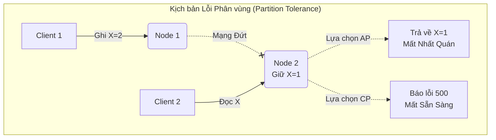

# Bài 4: Định lý CAP, PACELC và Thiết kế Đánh đổi Hệ thống Phân tán

Khi cơ sở dữ liệu phình to vượt quá sức chứa và năng lực xử lý (CPU/RAM) của một cỗ máy chủ vật lý đơn lẻ (Single-node Database), các Data Engineer buộc phải triển khai giải pháp lưu trữ ngang: **Hệ thống Phân tán (Distributed Systems)**. Hàng chục, hàng trăm máy chủ (Nodes) được liên kết qua mạng nội bộ để cùng vận hành một kho dữ liệu chung.

Nhưng thế giới mạng lưới vật lý chứa đầy khiếm khuyết. Hệ thống phân tán mở ra một thách thức thiết kế được Khoa học Máy tính quy chuẩn hóa thành Định lý CAP.

---

## 1. Định lý CAP (CAP Theorem)

Được phát biểu bởi Eric Brewer (Năm 2000), Định lý khẳng định: **"Trong một hệ thống tính toán phân tán, không thể nào đảm bảo thỏa mãn đồng thời và tuyệt đối cả 3 thuộc tính: Tính Nhất quán (C), Tính Sẵn sàng (A), và Khả năng chịu lỗi phân vùng (P)."** Mạng lưới chỉ được chọn 2.

### A. Định nghĩa 3 Thuộc tính
1. **Consistency (Tính Nhất quán):** Mọi client truy cập vào bất kỳ Node nào trong mạng lưới tại cùng một thời điểm, đều phải nhận được cùng một phiên bản dữ liệu mới nhất. (Nếu Node 1 vừa được Update, Node 2 phải lập tức trả về data đã Update đó, hoặc báo lỗi chờ, tuyệt đối không được trả data cũ).
2. **Availability (Tính Sẵn sàng):** Mọi request gửi đến hệ thống (nếu Node đó chưa chết) đều phải nhận được một phản hồi dữ liệu (Không báo lỗi chờ), ngay cả khi dữ liệu đó có thể là phiên bản cũ.
3. **Partition Tolerance (Khả năng chịu lỗi Phân vùng mạng):** Hệ thống vẫn phải tiếp tục vận hành ngay cả khi đường cáp mạng giữa các Node bị đứt, khiến các Node không thể nói chuyện được với nhau (Tạo thành các cụm đảo cô lập).

### B. Sự đánh đổi Bắt buộc (The Inevitable Trade-off)
Trong thế giới thực, rủi ro đứt cáp mạng, rớt gói tin giữa các switch router là **Điều chắc chắn xảy ra**. Tức là yếu tố `P` là bắt buộc phải có để hệ thống tồn tại. Khi chữ `P` xảy ra (Node A mất liên lạc với Node B), hệ thống chỉ còn quyền chọn 1 trong 2 con đường:

- **Hệ thống CP (Ưu tiên Nhất quán):** Khi mạng đứt, Node A vừa nhận 1 Update mới nhưng không thể đồng bộ báo cho Node B biết. Để giữ tính Nhất quán, hệ thống quyết định: Đánh sập luôn các request đọc vào Node B, báo lỗi "Hệ thống đang lỗi đồng bộ". Giữ được chữ `C`, nhưng hi sinh chữ `A`. (Đại diện: HBase, MongoDB, Redis Cluster).
- **Hệ thống AP (Ưu tiên Sẵn sàng):** Node B vẫn mỉm cười chấp nhận request đọc của khách hàng và tự tin trả về dữ liệu cũ (Stale data) mà nó đang giữ. Giữ được chữ `A`, nhưng vi phạm chữ `C` (Dữ liệu trả về không phải là mới nhất). (Đại diện: Cassandra, DynamoDB).

---

## 2. Định lý Mở rộng PACELC

CAP Theorem bị giới hạn vì nó chỉ giải thích hệ thống *vào lúc mạng bị đứt*. Sự thật là 99.9% thời gian mạng lưới hoạt động bình thường, vậy hệ thống sẽ ưu tiên cái gì? 
Định lý **PACELC** (Daniel Abadi, 2010) mở rộng toàn diện:

> **PAC**: If Partition (P) happens, how does the system trade off Availability (A) and Consistency (C)?
> **ELC**: Else (E), when the system is running normally, how does it trade off Latency (L) and Consistency (C)?

Chữ **ELC (Else - Latency vs Consistency)**: Khi mạng nội bộ ổn định, nếu User gửi lệnh Write vào Node 1, Node 1 phải gửi thông báo đồng bộ sang Node 2.
- **Ưu tiên C (Consistency):** Node 1 phải chờ Node 2 xác nhận đã nhận xong data, rồi mới trả OK về cho User. Dữ liệu chuẩn xác 100%, nhưng User phải chịu **Độ trễ cao (High Latency)**.
- **Ưu tiên L (Latency):** Node 1 vừa ghi vào ổ cứng của mình xong là báo OK cho User luôn (rất nhanh), chuyện đồng bộ sang Node 2 để hệ thống tự động xử lý ngầm (Background). Nếu User lập tức đọc từ Node 2 có thể bị lệch data vài mili-giây. Đây gọi là cơ chế **Eventual Consistency (Nhất quán Dần dần)**.

### Tầm quan trọng đối với Data Engineer
Hiểu được CAP và PACELC là điều kiện bắt buộc để thiết kế hệ thống Big Data. 
- Nếu xây dựng hệ thống Kế toán/Giao dịch ngân hàng: Bắt buộc chọn kiến trúc CP và EC (Chấp nhận web hơi chậm, miễn là không bao giờ sai 1 cent).
- Nếu xây dựng hệ thống Đếm Like/View Facebook hoặc Log giỏ hàng E-commerce: Bắt buộc chọn AP và EL (Sẵn sàng 100%, hiển thị View chậm vài giây hoặc sai một tí không sao, nhưng tốc độ click Like phải tức thì).

---
**Navigation:**
[⬅️ Previous: Bài 3: Giao dịch ACID và Nhật ký Ghi trước (WAL)](./03-wal-and-acid-transactions.md) | [Next: Bài 5: Nhân bản Dữ liệu (Replication) và Thuật toán Đồng thuận Quorum ➡️](./05-replication-and-consensus.md)
