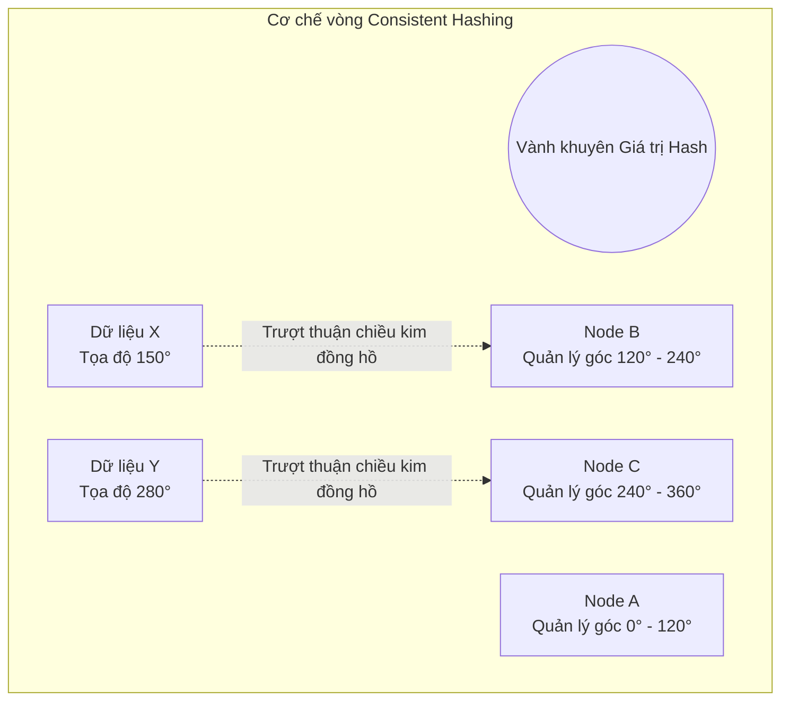

# Bài 6: Phân mảnh ngang (Sharding) và Băm nhất quán (Consistent Hashing)

Cơ chế Replication (Bài 5) giúp phòng chống thảm họa rủi ro và tăng cường tốc độ Đọc (Read), nhưng nó **hoàn toàn vô dụng** trước giới hạn của năng lực Ghi (Write) và Khối lượng Lưu trữ (Storage). 

Nếu hệ thống thu thập 10 Terabyte dữ liệu mỗi tháng, bạn không thể nhồi nhét tất cả vào một máy chủ (Dù bạn có Replication ra 10 máy, thì mỗi máy vẫn phải gánh đủ 10 Terabyte). 
Giải pháp duy nhất của Data Engineer để vượt qua bức tường giới hạn vật lý này là băm nát cấu trúc dữ liệu khổng lồ thành nhiều phần nhỏ để rải đều trên nhiều máy chủ độc lập: Kỹ thuật **Partitioning** (Phân mảnh) và dạng triển khai phân tán của nó là **Sharding**.

---

## 1. Bản chất của Sharding (Phân mảnh Ngang)

Trong cấu trúc cơ sở dữ liệu quan hệ, bảng dữ liệu thường được thiết kế theo các Dòng (Row). 
Sharding là quá trình chặt ngang bảng dữ liệu đó thành nhiều tập hợp nhỏ, và phân bố mỗi tập hợp vào một ổ đĩa / máy chủ (Shard) hoàn toàn tách biệt. Mỗi máy chủ sẽ tự quản lý một phần dữ liệu, sở hữu bộ CPU và RAM độc lập để xử lý truy vấn cho phần dữ liệu đó.

**Lựa chọn Khóa phân mảnh (Shard Key):**
Yếu tố sống còn quyết định toàn bộ hiệu năng của mạng lưới là cách chọn cột dữ liệu để làm mốc phân chia (Shard Key).

1. **Phân chia theo dải giá trị (Key-Range Partitioning):**
   - Ví dụ: Chia người dùng theo vần chữ cái tên. A-H (Máy 1), I-R (Máy 2), S-Z (Máy 3).
   - *Rủi ro sụp đổ (Hotspot):* Dữ liệu phân bổ không bao giờ đều. Nếu khách hàng vần A quá đông hoặc hoạt động truy xuất dồn dập vào cùng một thời điểm, Máy 1 sẽ chết chìm vì cạn kiệt CPU (gọi là hiện tượng Hotspot), trong khi 2 máy còn lại nhàn rỗi.
2. **Phân chia theo Hàm Băm (Hash-based Partitioning):**
   - Áp dụng Hash Function mã hóa ID Người dùng thành một chuỗi chuỗi giả ngẫu nhiên, sau đó tính toán để ném vào máy chủ tương ứng. 
   - *Ưu thế:* Dữ liệu được trải đều một cách hoàn hảo như phun sơn. Tải trọng CPU được chia chẻ công bằng cho toàn mạng lưới. Hầu hết kiến trúc NoSQL đều dùng cơ chế này làm mặc định.

---

## 2. Thảm họa Cấp phát lại (Rebalancing)

Nếu dùng Hash Partitioning cơ bản, thuật toán chia dữ liệu vào 3 máy chủ (Node) thường dùng công thức Modulo: `Node = Hash(User_ID) % 3`.

**Kịch bản Khủng hoảng:** Hệ thống quá tải, bạn mua thêm máy chủ thứ 4 cắm vào mạng. Số chia (Modulo) lập tức thay đổi từ 3 thành 4: `Hash(User_ID) % 4`. 
Hậu quả: 90% lượng tính toán ID cũ bị lệch kết quả. User ID 15 trước đây đang nằm ở Máy 0 (`15 % 3 = 0`), nay công thức chỉ về Máy 3 (`15 % 4 = 3`). Để hệ thống trả về đúng người, thuật toán bắt buộc phải rút dữ liệu từ Máy 0 chuyển dọn sang Máy 3.
Việc bổ sung thêm 1 Node gây ra chấn động sao chép lại hàng Terabyte dữ liệu trên toàn bộ cụm cáp mạng nội bộ, đánh sập toàn bộ đường truyền băng thông của Datacenter.

---

## 3. Thuật toán Vành khuyên Băm Nhất quán (Consistent Hashing)

Để triệt tiêu thảm họa di dời dữ liệu diện rộng khi tăng giảm lượng máy chủ (Scale in/out), Khoa học máy tính ứng dụng kiến trúc thuật toán học **Consistent Hashing**. Thuật toán này được coi là linh hồn của các hệ thống như DynamoDB, Cassandra hay memcached cluster.

**Cơ chế Hình học Ảo:**
Thay vì dùng phép chia lấy dư tuyến tính, thuật toán định hình Không gian Băm (Hash Space) dưới dạng một **Vành khuyên khép kín (Hash Ring)** có giá trị xoay vòng (ví dụ từ 0 đến $2^{32}-1$).

1. **Ánh xạ Máy chủ:** Các Máy chủ (Node A, Node B, Node C) được đưa qua Hàm băm và phân bổ vị trí tọa độ tĩnh trên Vành khuyên.
2. **Ánh xạ Dữ liệu:** Một bản ghi dữ liệu mới được đưa qua cùng Hàm băm đó để lấy ra một Tọa độ trên vòng khuyên.
3. **Quy tắc Chỉ định (Routing):** Từ tọa độ của Dữ liệu, hệ thống tự động trượt theo chiều kim đồng hồ trên Vành khuyên. Máy chủ đầu tiên mà nó đụng trúng sẽ là máy chủ chịu trách nhiệm lưu trữ nó.

**Sức mạnh Giải quyết sự cố:**
- Giả sử hệ thống bị cắm thêm một `Node D` mới vào vị trí 180° nằm giữa Node A và Node B. 
- Mọi dữ liệu có tọa độ từ 120° đến 180° trước kia đang thuộc về Node B, nay đụng trúng Node D nên sẽ chuyển sang Node D. **Chỉ có tập dữ liệu cục bộ nhỏ bé ở mảng này là bị di dời.** Toàn bộ dữ liệu của Node A, Node C, và nửa còn lại của Node B (180°-240°) nằm im bất động. Hệ thống không hề xáo trộn.
- Rủi ro duy nhất: Các Node thường không trải đều trên vòng tròn. Data Engineer khắc phục bằng kỹ thuật **Virtual Nodes** (Ảo hóa) - nhân bản danh tính Node A thành 100 điểm ảo nằm rải rác khắp vành khuyên để hứng dữ liệu đồng đều, hấp thụ triệt để mọi cú sốc phần cứng.

---
**Navigation:**
[⬅️ Previous: Bài 5: Nhân bản Dữ liệu (Replication) và Thuật toán Đồng thuận Quorum](./05-replication-and-consensus.md) | [Next: Bài 7: Bộ đệm (Caching), Redis và Chiến lược Xử lý rủi ro Cache ➡️](./07-key-value-stores-and-caching.md)
