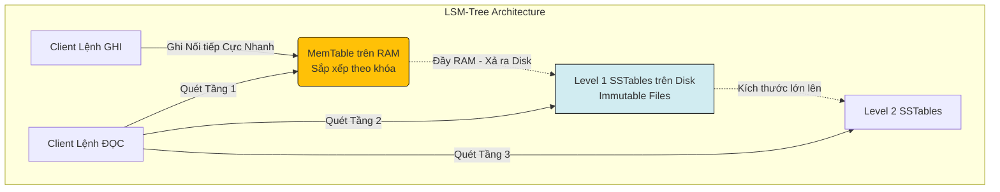

# Bài 9: Cơ sở dữ liệu Cột Rộng (Wide-Column) và Thuật toán LSM-Tree

Như chúng ta đã biết ở Bài 2 (Part 3), cơ sở dữ liệu quan hệ xây dựng sức mạnh trên cấu trúc chỉ mục **B+Tree**. Nhưng B+Tree bộc lộ yếu huyệt chết người trong bài toán **Heavy-Write (Lưu lượng Ghi khổng lồ)**. 
Nếu hệ thống phải tiếp nhận 100.000 log tin nhắn mạng xã hội mỗi giây, việc chèn liên tục dữ liệu rải rác vào các Node Lá khác nhau của B+Tree sẽ bóp nghẹt hệ thống bởi những cú nảy ổ đĩa ngẫu nhiên (Random Disk I/O) tàn khốc.

Để giải quyết bài toán Data Ingestion cường độ cao (Như Time-series data, IOT Sensors), Khoa học máy tính thiết kế hệ NoSQL **Wide-Column Store (Cassandra, HBase)** kết hợp với siêu cấu trúc ghi dữ liệu: **LSM-Tree (Log-Structured Merge-Tree)**.

---

## 1. Wide-Column Database: Ranh giới của Bảng và Key-Value

Cơ sở dữ liệu Cột Rộng, đặc trưng là Apache Cassandra, có một kiến trúc lai tạo (Hybrid) đặc biệt. Bề ngoài, nó có vẻ giống một bảng Relational DB với các cột (Columns) và dòng (Rows). Tuy nhiên, bên dưới (Under-the-hood), nó lưu trữ bản chất là một mô hình Key-Value đa chiều.

- Mọi Dòng (Row) được định danh bởi một **Row Key**. Dữ liệu của cùng 1 Row Key được gom chung cụm vật lý trên đĩa.
- Điểm khác biệt lớn nhất: Trong một bảng RDBMS, mọi Dòng bắt buộc phải có đủ số lượng Cột y hệt nhau. Trong Wide-Column, Dòng 1 có thể có 5 cột, Dòng 2 có thể chứa tới... 2 Tỷ cột riêng biệt (Do giới hạn mở rộng cột không bị ràng buộc tĩnh). 
Mô hình này tối ưu hóa việc phân tán (Sharding - Bài 6) bằng cách lấy Row Key đem đi Băm (Hashing) và ném vào Vòng khuyên Consistent Hashing.

---

## 2. Kiến trúc Khắc tinh B+Tree: Thuật toán LSM-Tree

LSM-Tree là cốt lõi làm nên tốc độ ghi không thể tưởng tượng nổi của hệ sinh thái Big Data. Triết lý của nó vô cùng cực đoan: **Biến tất cả mọi thao tác Ghi (Kể cả Update hay Delete) thành thao tác Ghi Nối Tiếp vào cuối file (Sequential Append-Only Write)**. Lược bỏ hoàn toàn Random I/O.

### Luồng Vận hành Cơ học (LSM-Tree Workflow)

Cấu trúc lưu trữ chia làm 2 tầng: RAM và Disk.
1. **Pha In-Memory (MemTable):** 
   Tất cả lệnh Ghi mới (Ghi Data, Sửa Data, Xóa Data) đều được tống thẳng lên một phân vùng trên RAM gọi là `MemTable` (Và song song được sao lưu vào tệp WAL Log để chống cúp điện, xem lại Bài 3). 
   Vì chỉ viết vào RAM, tốc độ Ghi hoàn thành trong chớp mắt $O(1)$. 
2. **Pha Flush (Chuyển xuống đĩa):**
   Khi MemTable trên RAM đầy (Ví dụ đạt 10MB), dữ liệu này được đóng băng (Immutable). Hệ thống sẽ xả toàn bộ dữ liệu này (Flush) thành một file tệp tĩnh gọi là **SSTable (Sorted String Table)** trên Ổ đĩa. Do xả tuần tự 1 phát toàn bộ, thao tác này hưởng trọn tốc độ Sequential Disk I/O siêu nhanh.
3. **Thao tác Sửa/Xóa Ảo:**
   Khi bạn Xóa bản ghi X, hệ thống KHÔNG truy lùng file trên đĩa để xóa (Random I/O). Thay vào đó, nó Ghi đè vào MemTable một thông điệp tên là **Tombstone (Bia mộ)**: "X đã chết vào giờ này". Khi hệ thống truy vấn gặp bia mộ, nó tự hiểu là dữ liệu đã bị xóa.

### Pha Merge (Hợp nhất và Nén dữ liệu)
Rủi ro của LSM-Tree là ổ cứng sẽ sớm bị ngập trong hàng ngàn file SSTable rác. Giải pháp khắc phục là tiến trình ngầm **Compaction (Nén/Gộp file)**. 
Vào ban đêm (khi tải hệ thống rảnh), Background Worker sẽ đọc hàng chục file SSTable nhỏ, loại bỏ những bản ghi cũ bị đè (Tombstone), và gộp chúng lại thành 1 file SSTable khổng lồ duy nhất, trả lại không gian đĩa vật lý.

---

## 3. Khắc phục Điểm mù Đọc (Read Penalty) bằng Bloom Filter

LSM-Tree đổi Tốc độ Ghi lấy Độ trễ Đọc (Read amplification). Để tìm biến $X$, do phân bố ở nhiều file rời rạc, CPU có nguy cơ phải quét rà soát toàn bộ hàng trăm tệp SSTable, gây giảm hiệu suất Disk nghiêm trọng.

Thuật toán cấu trúc hạt nhân **Bloom Filter** được gọi ra.
Bloom Filter là cấu trúc mảng Boolean xác suất nằm trên RAM. Chức năng của nó cực kì thô sơ nhưng mạnh mẽ: 
Khi CPU định mở tệp `SSTable_10.db` để tìm $X$, Bloom Filter sẽ chặn lại và phán đoán: 
- "Tôi chắc chắn 100% dữ liệu X KHÔNG CÓ trong tệp này." -> CPU lập tức bỏ qua tệp, tiết kiệm một lượng Disk I/O khổng lồ.
- "Có thể (Xác suất cao) dữ liệu X nằm ở tệp này." -> CPU bắt buộc phải mở tệp quét tìm.

Sự kết hợp giữa MemTable, SSTables tĩnh, tiến trình Compaction và Bloom Filter tạo nên xương sống kiến trúc vĩnh cửu của mọi kho dữ liệu IoT thời gian thực trên toàn thế giới hiện nay.

---
**Navigation:**
[⬅️ Previous: Bài 8: Cơ sở dữ liệu Tài liệu (Document DB) và Cấu trúc BSON](./08-document-databases-and-mongodb.md) | [Next: Bài 10: Kiến trúc Data Warehouse và Mô hình hóa Đa chiều (Dimensional Modeling) ➡️](./10-data-warehouse-and-dimensional-modeling.md)
