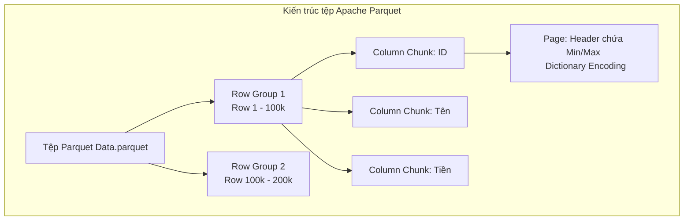

# Bài 11: Data Lake, Hệ thống phân tán và Định dạng File Columnar

Kiến trúc Kho Dữ liệu (Data Warehouse - Bài 10) là một môi trường hoàn hảo, nhưng nó mang bản chất RDBMS: Dữ liệu bị đóng khung trong các Lược đồ (Schema-on-Write). Bạn không thể nhét hình ảnh, luồng click chuột rời rạc, file âm thanh, hay log hệ thống định dạng tự do vào Data Warehouse. 

Khi các công ty công nghệ muốn lưu trữ MỌI THỨ để nạp cho các mô hình AI/Machine Learning, họ không dùng Warehouse mà đổ dữ liệu thô (Raw Data) vào một cái hồ không đáy: **Data Lake (Hồ Dữ liệu)**.

---

## 1. Bản chất Kiến trúc: Hệ thống File Phân tán (Distributed File Systems)

Khác với Data Warehouse chạy trên một cấu trúc Engine CSDL tĩnh đắt đỏ, Data Lake được xây dựng dựa trên cốt lõi là Hệ thống Tệp tin Phân tán (Distributed File System). Ở đây không có SQL Engine xử lý trực tiếp, chỉ có khái niệm File và Thư mục vật lý lưu trên hàng ngàn ổ cứng thương mại giá rẻ (Commodity Hardware).

Hai nền tảng lưu trữ thống trị Data Lake toàn cầu:
1. **HDFS (Hadoop Distributed File System):** Hệ thống mã nguồn mở trong Datacenter nội bộ (On-premise). HDFS cắt nhỏ một file lớn (Ví dụ 100GB Log) thành các Block (Block Size cực lớn, mặc định 128MB để hạn chế nghẽn rãnh Disk Seek), sau đó phân mảnh các Block này quăng lên 50 máy chủ vật lý khác nhau, sử dụng thuật toán nhân bản (Replication) để chống hỏng ổ đĩa.
2. **Cloud Object Storage (Amazon S3 / Google Cloud Storage):** Ở kỷ nguyên đám mây, S3 không có cấu trúc cây thư mục hệ điều hành, tất cả lưu dưới dạng Đối tượng (Object) không gian phẳng. Object Storage có khả năng chứa khối lượng dữ liệu Vô Cực (Petabytes/Exabytes) với chi phí thấp chưa từng có.

---

## 2. Tại sao lại dùng Parquet và ORC? Định dạng File Big Data

Sức mạnh của Data Lake không đến từ việc cấu trúc nó, mà đến từ **Cách Dữ liệu được mã hóa bên trong các File tĩnh.**
Nếu bạn lưu 1 tỷ dòng giao dịch vào Data Lake dưới dạng tệp `.CSV` hoặc `.JSON`, mỗi khi muốn tính tổng (Sum), hệ thống phân tán sẽ phải quét lướt qua hàng trăm GB Text ký tự tuần tự (Sequential Scan Row-based). 

Để ép hệ thống tệp tin tĩnh sở hữu năng lực truy vấn tốc độ cao của một Database Columnar, các chuẩn định dạng mã nguồn mở Big Data ra đời: **Apache Parquet**, **Apache ORC**, và **Apache Avro**.

### Kiến trúc Lưu trữ Lai (Hybrid: Row + Columnar) của Parquet
Nếu chỉ lưu rẽ nhánh thuần túy theo cột (Columnar), thao tác gom nhóm 1 bản ghi Row sẽ bị trễ. Khắc phục điểm này, tệp Parquet chẻ dữ liệu làm 2 chiều:

1. **Chiều Ngang (Row Group):** File Parquet 1GB sẽ chia thành 10 khối `Row Group`, mỗi khối chứa vừa đủ $100.000$ bản ghi dòng theo chiều ngang.
2. **Chiều Dọc (Column Chunk):** Nằm gọn bên trong mỗi `Row Group`, lúc này hệ thống mới xẻ dòng ra thành các khối Cột (Column Chunk).

### 3 Đặc quyền sức mạnh cấu trúc của Parquet

1. **Khối dữ liệu Cột (Column Chunk):** Khi cần tính trung bình doanh thu (Tiền), CPU gọi Disk I/O trích xuất đúng luồng byte của nhánh C3, bỏ qua hoàn toàn nhánh tên (C2) dưới ổ đĩa cứng. 
2. **Sức mạnh Nén (Compression):** Do cột Tiền toàn là con số, thuật toán mã hóa từ điển (Dictionary Encoding) và RLE (Run-Length Encoding) có thể nén khối byte xuống bằng 1/10 kích thước ban đầu, giải cứu băng thông cáp quang mạng.
3. **Thống kê đẩy xuống đĩa (Predicate Pushdown / Min-Max Skipping):** Mỗi Page và Row Group của Parquet đều lưu trữ một Metadata Header bằng vài byte chứa giá trị Max và Min. Giả sử câu lệnh là `WHERE Tiền > 500`. CPU check Metadata của Row Group 1 thấy giá trị Max bằng 300. Nó dứt khoát bỏ qua toàn bộ Row Group 1 (Không thèm load vào RAM). Thuật toán Skip này khiến tốc độ dò tìm tiệm cận Index B-Tree nhưng với chi phí duy trì rẻ mạt hơn hàng trăm lần.

Ngày nay, mô hình kết hợp (Data Lakehouse) là tiêu chuẩn ngành kiến trúc: Data Lake tĩnh nhưng chứa các tệp định dạng Parquet/Iceberg kết hợp cơ chế SQL Engine rời bên ngoài đắp lên.

---
**Navigation:**
[⬅️ Previous: Bài 10: Kiến trúc Data Warehouse và Mô hình hóa Đa chiều (Dimensional Modeling)](./10-data-warehouse-and-dimensional-modeling.md) | [Next: Bài 12: Thiết kế Đường ống Dữ liệu: Lựa chọn ETL vs ELT và Change Data Capture (CDC) ➡️](./12-etl-vs-elt-and-cdc.md)
