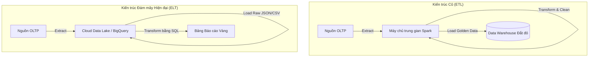

# Bài 12: Thiết kế Đường ống Dữ liệu: Lựa chọn ETL vs ELT và Change Data Capture (CDC)

Dữ liệu nguyên thủy sinh ra từ ứng dụng web/mobile (OLTP) không thể tự động chảy sang Hệ thống phân tích Kho (Data Warehouse/Data Lake). Data Engineer phải xây dựng một hệ thống đường truyền gọi là **Data Pipeline**. Trái tim của Data Pipeline chính là khái niệm ETL.

---

## 1. Dòng chảy Cơ sở: Kiến trúc ETL (Extract, Transform, Load)

Trong thập kỷ 2000-2010, cơ sở dữ liệu kho bãi (Warehouse) trên Server vật lý (On-premise) có chi phí phần cứng CPU/RAM siêu đắt đỏ. Các kỹ sư không dám tống mọi loại dữ liệu hỗn độn, dơ bẩn (Raw Data) vào Kho rồi bắt nó tính toán dọn dẹp, vì việc này làm sập máy chủ. Hệ quả là kiến trúc **ETL** ra đời.

- **E - Extract (Trích xuất):** Quét qua các Database nguồn (MySQL, MongoDB) để kéo dữ liệu thô ra ngoài.
- **T - Transform (Biến đổi - Nút thắt Lõi):** Dữ liệu thô bị ném vào một Máy chủ Trạm Xử lý (Processing Server/Spark) nằm tách biệt bên ngoài kho. Tại đây, code chuyển đổi chạy cực nặng để đổi định dạng ngày tháng, khử trùng lặp (Deduplication), làm sạch rác (Cleaning), và cấu trúc lại bảng. Mọi bụi bặm tính toán do một máy chủ độc lập gánh vác.
- **L - Load (Tải lên):** Chỉ những bản ghi Dữ liệu Vàng (Golden Data) đã sạch sẽ và đúng Schema cấu trúc mới được cho phép lưu vào không gian Data Warehouse linh thiêng.

---

## 2. Kiến trúc Hiện đại: Sự lên ngôi của ELT (Extract, Load, Transform)

Trong 10 năm trở lại đây, sự bùng nổ của hạ tầng Đám mây (Cloud Computing - Snowflake, Google BigQuery) đã bẻ gãy ranh giới rào cản phần cứng. Chi phí lưu trữ đĩa và sức mạnh điện toán Scale-out ngang của Cloud rẻ đến mức nực cười. Điều này kéo theo cấu trúc luồng chảy bẻ lái sang mô hình **ELT**.

- **E - Extract:** Kéo dữ liệu thô.
- **L - Load (Đảo lên trước):** Chẳng cần biến đổi gì cả. Tống thẳng mọi thứ dơ bẩn, chưa rõ định dạng, JSON lồng ghép... trực tiếp vào thẳng Data Lake hoặc Cloud Data Warehouse (Data Ingestion). Không gian lưu trữ Cloud dư sức chứa mà không hề tốn kém.
- **T - Transform:** Khi Analyst cần báo cáo, Data Engineer dùng dbt (Data Build Tool) viết các câu lệnh SQL để bóp nắn, xào nấu đống Raw Data đó ngay bên trong lòng (In-Database) của BigQuery/Snowflake, tận dụng nguồn siêu năng lực CPU tính toán song song có sẵn của Cloud.

**Tại sao ELT làm bá chủ?** Vì nó nhanh và linh hoạt. Nếu một ngày Business thay đổi điều kiện tính Doanh thu, bên ETL phải hì hục sửa Code trên trạm trung gian, xóa dữ liệu trong Kho rồi cày lại toàn bộ (Backfill) từ hệ thống gốc. Ở mô hình ELT, dữ liệu gốc nguyên bản vẫn đang nằm ngủ trong Lake, kỹ sư chỉ việc viết lại câu lệnh SQL View T-Transform là xong.

---

## 3. Quá trình Trích xuất (Extract): Từ Batch đến Cơ chế CDC

Làm cách nào để chuyển dữ liệu từ hệ thống nguồn đang bận rộn bán hàng (MySQL) ra ngoài mà không làm treo hệ thống?

**Phương thức truyền thống (Batch Processing):** Kỹ sư lập trình Cronjob cứ 12h đêm hàng ngày sẽ quét lệnh `SELECT * FROM orders WHERE updated_at > ngày_hôm_qua`. Hệ thống sẽ sụt giảm sức mạnh vào giữa đêm, nhưng báo cáo BI sẽ luôn chậm (Stale) 1 ngày (T+1).

**Change Data Capture (CDC) - Sự Tinh Hoa của Kỹ thuật:**
Để có dữ liệu Real-time mà không chạy lệnh SELECT phá hoại, hệ thống CDC (như công cụ Debezium) sẽ giả lập bản thân nó làm một Node Replica (Slave) để cấu kết vào thuật toán Đồng bộ Hệ thống của Database nguồn (Bài 3). 
Thay vì cào dữ liệu, bộ công cụ này xâm nhập thẳng xuống dưới hệ điều hành để đọc và ăn cắp ngầm các tệp **WAL (Write-Ahead Logging)** hoặc **Binlog** của MySQL. 
Mỗi khi có biến cố UPDATE trên Database, log được ghi xuống ổ đĩa, tiến trình CDC sẽ copy dòng sự thay đổi đó gửi lên Message Queue chưa tới 50 mili-giây.
Ứng dụng CDC không hề gây bất cứ tác động nào đến RAM hay CPU của Database chính (Zero-Impact), thiết lập nền tảng thời gian thực (Real-time Streaming) mà chúng ta sẽ đào sâu ở Chương 5.

---
**Navigation:**
[⬅️ Previous: Bài 11: Data Lake, Hệ thống phân tán và Định dạng File Columnar](./11-data-lake-and-file-formats.md) | [Next: Bài 13: Mô hình MapReduce và Nguyên lý Xử lý Bộ nhớ của Apache Spark ➡️](./13-mapreduce-and-spark.md)
