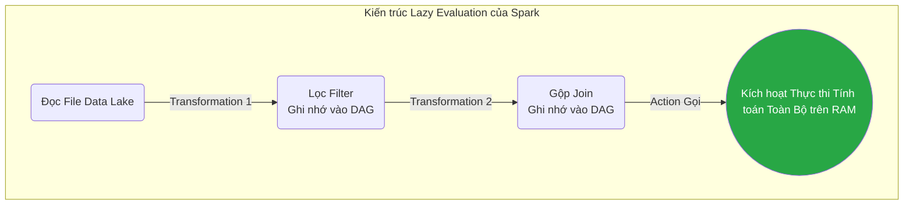

# Bài 13: Mô hình MapReduce và Nguyên lý Xử lý Bộ nhớ của Apache Spark

Khi hệ thống Data Lake (HDFS/S3 - Bài 11) chứa hàng ngàn File khổng lồ rải rác trên mạng lưới, một máy tính CPU mạnh cỡ nào cũng không thể đọc nổi. Chúng ta cần một giải pháp điều phối hàng chục máy tính **Cùng xử lý dữ liệu song song (Parallel Processing)**. 

---

## 1. MapReduce: Cột mốc Định hình Big Data

Được Google khởi xướng (2004) và áp dụng mạnh mẽ bởi Hadoop, MapReduce định hình triết lý: *"Thay vì di chuyển Dữ liệu 100GB tới chỗ máy tính, hãy di chuyển Mã lệnh (Code) bằng vài KB tới thẳng chỗ chiếc máy đang giữ Dữ liệu"*.

Thuật toán ép buộc kỹ sư lập trình phải chia bài toán thành 2 Giai đoạn hàm độc lập:
1. **Map (Ánh xạ/Băm nhỏ):** Các Node máy tính độc lập nhận nhiệm vụ phân giải phân mảnh file của riêng nó, lọc và biến dữ liệu thành các cặp Key-Value thô. (Ví dụ: Máy 1 đếm văn bản thấy 2 chữ "Cat", nó thả ra `{"Cat": 1, "Cat": 1}`). Quá trình này độc lập tuyệt đối giữa các máy, không cần trao đổi.
2. **Shuffle & Reduce (Xáo trộn & Thu gọn):** Hệ thống gom tất cả dữ liệu có cùng Key từ mọi máy rải rác trên mạng, đưa về cho 1 máy duy nhất để Cộng gộp. Máy đó sẽ đếm `{"Cat": 2}`.

**Cái chết của MapReduce:**
Giai đoạn ở giữa (Shuffle) phải đồng bộ chéo qua cáp mạng LAN. Chậm hơn nữa, Hadoop thiết kế tính chịu lỗi (Fault-Tolerance) cực đoan: Kết thúc hàm Map, nó phải ghi thẳng kết quả trung gian xuống Ổ cứng vật lý (Disk) để lỡ máy chết thì máy khác đọc được. Hàng loạt thao tác Ghi đĩa đã bóp chết hiệu năng, khiến thời gian xử lý một luồng MapReduce từ vài phút kéo dài đến hàng giờ.

---

## 2. Apache Spark: Sự thống trị của Xử lý In-Memory

Spark ra đời nhằm hủy diệt điểm mù Ghi Đĩa của Hadoop. Tôn chỉ của Spark là: **Xử lý toàn bộ trên RAM (In-Memory Processing)**. Để làm được điều này mà không sợ sập máy mất dữ liệu, Spark phát minh ra **RDD (Resilient Distributed Datasets - Tập dữ liệu phân tán có khả năng phục hồi)**.

### Sức mạnh của Cơ chế Lazy Evaluation (Trì hoãn tính toán) và RDD

Một tiến trình Data Pipeline của Data Engineer thường trải qua 10 bước chuyển đổi (Filter, Join, Group). 
- Với Hadoop MapReduce: Xong bước 1 -> Ghi xuống ổ đĩa -> Đọc lên làm bước 2 -> Ghi ổ đĩa...
- **Với Spark:** Nó Không Tính Toán Ngay Lập Tức. Kỹ sư code 10 bước lọc dữ liệu, Spark chỉ ghi nhận các dòng code đó thành một biểu đồ Hướng toán học gọi là **DAG (Directed Acyclic Graph)**. Các khối RDD trong RAM chỉ nhớ sợi dây gia phả (Lineage) của nó (Ví dụ: "Tôi là khối RDD 3, tôi được tạo ra từ việc Filter khối RDD 2").

Mọi lệnh tính toán bị đóng băng hoàn toàn cho đến khi Lập trình viên gọi lệnh Bóp Cò (**Action** như `Count()`, `Save()`).

**Chiến lược Phục hồi không dùng Ổ đĩa:**
Giả sử đang xử lý trên RAM ở bước 8, Máy chủ bị cháy và bốc hơi toàn bộ RAM. Spark không quan tâm đến việc lục tìm bản sao lưu trên đĩa (vì không có). Nó nhìn vào **DAG (Gia phả)**, phát hiện khối dữ liệu bị mất được tạo ra bằng phép `Join` ở bước 7. Nó yêu cầu một máy khác tính lại đúng đoạn bước 7 đó trên RAM. 

Sự kết hợp giữa DAG định tuyến hoàn hảo và thao tác cày ải 100% trên Bộ nhớ trong giúp Apache Spark đạt tốc độ cao gấp 100 lần Hadoop MapReduce, thiết lập ngai vàng vững chắc trong lĩnh vực Xử lý Dữ liệu Lớn trên mọi nền tảng Đám mây.

---
**Navigation:**
[⬅️ Previous: Bài 12: Thiết kế Đường ống Dữ liệu: Lựa chọn ETL vs ELT và Change Data Capture (CDC)](./12-etl-vs-elt-and-cdc.md) | [Next: Bài 14: Kiến trúc Hướng Sự kiện (Event-Driven) và Apache Kafka ➡️](./14-message-queues-and-kafka.md)
