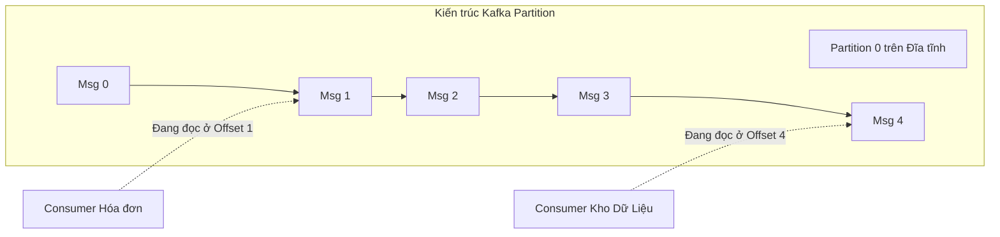

# Bài 14: Kiến trúc Hướng Sự kiện (Event-Driven) và Apache Kafka

Nếu Spark (Bài 13) là gã khổng lồ chuyên xử lý các khối dữ liệu tĩnh khổng lồ theo Lô (Batch Processing), thì hệ sinh thái dữ liệu thực tế lại không đứng yên. Hàng triệu click chuột, giao dịch thẻ tín dụng diễn ra liên tục từng giây (Streaming). 

Nếu ứng dụng Thanh toán phải gửi trực tiếp thông tin bằng API point-to-point sang ứng dụng Hóa đơn, Giao hàng, Tích điểm, hệ thống sẽ rơi vào mớ bòng bong chằng chịt cáp mạng. Bất cứ ứng dụng Giao hàng nào sập, nó sẽ kéo theo ứng dụng Thanh toán bị nghẽn (Coupled Architecture).

**Kiến trúc Hướng Sự kiện (Event-Driven) và Message Queue** xuất hiện với tư cách là một Trạm xe bus trung tâm (Broker) để gỡ rối hệ thống (Decoupling).

---

## 1. Thiết kế Hệ thống của Apache Kafka

Dù được gọi là Message Queue (Hàng đợi thông điệp), thiết kế của Kafka hoàn toàn không giống các cấu trúc hàng đợi truyền thống (như RabbitMQ). Kiến trúc dưới mui xe của Kafka (Under-the-hood) mang bản chất của một **Hệ thống Lưu trữ CSDL Dạng Nhật ký (Distributed Commit Log)**.

Các thành phần giao tiếp:
1. **Producer:** Nguồn phát dữ liệu (Ứng dụng Web, Thiết bị IoT). Nó mù tịt về việc ai sẽ nhận tin, chỉ có nhiệm vụ bắn Data vào Kafka.
2. **Broker (Máy chủ Kafka):** Lưu trữ tin nhắn tĩnh trên Ổ đĩa vật lý (Disk).
3. **Consumer:** Người tiêu thụ. Nó tự do kết nối vào Kafka lấy tin về đọc theo tốc độ của riêng nó.

### Cơ chế Topic và Partition (Phân mảnh theo vệt đĩa)

Kafka không lưu dữ liệu bằng dạng Object hay Table, nó lưu bằng một Cấu trúc Mảng Tĩnh tuyến tính mở rộng về một phía (Append-Only Array), gọi là một **Topic**. 

Để đối phó với dữ liệu siêu khủng, một Topic bị chặt ra thành nhiều **Partitions (Phân vùng)** rải trên các máy chủ khác nhau. Khi một tin nhắn mới được tống vào Partition, nó được ghi nối tiếp vào cuối ổ cứng theo chuẩn **Sequential I/O** (Giống hệt cách cơ sở dữ liệu lưu tệp WAL - Bài 3). Điều này biến Kafka từ một cổng nối mạng trở thành một hệ thống đĩa cứng tốc độ ghi siêu thanh.

---

## 2. Bí ẩn của Offset và Consumer Group

**Vấn đề của Message Queue Cũ (RabbitMQ):** Khi ứng dụng Đọc lấy 1 tin nhắn ra khỏi Queue, RabbitMQ coi như giao hàng xong và xóa tin nhắn đó vĩnh viễn khỏi hàng đợi. Nếu một hệ thống Phân tích Data (Machine Learning) muốn đọc lại để huấn luyện model, dữ liệu đã hoàn toàn biến mất.

**Giải pháp Định dạng Ổ cứng của Kafka:** 
Kafka **không bao giờ xóa tin nhắn** khi được đọc. Tin nhắn cứ nằm chết trên ổ đĩa cho đến khi quá hạn (Ví dụ 7 ngày, hoặc 100GB).
Mỗi tin nhắn trong Partition được gán một số chỉ mục tịnh tiến tuyệt đối, gọi là **Offset** (0, 1, 2, 3...).

Thay vì quản lý tin nhắn, Kafka để cho các **Consumer tự quản lý con trỏ (Offset) của riêng mình**.
- Dịch vụ Hóa đơn vừa sập nguồn. Sáng hôm sau khởi động lại, nó mở sổ tự nhớ: "Hôm qua mình đọc tới Offset 1". Nó gửi lệnh cho Kafka xin đọc tiếp từ Offset 2. Mọi dữ liệu không bao giờ bị sót.
- Tuần sau, sếp yêu cầu cắm thêm một Dịch vụ AI phân tích. Nó có quyền kết nối vào và khai báo: "Xin đọc từ Offset 0". Nó sẽ kéo lại toàn bộ luồng lịch sử giao dịch từ đầu.

### Sự hoàn thiện của Data Streaming
Bằng kiến trúc Nhật ký nối tiếp (Log-structured) siêu bền và độc lập hóa con trỏ đọc (Decoupled Readers), Apache Kafka vĩnh viễn thay đổi phương pháp luân chuyển dữ liệu, trở thành động cơ cốt lõi đằng sau mọi kiến trúc Data Engineering Real-time toàn cầu.

---
**Navigation:**
[⬅️ Previous: Bài 13: Mô hình MapReduce và Nguyên lý Xử lý Bộ nhớ của Apache Spark](./13-mapreduce-and-spark.md) | [Next: Bài 15: Công cụ Tìm kiếm (Search Engine) và Chỉ mục Ngược (Inverted Index) ➡️](./15-search-engines-and-elasticsearch.md)
