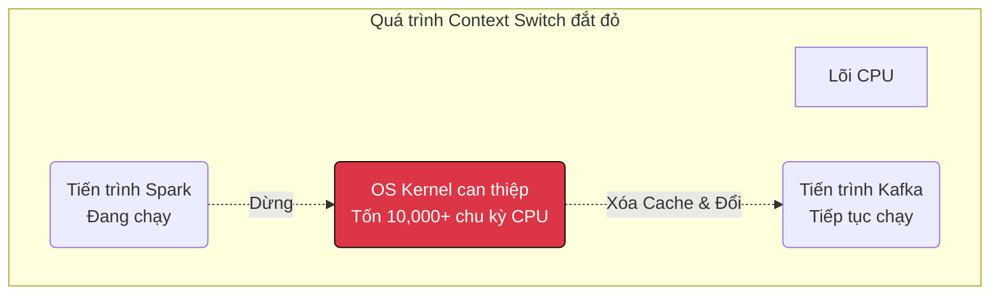

# Bài 1: Ranh giới An ninh (Kernel vs User Space) và Chuyển đổi Ngữ cảnh (Context Switching)

Hệ điều hành (Operating System - OS) không chỉ là một phần mềm giao diện, nó là một nhà độc tài quản lý tài nguyên. Nó kiểm soát CPU, RAM, Ổ cứng và Card mạng. 

Để bảo vệ phần cứng khỏi những đoạn code chứa đầy lỗi của lập trình viên (hoặc mã độc của hacker), CPU và Hệ điều hành (như Linux/Windows) được thiết kế với một ranh giới chia cắt phần mềm thành hai thế giới cách ly vật lý: **User Space (Không gian Người dùng)** và **Kernel Space (Không gian Nhân)**.

---

## 1. Ranh giới Phân quyền: User Space và Kernel Space

Kiến trúc CPU hiện đại (như x86) hỗ trợ nhiều cấp độ đặc quyền vật lý, gọi là các **Protection Rings**.
- **Ring 0 (Quyền lực Tối cao):** Dành riêng cho lõi hệ điều hành (Kernel). Code chạy ở đây có quyền can thiệp vào bất cứ chip nhớ nào, tắt nguồn máy tính, hoặc gửi byte thẳng ra cáp mạng. Đây là **Kernel Space**.
- **Ring 3 (Quyền lực Cấp thấp):** Dành cho mọi phần mềm ứng dụng (Game, Trình duyệt Web, Python Script, MySQL). Code ở đây bị "mù" phần cứng. Nó không thể tự mình lưu file ra ổ đĩa hay xuất chữ ra màn hình. Đây là **User Space**.

**Tại sao phải phân quyền?** 
Nếu code Python của bạn trong User Space bị lỗi (ví dụ chia một số cho 0), tiến trình Python sẽ sập. Nhưng Hệ điều hành không sập, máy tính vẫn chạy bình thường. Nếu đoạn code đó chạy trong Kernel Space, toàn bộ máy tính sẽ dính lỗi "Màn hình xanh chết chóc" (Blue Screen of Death / Kernel Panic) và tắt ngụm.

---

## 2. Cầu nối System Call (Lời gọi Hệ thống)

Vì code trong User Space (ví dụ lệnh `print("Hello")` trong Python) bị cấm xuất dữ liệu ra màn hình, nó buộc phải **nhờ vả** Hệ điều hành làm thay. Cơ chế "nhờ vả" này được gọi là **System Call (Syscall)**.

Khi ứng dụng gọi một Syscall (ví dụ hàm `write()` để lưu file), một quá trình rườm rà xảy ra:
1. Ứng dụng đặt dữ liệu cần lưu vào các Thanh ghi (Registers) của CPU.
2. Ứng dụng kích hoạt một "Lệnh ngắt mềm" (Software Interrupt).
3. CPU lập tức đình chỉ luồng chạy của ứng dụng, **chuyển trạng thái bảo mật từ Ring 3 xuống Ring 0** (Chuyển vào Kernel Space).
4. Kernel của Linux tiếp quản, kiểm tra xem ứng dụng này có quyền ghi file không. Nếu OK, Kernel ra lệnh cho ổ đĩa quay để ghi dữ liệu.
5. Ghi xong, CPU **hạ quyền từ Ring 0 về lại Ring 3**, và trả quyền điều khiển lại cho ứng dụng.

Quá trình chuyển đổi lên xuống này mất khoảng vài trăm nano-giây. Thoạt nhìn có vẻ nhanh, nhưng nếu một phần mềm xử lý Big Data gọi vòng lặp Syscall hàng triệu lần mỗi giây, chi phí thời gian cộng dồn sẽ đánh gục CPU.

---

## 3. Nút thắt Cổ chai: Context Switching (Chuyển đổi Ngữ cảnh)

Vấn đề còn nghiêm trọng hơn khi máy tính có 4 lõi CPU nhưng phải chạy 1000 tiến trình ứng dụng cùng lúc. OS giải quyết bằng kỹ thuật **Time-slicing (Cắt lát thời gian)**: Nó cho Tiến trình A chạy 10 mili-giây, rồi tạm dừng A để cho Tiến trình B chạy 10 mili-giây. Tốc độ hoán đổi cực nhanh khiến con người lầm tưởng máy tính đang làm nhiều việc song song.

Thao tác hoán đổi này được gọi là **Context Switching**. Nó là tác vụ hao tổn năng lượng bậc nhất của Hệ điều hành.

### Những gì xảy ra trong 1 lần Context Switching?
Khi OS quyết định dừng Tiến trình A để chạy Tiến trình B:
1. **Lưu trạng thái A:** OS phải chụp lại (Snapshot) toàn bộ các thanh ghi CPU, con trỏ lệnh (Program Counter), và bộ nhớ của A để tống vào một kho chứa trên RAM (Process Control Block - PCB).
2. **Xóa Cache (Cache Flush):** Xóa toàn bộ bộ nhớ đệm nội bộ siêu nhanh (L1, L2 Cache, và TLB) của CPU vì dữ liệu rác của A không được phép để B nhìn thấy.
3. **Nạp trạng thái B:** Rút PCB của B từ RAM nhồi ngược lại vào CPU.
4. **Mất đà (Cold Cache Penalty):** Tiến trình B bắt đầu chạy với một bộ Cache trống rỗng. Nó phải lóc cóc xuống RAM lấy dữ liệu chậm chạp từ đầu.

### Bài học cho Data Engineer
Trong kiến trúc Hệ thống phân tán, việc tạo ra hàng chục nghìn Luồng (Threads) để xử lý dữ liệu dường như là một ý hay. Nhưng nếu tạo quá nhiều Thread vượt xa số lõi vật lý của CPU, CPU sẽ không dùng sức để xử lý dữ liệu nữa, mà nó sẽ dành 90% thời gian chỉ để **Context Switching** (Tráo đổi các Thread qua lại). Hiện tượng này gọi là CPU Thrashing, làm hệ thống treo cứng. 
Các hệ thống siêu việt như Nginx hay Node.js giải bài toán này bằng kiến trúc **Event-Loop (Bất đồng bộ)** chỉ với 1 Thread duy nhất, triệt tiêu hoàn toàn chi phí Context Switching của OS. Chúng ta sẽ phân tích kỹ tại Bài 4.

---
**Navigation:**
[Next: Bài 2: Quản trị Bộ nhớ Ảo, Page Cache và Sự cố sập nguồn (OOM) ➡️](./02-memory-management-and-page-cache.md)
