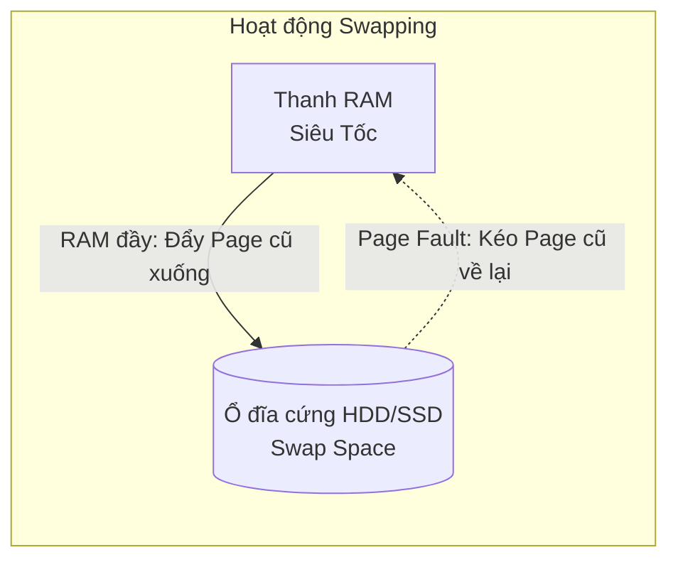

# Bài 2: Quản trị Bộ nhớ Ảo, Page Cache và Sự cố sập nguồn (OOM)

Đối với Data Engineer, cấu hình quan trọng thứ hai sau ổ đĩa chính là RAM. Khi chạy một Job Spark xử lý tệp tin Parquet dung lượng 100GB trên một máy tính chỉ có 16GB RAM, máy tính sẽ không phát nổ, cũng không từ chối chạy.

Sự kỳ diệu cho phép phần mềm sử dụng bộ nhớ vượt quá khả năng vật lý của máy tính chính là **Bộ nhớ Ảo (Virtual Memory)** và cơ chế **Paging**.

---

## 1. Ảo ảnh của Virtual Memory và Cấu trúc Paging

Trước thập niên 90, các chương trình được cấp phát thẳng vào RAM vật lý. Nếu chương trình A ghi đè nhầm sang địa chỉ RAM của chương trình B, máy tính sẽ bị sập hệ thống (Kernel Panic). Thêm vào đó, bộ nhớ rất dễ bị phân mảnh mấp mô.

Hệ điều hành hiện đại Linux/Windows xử lý bằng cách lập ra **Virtual Memory (Bộ nhớ Ảo)**. 
- Mọi tiến trình (Ví dụ: 1 Script Python) khi bật lên sẽ bị OS "lừa" rằng nó đang độc chiếm một khoảng không gian RAM trống khổng lồ, trải dài liền mạch từ byte số 0 đến byte cuối cùng. 
- Trên thực tế, dải RAM ảo này không tồn tại. OS âm thầm chia không gian ảo và cả thanh RAM vật lý thành các khối hình chữ nhật đều tăm tắp, mỗi khối chuẩn kích thước là **4KB** - gọi là các **Pages**.

**Bản đồ MMU (Memory Management Unit):**
CPU tích hợp một con chip tên là MMU làm nhiệm vụ dịch ngôn ngữ. Khi Python xin ghi vào "Page ảo số 5", MMU sẽ tra một quyển sổ từ điển (Page Table) để tự động bẻ lái dòng dữ liệu đó nạp vào "Page vật lý số 200 trên thanh RAM thật". 
Nhờ cơ chế này, các ứng dụng bị giam lỏng. Ứng dụng A không bao giờ biết được địa chỉ vật lý thật sự của ứng dụng B, triệt tiêu hoàn toàn rủi ro bảo mật dẫm đạp bộ nhớ.

---

## 2. Vũ khí Xử lý Dữ liệu Lớn: Swapping và Hiện tượng Thrashing

Điều gì xảy ra khi bạn mở hàng trăm tab Chrome, làm thanh RAM 16GB bị lấp đầy 100% bằng các khối Pages vật lý?

Hệ điều hành không chặn ứng dụng mới. Thay vào đó, nó kích hoạt thuật toán trục xuất (Tương tự thuật toán LRU của Cache - Bài 7 Part 3).
1. OS lùng sục trên RAM tìm ra những Pages dữ liệu đã lâu không có ai đụng tới (Ví dụ tab Chrome bạn mở từ sáng nhưng không xem).
2. Nó rinh các khối Page này ra khỏi RAM và **chép tạm xuống một phân vùng ổ cứng (Disk)**. Phân vùng này gọi là **Swap Space**.
3. RAM giờ có chỗ trống để nạp chương trình mới. 
4. Nếu bạn click lại vào cái tab Chrome cũ kia, CPU báo lỗi **Page Fault**. Tức là dữ liệu không còn trên RAM nữa. Lập tức, OS phải ra lệnh đi xuống ổ cứng, bốc khối Page từ Swap Space nhồi ngược trở lại lên RAM.

Quá trình tráo đổi liên tục giữa RAM và Đĩa cứng này gọi là **Swapping**.

**Thảm họa Thrashing (Nghiền nát CPU):**
Khi hệ thống cạn kiệt RAM nghiêm trọng và có hàng chục phần mềm đang hoạt động dữ dội. Máy tính sẽ bị cuốn vào vòng lặp tử thần: Đẩy Page A xuống Đĩa để lấy chỗ nạp Page B -> Vừa nạp xong lại đẩy Page B xuống để kéo Page C lên -> Đẩy Page C lấy chỗ kéo Page A về lại...
Hệ điều hành dành 100% sức lực chỉ để luân chuyển dữ liệu giữa Đĩa và RAM thay vì xử lý thuật toán. Máy tính của bạn sẽ **đóng băng (treo cứng)**. Đèn ổ cứng nháy sáng liên tục không ngừng nghỉ. Hiện tượng này gọi là Thrashing.

---

## 3. OOM-Killer: Ác mộng của Kỹ sư Hệ thống

Khi tình trạng bộ nhớ cạn kiệt đến mức Swap Space cũng đầy, hoặc hệ điều hành nhận thấy Thrashing đang phá hủy hệ thống, Kernel Linux sẽ rút thanh gươm hành quyết cuối cùng: **OOM-Killer (Out-Of-Memory Killer)**.

OOM-Killer là một tiến trình tử thần của Kernel. Nó sẽ quét qua toàn bộ các ứng dụng đang chạy, tự động chấm điểm độ ngốn RAM (Badness Score). Ứng dụng nào đang phình to nhất (Thường là cơ sở dữ liệu Elasticsearch hoặc các Job Spark đang xử lý Array khổng lồ), OOM-Killer sẽ bắn lệnh `SIGKILL` **Giết chết ngay lập tức** ứng dụng đó không báo trước.
Kết quả: Data Pipeline của bạn thất bại giữa chừng, Terminal hiện lên vỏn vẹn dòng chữ lạnh lẽo `Killed`.

**Bài học cốt lõi:** Kỹ sư thiết kế dữ liệu luôn phải vô hiệu hóa Swapping trên các cụm máy chủ Database (PostgreSQL/Cassandra). Vì nếu DB bị ép đẩy xuống Swap Space (Ổ đĩa), tốc độ truy xuất của nó sẽ rớt xuống hàng vạn lần, đánh sập tốc độ của toàn bộ kiến trúc toàn cầu. Thà để DB báo lỗi không nhận thêm data, còn hơn để nó rơi vào trạng thái Thrashing sống không bằng chết.

---
**Navigation:**
[⬅️ Previous: Bài 1: Ranh giới An ninh (Kernel vs User Space) và Chuyển đổi Ngữ cảnh (Context Switching)](./01-kernel-user-space-and-context-switching.md) | [Next: Bài 3: Kỹ thuật Zero-copy và Mảnh ghép Sức mạnh của Apache Kafka ➡️](./03-zero-copy-and-disk-io.md)
