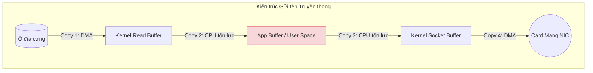
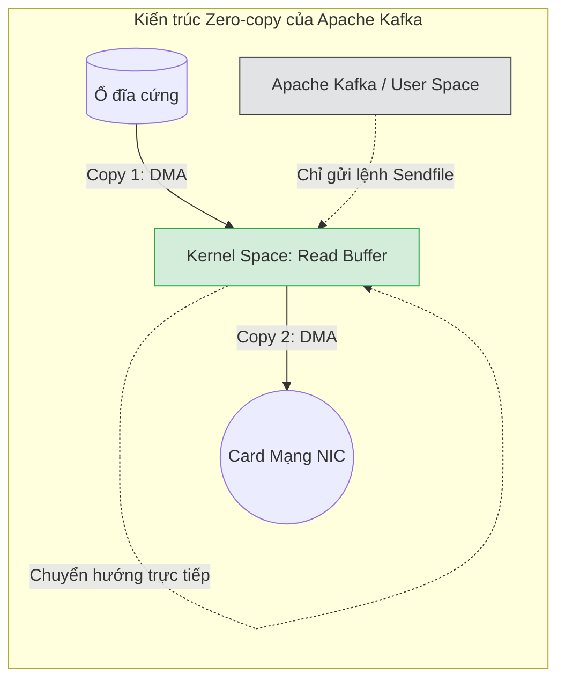

# Bài 3: Kỹ thuật Zero-copy và Mảnh ghép Sức mạnh của Apache Kafka

Khi tải một tệp tin (File) nặng 10GB từ Ổ cứng máy chủ để gửi qua mạng Internet cho một máy khách (Client), quá trình luân chuyển dữ liệu bên trong Hệ điều hành tưởng chừng đơn giản nhưng lại chứa đựng một sự lãng phí khủng khiếp. 

Apache Kafka - cỗ máy Message Broker vĩ đại nhất của kiến trúc Streaming (Bài 14, Part 3) - có thể truyền tải hàng triệu sự kiện mỗi giây với độ trễ nano-giây. Bí mật duy nhất giúp Kafka đánh bại mọi đối thủ nằm ở một kỹ thuật can thiệp thẳng vào hệ điều hành có tên là **Zero-copy (Không sao chép)**.

---

## 1. Đường đi của Dữ liệu Cổ điển: Thảm họa 4 lần Copy

Trong lập trình thông thường, để lấy file từ Đĩa gửi ra Mạng, ứng dụng (như Java hoặc Python) sẽ gọi 2 thao tác System Call (Bài 1, Part 4): 
1. Gọi lệnh `read()` để đọc file.
2. Gọi lệnh `write()` để gửi vào Card mạng (Socket).

Hành trình đắt đỏ của các dải Byte sẽ diễn ra như sau:
- **Copy 1 (Hardware to Kernel):** Ổ đĩa từ tính quét dữ liệu, copy nó vào một vùng đệm bộ nhớ thuộc quyền kiểm soát của Hệ điều hành (Kernel Read Buffer / Page Cache).
- **Copy 2 (Kernel to User Space):** OS copy luồng dữ liệu từ Kernel Buffer ngược lên vùng RAM của Ứng dụng (User Space) để ứng dụng có thể "nhìn thấy" biến dữ liệu đó. Kèm theo thao tác chuyển đổi ngữ cảnh đắt đỏ (Context Switch).
- **Copy 3 (User Space to Kernel):** Ứng dụng chả làm gì với dữ liệu đó ngoài việc ra lệnh đẩy ra mạng. Nó lại copy ngược dữ liệu từ vùng nhớ ứng dụng tống xuống bộ đệm Socket (Kernel Socket Buffer). Sinh ra thêm 1 lần Context Switch.
- **Copy 4 (Kernel to Hardware):** Card mạng (NIC) copy dữ liệu từ Socket Buffer để đóng gói thành tín hiệu quang điện tống vào cáp mạng LAN.

**Nhận xét:** Lập trình viên không có nhu cầu sửa đổi nội dung file, họ chỉ muốn "chuyển phát nhanh". Nhưng CPU lại bị ép phải làm cửu vạn, hì hục bê vác sao chép 10GB dữ liệu từ dưới lõi OS lên trên tầng Ứng dụng, rồi lại hì hục vác từ tầng Ứng dụng xuống dưới lõi OS. Vừa tốn RAM gấp 3 lần, vừa lãng phí chu kỳ xung nhịp CPU, vừa chịu độ trễ Context Switching.

---

## 2. Kỹ thuật Zero-copy: Lời giải của các Vị thần Cấu trúc

Để triệt tiêu những chặng đường dư thừa, lõi Linux và Unix cung cấp một System Call đặc biệt: `sendfile()` (Trên Java được đóng gói thành thư viện `transferTo()`). Kỹ thuật này được gọi là **Zero-copy**.

Với lệnh `sendfile()`, ứng dụng Kafka nói với Hệ điều hành: *"Đại ca, em cần gửi cái file X trên ổ đĩa kia qua đường mạng Y. Em không cần nhìn nội dung nó đâu, đại ca chuyển hộ em trực tiếp dưới tầng ngầm luôn đi"*.

**Hành trình Zero-copy:**
1. Lệnh `sendfile()` kích hoạt. Máy chuyển quyền xuống Kernel Space 1 lần.
2. **Copy 1 (Hardware to Kernel):** Bộ điều khiển ổ cứng DMA (Direct Memory Access - Con chip tự hành không dính dáng đến CPU) tự động rút dữ liệu từ đĩa tống vào Kernel Read Buffer.
3. **BƯỚC ĐỘT PHÁ:** Thay vì copy dữ liệu lên User Space, Kernel OS **nối thẳng** ống dẫn nước từ Read Buffer sang Socket Buffer nội bộ dưới lòng Kernel. Không một byte dữ liệu nào bị ép ngoi lên tầng Ứng dụng. Hủy bỏ hoàn toàn bước Copy 2 và 3, tiêu diệt 100% hao tổn CPU.
4. **Copy 2 (Kernel to Hardware):** DMA của Card mạng rút dữ liệu bắn thẳng ra cáp mạng.

**Thành tựu Tốc độ:**
Nhờ áp dụng cấu trúc tuần tự Zero-copy, việc truyền tải dữ liệu của Kafka hoàn toàn không sử dụng đến bộ xử lý trung tâm (CPU Zero-Utilization). Máy chủ có thể stream hàng Gigabytes dữ liệu tin nhắn mỗi giây băng qua cáp quang nhưng biểu đồ Load CPU vẫn duy trì ở mức phẳng lặng 1%.

Sức mạnh của Kafka, Nginx, HDFS DataNode không phải là phép màu thuật toán, mà là khả năng giao tiếp ở tầng thấp nhất với kiến trúc phần cứng của hệ điều hành lõi Linux.

---
**Navigation:**
[⬅️ Previous: Bài 2: Quản trị Bộ nhớ Ảo, Page Cache và Sự cố sập nguồn (OOM)](./02-memory-management-and-page-cache.md) | [Next: Bài 4: Song song hóa (Process vs Thread), Nút thắt GIL và Cơ chế Async I/O ➡️](./04-process-thread-and-async-io.md)
