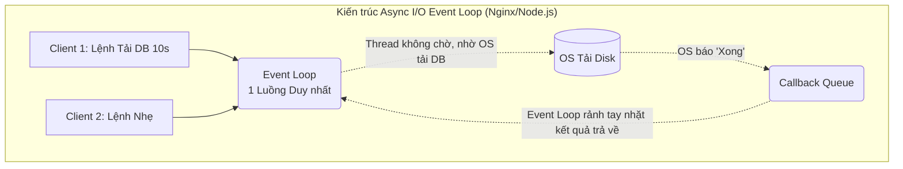

# Bài 4: Song song hóa (Process vs Thread), Nút thắt GIL và Cơ chế Async I/O

Máy chủ vật lý chỉ có một giới hạn nhất định về tốc độ xung nhịp CPU. Để một ứng dụng (như Web Server) phục vụ được hàng vạn người cùng lúc, Khoa học Máy tính cung cấp 3 nền tảng kiến trúc: **Đa tiến trình (Multi-processing)**, **Đa luồng (Multi-threading)**, và cao cấp nhất là **Luồng đơn Bất đồng bộ (Single-thread Async I/O)**.

---

## 1. Tiến trình (Process) và Luồng (Thread)

### A. Tiến trình (Process)
Khi bạn chạy lệnh `python script.py`, Hệ điều hành lập tức đúc ra một **Tiến trình (Process)**. 
- Process là một thực thể cô lập tuyệt đối. OS cấp phát cho nó một vùng Nhớ Ảo (RAM) riêng biệt, một ID (PID) riêng, và các không gian dữ liệu tách biệt. 
- Nếu tạo ra 10 Process xử lý dữ liệu, OS phải tạo 10 không gian RAM tốn kém. Process này không thể chọc vào biến của Process kia (Đảm bảo an toàn 100%). Nếu muốn chúng nói chuyện, phải dùng đường cáp mạng IPC (Inter-Process Communication) rất chậm.

### B. Luồng (Thread)
Để tiết kiệm RAM thay vì tạo nhiều Process, lập trình viên tạo ra các **Luồng (Threads)**. 
- Thread là một luồng xử lý nhẹ kí nằm "ký sinh" ở bên trong 1 Process gốc. 
- Tất cả các Thread trong cùng một Process chia sẻ chung 100% không gian RAM, cấu trúc dữ liệu, và Code của Process gốc đó. 
- **Ưu điểm:** Khởi tạo siêu nhanh, tốn ít bộ nhớ. Thread 1 tính toán xong một biến `x`, Thread 2 có thể đọc trực tiếp biến `x` đó từ RAM ngay lập tức.
- **Thảm họa rủi ro:** Chuyện gì xảy ra nếu Thread 1 đang cố cập nhật biến `x=5`, và trong cùng nano-giây đó Thread 2 đọc `x`? Thread 2 sẽ nhận về một mớ rác byte hỗn độn. Hiện tượng này gọi là **Race Condition** - cơn ác mộng gỡ lỗi khó nhất trong ngành Kỹ thuật phần mềm. Để chống Race Condition, người ta phải tạo ra các chốt khóa **Mutex Locks** (Chặn 1 Thread lại chờ Thread kia làm xong), nhưng Mutex lại sinh ra một thảm họa khác là Deadlock (Chết chùm khóa chéo).

---

## 2. Lời nguyền GIL của Ngôn ngữ Python (Global Interpreter Lock)

Trong mảng Khoa học Dữ liệu và AI, Python là ngôn ngữ Thống trị. Tuy nhiên, Python lại sở hữu một điểm mù chí mạng mang tên **GIL (Global Interpreter Lock)**.

Vào những năm 90, để bảo vệ hệ thống quản lý bộ nhớ nội bộ khỏi thảm họa Race Condition của Đa luồng (Threads), cha đẻ Python đã chọn một giải pháp thô thiển: Đặt một cái khóa Khổng lồ chặn ngay cửa lõi biên dịch Python.
Cái khóa GIL này ép buộc một quy luật độc tài: **Cho dù máy tính của bạn có CPU 128 Lõi (Cores) cực mạnh, và bạn đẻ ra 100 Threads trong code, bộ biên dịch Python chỉ cho phép duy nhất 1 Thread được chạy trên 1 Lõi CPU tại 1 thời điểm.** 99 Thread còn lại và 127 lõi CPU bị ép đóng băng đứng nhìn.

**Đánh đổi cho Data Engineer:**
- Bạn KHÔNG THỂ dùng Multi-threading trong Python để giải quyết bài toán tính toán AI nặng nề (CPU-bound) vì nó không bao giờ chạy nhanh hơn 1 Thread. (Trái ngược với Java, C++ chạy đa luồng thoải mái tận dụng đa lõi).
- Giải pháp duy nhất của Python cho CPU-bound là dùng **Multi-processing** (Chạy nhiều tiến trình con). Mỗi tiến trình sẽ cõng một cái GIL riêng biệt chạy trên lõi riêng. Tuy nhiên chi phí RAM sẽ đội lên khủng khiếp (10 Process x 500MB = 5GB RAM).

---

## 3. Kiến trúc Cứu rỗi của C10K: Async I/O và Event Loop

Vào năm 1999, kỹ sư Dan Kegel đặt ra bài toán C10K (Làm sao để 1 Server đơn xử lý đồng thời 10.000 Kết nối Web cùng lúc?).
- Nếu dùng mô hình **Thread-per-request** (Có khách vào web là OS tạo 1 Thread để hầu hạ khách đó). Tốc độ tạo Thread tốn 1MB RAM. 10.000 Thread tốn 10GB RAM. Kinh khủng hơn, Hệ điều hành sẽ chết chìm trong hiện tượng **Context Switching (Bài 1)** khi cố gắng tráo đổi 10.000 Thread này liên tục. 

Để giải bài toán này, các kiến trúc sư OS (Linux) tạo ra hàm `epoll()` (kqueue trên BSD), khai sinh ra triết lý **Asynchronous I/O (I/O Bất đồng bộ)**. Cấu trúc này làm nên danh tiếng bất bại của **Nginx, Node.js và Redis**.

### Cơ chế Hoạt động của Async I/O (Luồng Đơn)

Thay vì tạo 10.000 luồng, hệ thống tạo ra **Đúng 1 Luồng Duy Nhất (Single Thread)**. Luồng này chạy một cái vòng lặp vô tận tên là **Event Loop**.

**Tại sao nó mạnh vô địch?**
1. Client 1 kết nối vào xin tải file 1GB từ ổ đĩa cứng. Bình thường, Thread sẽ phải **bị Block (Đứng chờ cứng đơ)** mất 5 giây chờ đĩa quay xong để lấy file. 
2. Trong mô hình Async I/O, Event Loop của Thread đẩy tờ giấy báo yêu cầu đọc ổ cứng xuống cho `epoll` của OS. Rồi nó lập tức quay lưng đi ra phục vụ Client thứ 2, thứ 3, thứ 10.000. **Nó không bao giờ lãng phí 1 mili-giây nào để đứng chờ thao tác I/O chậm chạp**.
3. Khi ổ đĩa quay xong lấy được file, OS sẽ "giật chuông" bắn một sự kiện (Event) vào Hộp thư.
4. Event Loop chạy vòng quanh rảnh tay, nhặt sự kiện đó lên và ném cục File về cho Client 1.

Do chỉ xài 1 Luồng (Zero Context Switch), kiến trúc này ăn siêu ít RAM (vài MB) và chạy nhanh đến mức ép toàn bộ CPU đạt hiệu suất 100% không ngừng nghỉ. Đây là trái tim của mọi Gateway và Load Balancer toàn cầu ngày nay.

---
**Navigation:**
[⬅️ Previous: Bài 3: Kỹ thuật Zero-copy và Mảnh ghép Sức mạnh của Apache Kafka](./03-zero-copy-and-disk-io.md) | [Next: Bài 5: Cấu trúc Cách ly Lõi Linux (Namespaces) và Bản chất Container (Docker) ➡️](./05-namespaces-cgroups-and-docker.md)
