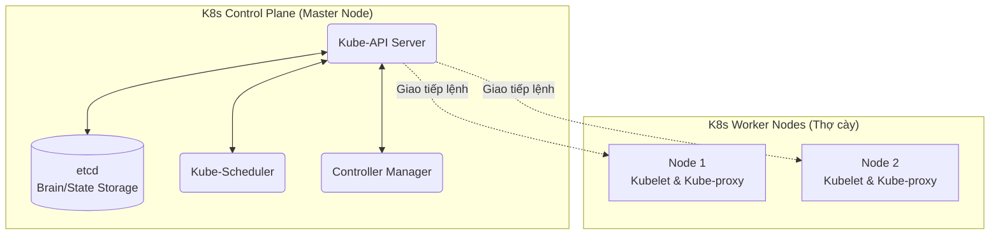

# Bài 6: Giải phẫu Kiến trúc Kubernetes (K8s) cho Data Pipelines

Khi triển khai 5 hoặc 10 Container (Bài 5) như Spark hay Kafka trên 1 máy tính đơn, hệ thống Docker Compose hoạt động rất tốt. 
Nhưng khi môi trường Data Engineering sản xuất (Production) đòi hỏi việc triển khai hệ thống Pipeline Big Data với 5,000 Container rải rác trên 100 máy chủ (Servers) vật lý nằm ở 3 khu vực châu lục, Docker thuần túy lập tức sụp đổ. 

Bài toán đặt ra: 
- Nếu Máy chủ A bị cháy, ai sẽ tự động khôi phục (Restart) lại 50 Container trên máy chủ A qua Máy chủ B?
- Nếu lưu lượng web tăng đột biến lúc 0h đêm, ai sẽ tự động nhân bản (Scale-out) hệ thống Kafka từ 10 lên 50 Container trong 2 giây?

Giải pháp tối thượng được Google công bố mã nguồn mở: **Kubernetes (K8s) - Hệ thống Điều phối Vận hành (Container Orchestration).**

---

## 1. Bản chất Kiến trúc: Bầu trời Mạng Lưới (Cluster)

Kubernetes không phải là ảo hóa, nó là một nền tảng quản lý tài nguyên. Nó gộp hàng trăm CPU rải rác ở hàng trăm máy chủ thành một "siêu máy tính" trung tâm (Cluster). Mạng lưới K8s phân tách thành 2 vai trò vật lý:

1. **Control Plane (Cụm Đầu não - Master Nodes):** Vùng không gian quản trị. Nó không chạy bất kỳ một ứng dụng code phân tích dữ liệu nào của bạn. Nhiệm vụ của nó là theo dõi, ghi chép cấu hình (bằng cơ sở dữ liệu `etcd`), và ra lệnh. 
2. **Worker Nodes (Cụm Thợ cày):** Các máy chủ thực thi trực tiếp việc chạy Container. Khi một Node bị chết, Đầu não lập tức nhận biết và tái phân bổ công việc sang Node khác.

---

## 2. Pod - Đơn vị Nguyên tử của Kubernetes

Trong K8s, **không có khái niệm chạy một Container độc lập**. Để tạo độ linh hoạt hệ thống, K8s bao bọc Container bằng một lớp vỏ màng ngoài gọi là **Pod**.
Pod là khối xây dựng nguyên tử (nhỏ nhất) của K8s. 
- Một Pod thường chứa 1 Container ứng dụng chính. 
- Nhưng điểm vi diệu là 1 Pod có thể chứa **nhiều Container cùng lúc**. Các Container trong cùng 1 Pod xài chung 1 dải IP mạng, xài chung Localhost và xài chung 1 Không gian ổ cứng chia sẻ.

*Ứng dụng Data Engineer (Sidecar Pattern):* Bạn có 1 Container A chạy code Python Spark. Nhưng bạn cần đẩy log của A ra ngoài Elasticsearch. Thay vì viết code đẩy log vào trong Python gây nặng nề, bạn tạo thêm một Container B (Log Forwarder như Fluentd) ghép chung vào cùng 1 Pod. Container B sẽ âm thầm đọc ổ đĩa của A và tống ra mạng.

---

## 3. Kiến trúc Cốt lõi của Control Plane

Control Plane điều hành mọi luồng di cư Container trên mây bằng bộ tứ rường cột:

### Các thành phần Đầu Não:
1. **API Server:** Cửa ngõ duy nhất. Data Engineer dùng dòng lệnh (CLI `kubectl`) ném file cấu hình định dạng YAML (Ví dụ yêu cầu: "Tôi muốn 5 Pods Redis") vào API Server. 
2. **etcd (Kho lưu trạng thái):** Là một Cơ sở dữ liệu NoSQL Key-Value siêu nhanh và phân tán. Nó lưu trữ **Trạng thái Kỳ vọng (Desired State)** của hệ thống. (Lưu giữ lệnh: "Hệ thống BẮT BUỘC phải luôn có 5 Pods Redis").
3. **Kube-Scheduler:** Bộ điều phối tìm nhà. Nó nhìn thấy yêu cầu "Cần tạo 5 Pods", nó sẽ lùng sục kiểm tra dung lượng RAM/CPU của hàng trăm Node Thợ cày. Nó phát hiện Node 2 đang dư RAM, lập tức chỉ định ném 2 Pods sang Node 2.
4. **Controller Manager (Vòng lặp Sinh Tử):** Trái tim vận hành tự động của K8s (Reconciliation Loop). Nó sẽ **LIÊN TỤC** quét chéo trạng thái máy tính Thực tế và so sánh với Trạng thái Kỳ vọng trên `etcd`. 
   - *Kịch bản:* Đang chạy 5 Pods, Máy Node 2 cháy. 2 Pods Redis chết. Controller Manager quét thấy: "Thực tế còn 3, Kỳ vọng là 5 -> Lệch 2". Nó LẬP TỨC gửi lệnh lên Scheduler ép đẻ ra thêm 2 Pods mới nhét vào Node 1 hoặc Node 3. Hệ thống phục hồi (Self-Healing) hoàn toàn tự động, con người không cần can thiệp.

Kubernetes đã tạo ra chuẩn mực tự động hóa vô song (Automated Orchestration). Khi Data Engineer dùng Apache Airflow hay Spark, họ tích hợp thẳng tiến trình (Operators) của các ứng dụng này vào K8s, biến hệ thống máy chủ vật lý trở thành một môi trường tính toán siêu quy mô, linh hoạt theo thời gian thực (Real-time).

---
**Navigation:**
[⬅️ Previous: Bài 5: Cấu trúc Cách ly Lõi Linux (Namespaces) và Bản chất Container (Docker)](./05-namespaces-cgroups-and-docker.md) | [Next: Bài 7: Tầng Giao vận TCP/IP, Cửa sổ trượt và Kiểm soát Tắc nghẽn ➡️](./07-tcp-ip-and-congestion-control.md)
