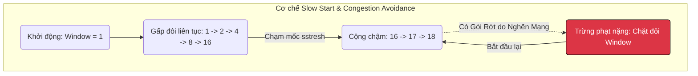

# Bài 7: Tầng Giao vận TCP/IP, Cửa sổ trượt và Kiểm soát Tắc nghẽn

Trong môi trường phân tán, CPU xử lý dữ liệu với tốc độ nano-giây (ns), RAM phản hồi trong vi-giây ($\mu$s), nhưng mạng Internet lại giao tiếp ở mức mili-giây (ms). Do đó, Nút thắt cổ chai lớn nhất của Data Pipeline không nằm ở Máy chủ, mà nằm ở **Cáp quang và Bộ định tuyến (Routers)**.

Để đảm bảo tệp dữ liệu 100GB từ Server A đến Server B không bị rớt mất dù chỉ 1 byte khi đi qua mạng lưới toàn cầu, nhân loại sử dụng **Giao thức TCP (Transmission Control Protocol)** nằm ở Tầng Giao vận (Transport Layer) của mô hình mạng OSI.

---

## 1. Hành trình Băm nhỏ Dữ liệu và TCP 3-way Handshake

Hệ điều hành không bao giờ nhét nguyên 1 tệp tin 100GB vào cáp mạng. Giao thức TCP sẽ băm nhỏ tệp 100GB đó ra thành hàng triệu gói tin bé xíu gọi là **Segments (Phân đoạn)**, mỗi gói có kích thước trần khoảng 1500 bytes (MTU).

Trước khi gửi bất cứ gói tin nào, Máy Gửi (Client) và Máy Nhận (Server) phải thực hiện một nghi thức chào hỏi đắt đỏ gọi là **Bắt tay 3 bước (3-way Handshake)** để thiết lập ống nối ảo:

1. **Client $\rightarrow$ Server (`SYN`):** "Alo, tôi muốn nói chuyện. Số sê-ri khởi điểm của tôi là 100".
2. **Server $\rightarrow$ Client (`SYN-ACK`):** "Nghe rõ. Số sê-ri khởi điểm của tôi là 500. Xác nhận tôi đã nhận được số 100 của bạn".
3. **Client $\rightarrow$ Server (`ACK`):** "Xác nhận tôi đã nhận được số 500 của bạn".

Chỉ sau 3 nhịp mạng khứ hồi này, 1.5 chuyến khứ hồi mạng (RTT - Round Trip Time), đường ống TCP mới chính thức được mở để luân chuyển dữ liệu.

---

## 2. Sliding Window (Cửa sổ Trượt) và Cơ chế Gửi Lại (Retransmission)

Đường ống TCP là một đường ống "Bảo đảm Vận chuyển 100%". 
Khi Client gửi Gói tin số 1, nó sẽ **Ngồi chờ** Server gửi lại tin nhắn báo cáo `ACK 1` (Đã nhận được gói 1) rồi mới dám gửi tiếp Gói 2. Cơ chế này siêu an toàn nhưng vô cùng lãng phí băng thông cáp quang.

Để tối đa hóa tốc độ, TCP sử dụng **Sliding Window (Cửa sổ trượt)**.
- Client nói: "Tôi sẽ mở cửa sổ kích thước 5. Tức là tôi sẽ bắn một loạt 5 gói tin (1, 2, 3, 4, 5) liên thanh vào cáp quang mà không cần chờ bạn báo cáo".
- Server nhận được 5 gói, nó sẽ gửi trả một báo cáo `ACK 6` (Đã nhận đủ đến 5, đang chờ gói 6).
- Cửa sổ của Client lập tức "trượt" lên phía trước, tiếp tục bắn một loạt gói tin từ (6 đến 10).

**Xử lý mất gói (Packet Loss):**
Nếu Gói số 3 bị rơi mất do đứt cáp, Server chỉ nhận được (1, 2, 4, 5). Server sẽ báo cáo `ACK 3` liên tục (Tôi chỉ nhận đủ tới 2, nôn gói 3 ra mau).
Client thấy báo cáo `ACK 3` lặp đi lặp lại 3 lần (Fast Retransmit), nó biết ngay gói 3 đã rơi, và lập tức gửi lại duy nhất Gói số 3 mà không cần gửi lại toàn bộ.

---

## 3. Thuật toán Kiểm soát Tắc nghẽn (TCP Congestion Control)

Sliding Window gây ra một thảm họa tàn khốc: Nếu Máy A có mạng cáp quang 10Gbps bắn dữ dội Sliding Window kích thước 10.000 gói tin sang Máy B chỉ xài mạng 3G yếu ớt. Bộ định tuyến (Router) đứng giữa hai máy sẽ bị nghẽn (Buffer Overflow) và vứt bỏ toàn bộ gói tin vào thùng rác.

Để ngăn mạng Internet toàn cầu sụp đổ, TCP tích hợp cơ chế **Kiểm soát Tắc nghẽn (Congestion Control)** vào thẳng lõi hệ điều hành. Thuật toán nổi tiếng nhất là **AIMD (Cộng tăng Dần - Nhân giảm Phân nửa)** và **Slow Start (Khởi động Chậm)**.

1. **Slow Start:** Ban đầu, TCP không biết mạng mạnh hay yếu. Nó rụt rè gửi 1 gói. Nếu Ổn, nó nhân đôi gửi 2 gói. Nếu Ổn, nó nhân đôi thành 4, 8, 16, 32... Tốc độ tăng trưởng theo hàm mũ (Exponential) tìm kiếm giới hạn của đường truyền.
2. **Congestion Avoidance:** Khi tốc độ lên đến mức 1000 gói/giây, bộ định tuyến Router báo Nghẽn bằng cách đánh rơi 1 gói tin. 
3. **Phạt Nặng:** Lõi TCP của Client phát hiện mất gói, nó lập tức hiểu là mạng đã chạm đỉnh. Nó cực kì hoảng sợ và tự động "Chặt Đôi" tốc độ tải xuống còn 500 gói/giây.

**Tại sao Data Engineer cần quan tâm?**
Thuật toán "Chặt đôi tốc độ" này cực kỳ tàn bạo đối với các Data Pipeline đường dài (WAN). Nếu bạn gửi 1 tệp tin 100GB từ Server Việt Nam sang Server Mỹ. Do quãng đường quá xa, chỉ cần rớt ngẫu nhiên 1 gói tin (dù mạng chưa hề nghẽn), TCP sẽ lầm tưởng mạng bị tắc nghẽn và bóp nghẹt 50% băng thông truyền tải của bạn. 
Để vượt qua giới hạn của TCP truyền thống, Google đã phát minh ra giao thức **BBR (Bottleneck Bandwidth and Round-trip propagation time)** chuyên biệt cho Linux Kernel, giúp duy trì tốc độ truyền siêu cao bỏ qua sự rơi rớt gói tin ngẫu nhiên. Mọi hệ thống Kafka/Spark trên Cloud ngày nay đều được tinh chỉnh nhân Kernel Linux bằng giao thức này.

---
**Navigation:**
[⬅️ Previous: Bài 6: Giải phẫu Kiến trúc Kubernetes (K8s) cho Data Pipelines](./06-kubernetes-architecture.md) | [Next: Bài 8: Mạng Nội bộ Đám mây: IP, DNS, BGP và Kiến trúc VPC ➡️](./08-dns-bgp-and-vpc.md)
