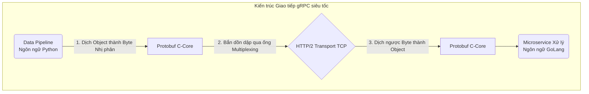

# Bài 10: Sự tiến hóa HTTP và Kiến trúc Data Pipeline với gRPC

Khi hai ứng dụng đã bắt tay xong mạng TCP/IP ở tầng Giao vận (Bài 7), chúng sẽ nói chuyện bằng ngôn ngữ gì ở tầng Ứng dụng cao nhất (Application Layer)? Ngôn ngữ thông trị 30 năm qua là HTTP (HyperText Transfer Protocol) và định dạng văn bản JSON.
Tuy nhiên, khi đối diện với bài toán truyền luồng dữ liệu 100GB Data Analytics, cấu trúc JSON/HTTP bộc lộ những tử huyệt chí mạng về băng thông.

---

## 1. Sự kìm hãm của HTTP/1.1 và JSON (RESTful API)

Trong kiến trúc RESTful kinh điển, mọi thông tin đẩy đi đều bám vào HTTP/1.1 với định dạng `.JSON`.
**Vấn đề chết người của JSON là Cấu trúc Phình to Ký tự (Text-Bloat):**
Nếu Data Engineer muốn truyền một con số `1` cực nhỏ, JSON bắt buộc phải đính kèm hàng tá ký tự chữ nghĩa giải thích xung quanh:
```json
{
  "customer_id": 1,
  "transaction_status": "success"
}
```
Để truyền đi 1 byte giá trị `1`, đường truyền mạng phải gánh tới gần 60 bytes chữ rác (`"customer_id": `). Phép nhân 60 lần hao phí băng thông này là thảm họa khi scale hệ thống lên hàng tỷ dòng dữ liệu.

Thêm vào đó, HTTP/1.1 mắc lỗi **Head-of-Line Blocking**:
Giao thức này quy định: Request 1 đi qua ống TCP, Server phải trả lời xong Request 1 thì Client mới được gửi tiếp Request 2. Nó tạo ra một hàng đợi chai cổ y hệt cái phễu rót nước, triệt tiêu sức mạnh song song. 

**Nỗ lực giải cứu của HTTP/2 và HTTP/3 (QUIC):**
- **HTTP/2 (Multiplexing):** Băm nhỏ các Request ra và trộn chung vào 1 ống TCP duy nhất gửi đi đồng loạt. Giải quyết được bài toán phễu nghẽn.
- **HTTP/3 (QUIC):** Táo bạo hơn, nó vứt bỏ hoàn toàn cấu trúc ống bắt tay 3 bước lề mề của TCP. Nó xây dựng lại giao thức trên nền tảng UDP (nhanh nhạy, không bắt tay).

Tuy nhiên, dù HTTP/2 có nhanh đến mấy, chừng nào nhân loại còn cố chấp truyền văn bản bằng chữ `.JSON`, băng thông cáp quang vẫn bị lãng phí.

---

## 2. Quyền năng của gRPC và Protocol Buffers (Mã hóa Nhị phân)

Google, khi đối diện với lưu lượng hàng Exabyte dữ liệu giữa các Data Center, đã phát minh ra chuẩn giao tiếp mạng tối thượng cho Microservices và Data Pipelines: **gRPC** (chạy trên nền tảng HTTP/2).
Điểm khác biệt cốt lõi nhất của gRPC so với RESTful API là nó Không dùng JSON, nó dùng **Protocol Buffers (Protobuf)**.

### A. Triệt tiêu Chữ nghĩa bằng Schema Dịch mã Nhị phân
Với Protobuf, cả 2 máy chủ gửi và nhận thống nhất ký với nhau một bản Hiệp ước Hợp đồng (File `.proto`), ví dụ:
```protobuf
message Transaction {
  int32 customer_id = 1;
  string status = 2;
}
```
Khi Server A muốn gửi khách hàng số `1` trạng thái `success`, mã nguồn Protobuf sẽ **hủy diệt toàn bộ chữ nghĩa**. Nó nén dữ liệu thành một khối Byte Nhị phân (Binary) siêu đặc:
`[0x08, 0x01, 0x12, 0x07, 0x73, 0x75, 0x63, 0x63, 0x65, 0x73, 0x73]`
(Tổng cộng chưa tới 11 bytes, so với 60 bytes của JSON).

Khi chuỗi byte này bay sang Server B qua mạng cáp quang, Server B dùng tờ Hợp đồng `.proto` để dịch ngược khối Byte đó về dạng cấu trúc lập trình ngay tắp lự. Quá trình băm/giải mã Nhị phân tốn cực ít CPU và triệt tiêu 80% rác băng thông đường mạng.



### B. Streaming (Dòng chảy Hai chiều)
REST API là mô hình "Gọi 1 câu - Chờ 1 câu trả lời".
gRPC hỗ trợ **Bi-directional Streaming (Dòng chảy Mở liên tục)**. Data Engineer có thể thiết lập 1 ống nối duy nhất mở vĩnh viễn giữa 2 Máy chủ. Cả 2 bên tự do tống hàng triệu luồng byte vào ống mà không cần đếm xỉa gì đến quá trình chờ trả lời của bên kia.

Đối với việc luân chuyển các khối tệp siêu lớn giữa cụm Hadoop hay Kafka liên lục địa, việc chuyển đổi các lệnh gọi nội bộ sang kiến trúc gRPC là tiêu chuẩn bắt buộc giúp tiết kiệm hàng triệu đô-la chi phí băng thông (Egress Network Cost) trên Đám mây.

---
**Navigation:**
[⬅️ Previous: Bài 9: Kiến trúc Cân bằng Tải (Load Balancing) và Reverse Proxy](./09-load-balancing-and-reverse-proxy.md) | [Next: Bài 11: Mật mã học Cơ sở và Quá trình Bắt tay TLS/SSL (Handshake) ➡️](./11-tls-ssl-and-symmetric-encryption.md)
