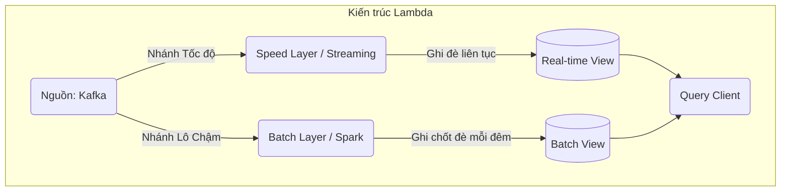

# Bài 1: Sự tiến hóa từ Batch đến Streaming và Kiến trúc Lambda/Kappa

Khi dữ liệu chỉ nằm trong ranh giới 1 Terabyte, hệ thống Data Warehouse cổ điển (Sử dụng MySQL, ETL cơ bản) hoạt động rất hoàn hảo. Tuy nhiên, khi dung lượng cán mốc Petabytes từ hệ thống log sự kiện (Clickstream) hay giao dịch thẻ tín dụng liên tục 24/7, mọi thứ cần một tư duy thiết kế kiến trúc hoàn toàn khác.

---

## 1. Nỗi đau của Batch Processing (Xử lý theo Lô)

**Batch Processing (Xử lý theo lô)** là phương pháp sơ khai và phổ biến nhất (Sử dụng Apache Spark/Hadoop MapReduce).
- **Cách hoạt động:** Dữ liệu thô từ Kafka hay Database được ném dồn thành một cục vào Data Lake. Cứ đúng 12h đêm hàng ngày, Lập trình viên chạy lệnh gọi một hạm đội 50 máy chủ Spark quét khối dữ liệu 50GB đó, tính toán tổng doanh thu, lưu kết quả lại, sau đó tắt máy.
- **Đánh đổi:** 
  - **Ưu điểm:** Tính toán trên toàn bộ tệp tĩnh siêu chính xác. Dễ code, dễ xử lý lỗi (Lỗi thì 1h sáng chạy lại lệnh từ đầu là xong).
  - **Tử huyệt (Nút thắt cổ chai):** Độ trễ (Latency). Báo cáo luôn bị chậm (Stale) một ngày. Bạn không thể dùng Batch Processing để phát hiện một giao dịch thẻ tín dụng giả mạo (Fraud Detection) ngay tại thời điểm khách hàng vừa quẹt thẻ xong.

---

## 2. Dòng thời gian Vô hạn: Data Streaming

**Data Streaming (Xử lý luồng)** sinh ra để diệt trừ độ trễ. 
Thay vì gom dữ liệu thành từng cục 50GB, Streaming tiếp cận dòng chảy dữ liệu (Event stream) như một **chuỗi sự kiện không có điểm kết thúc**.
- Mỗi khi có 1 User Click chuột, sự kiện đó chui qua đường ống Zero-copy của Apache Kafka (Bài 3, Part 4) và đập ngay vào 1 máy chủ Xử lý luồng (như Apache Flink).
- Hệ thống lập tức cập nhật con số "Tổng số lượt Click = 1" trong vòng chưa tới 10 mili-giây.

**Sự điên rồ của Streaming:**
Bởi vì luồng là vô tận, phần mềm Streaming **Không Bao Giờ Được Tắt**. Nó chạy miệt mài 24/7/365. Nếu máy chủ Flink bỗng nhiên mất điện khởi động lại, làm sao nó nhớ được "Ngày hôm qua đã đếm tới bao nhiêu Click"? Sự phức tạp khủng khiếp này sinh ra bài toán Stateful Processing (Xử lý có lưu trạng thái) mà chúng ta sẽ mổ xẻ ở Bài 2.

---

## 3. Kiến trúc Đứt gãy: Lambda Architecture

Vào thập niên 2010, con người thèm khát tốc độ của Streaming nhưng lại kinh sợ độ thiếu chính xác và dễ lỗi của nó. Họ không dám vứt bỏ Batch. Kỹ sư Nathan Marz đã sáng tạo ra một kiến trúc quái đản gọi là **Lambda Architecture**.

Kiến trúc Lambda bẻ đôi đường ống phân tích dữ liệu làm 2 ngả song song:

- **Nhánh Tốc độ (Speed Layer - Flink/Spark Streaming):** Cho số liệu ngay lập tức nhưng chấp nhận rủi ro sai sót (Do rớt gói tin hoặc lỗi mạng).
- **Nhánh Chậm (Batch Layer - Spark):** Nhánh này quét toàn bộ dữ liệu lưu dưới ổ cứng cẩn thận. Cứ 12h đêm nó chạy 1 lần và ghi đè một báo cáo CHÍNH XÁC 100% đè lên cái báo cáo sai sót của Nhánh Tốc độ.

**Sự Tàn Khốc của Lambda:** Data Engineer phải cày cuốc gấp đôi. Họ phải viết 2 đoạn Code song song (1 bằng code Streaming, 1 bằng code Batch) để tính chung 1 chỉ số Doanh thu. Bất cứ khi nào nghiệp vụ đổi công thức tính, kỹ sư phải đi sửa 2 kho repo code khác nhau.

---

## 4. Sự Thống nhất: Kappa Architecture

Sự mệt mỏi của Lambda kéo dài cho đến khi hệ sinh thái Streaming (Cụ thể là Kafka và Apache Flink) phát triển đến mức hoàn hảo. Người ta nhận ra: *"Khoan đã, nếu Streaming đã xịn đến mức đảm bảo chính xác tuyệt đối 100% không thua gì Batch, tại sao tôi phải giữ lại Nhánh Batch làm gì cho cực?"*.
Đó là sự ra đời của **Kappa Architecture**.

**Triết lý duy nhất của Kappa:** MỌI THỨ LÀ STREAMING.

- Không có khái niệm Batch. Bảng dữ liệu tĩnh (Table) thực chất chỉ là một bức ảnh chụp (Snapshot) của một Luồng (Stream) mà thôi.
- Cấu trúc chỉ có đúng 1 hệ thống Kafka truyền dữ liệu vô tận, và 1 hệ thống Flink để tính toán 24/7.
- **Cách sửa lỗi:** Nếu hôm nay phát hiện Code chạy sai công thức doanh thu trong suốt 1 năm qua. Data Engineer lập tức ném Code mới lên con Flink mới. Do Kafka không bao giờ xóa dữ liệu (cơ chế đĩa tĩnh siêu cấp - Bài 14 Part 3), con Flink mới sẽ quay con trỏ Offset về lại ngày 1/1/2023, đọc stream lại tốc độ cực đại như thác lũ băng qua lịch sử 1 năm để đếm lại tiền. 

Kappa Architecture với Apache Flink hiện là chuẩn mực tối cao của các tập đoàn siêu công nghệ như Uber, Netflix, và Alibaba để duy trì độ trễ thời gian thực tuyệt đối.

---
**Navigation:**
[Next: Bài 2: Trái tim Apache Flink: Xử lý Trạng thái (Stateful), Chandy-Lamport và RocksDB ➡️](./02-apache-flink-and-stateful-processing.md)
