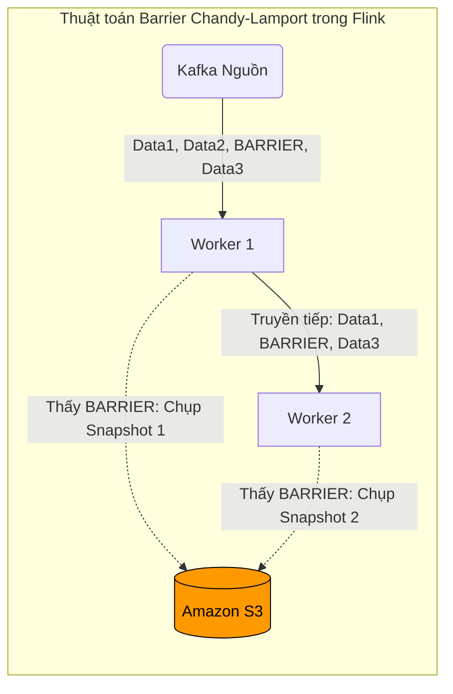

# Bài 2: Trái tim Apache Flink: Xử lý Trạng thái (Stateful), Chandy-Lamport và RocksDB

Sự kiêu hãnh của Data Streaming (Kiến trúc Kappa - Bài 1) là đảm bảo tính chính xác 100% thời gian thực. Nhưng làm thế nào để đảm bảo tính chính xác khi 10 máy chủ phân tán (Workers) đang xử lý 1 tỷ giao dịch/giây bỗng nhiên cúp điện mất sạch RAM?

Khác biệt giữa một luồng Streaming đơn giản (Stateless - không có não) và một hệ thống Streaming quy mô lớn (Stateful - lưu giữ trạng thái) chính là lõi công nghệ của siêu nền tảng **Apache Flink**.

---

## 1. Bài toán Xử lý Có Trạng Thái (Stateful Processing)

Nếu ứng dụng Flink của bạn chỉ làm mỗi việc: *Chuyển đổi IP khách hàng thành Mã Quốc gia (Filter/Map)*. Nó cực kỳ đơn giản vì nó vô tri (Stateless). Nếu máy tính sập, cứ khởi động lại và nhặt tin nhắn tiếp theo đọc tiếp.

Nhưng nếu ứng dụng Flink của bạn làm nhiệm vụ: *Kiểm tra xem User A có đăng nhập sai password quá 3 lần trong 5 phút không để Khóa tài khoản*. 
Ứng dụng bắt buộc phải dùng RAM để GHI NHỚ: *"À, lúc 10h01 ông A sai 1 lần. Lúc 10h03 sai thêm lần nữa. Tổng là 2 lần"*. 
Con số `2` này được gọi là **Trạng thái nội bộ (Local State)**.

Vấn đề: Giả sử đến 10h04, Máy chủ Flink bị cháy ổ cứng sụp nguồn. Trạng thái `2 lần` nằm trên RAM hoàn toàn bốc hơi. Khi máy tính khởi động lại, User A nhập sai lần 3, Flink lại đếm từ số 1, dẫn đến lỗ hổng bảo mật tàn khốc.

---

## 2. Checkpointing và Thuật toán Chandy-Lamport

Để giải quyết vấn đề RAM bốc hơi, Flink phát minh ra cơ chế **Trạm kiểm soát (Checkpointing)**.
Cứ mỗi 10 giây, Flink sẽ chụp một bức ảnh (Snapshot) toàn bộ khối RAM của tất cả các máy chủ Worker, sau đó đem bức ảnh đó gửi cho ổ đĩa tĩnh cực kì an toàn của HDFS hoặc Amazon S3 để cất giữ. Nếu máy Flink cháy, nó chỉ việc bật lên, chọc vào S3 kéo cái Snapshot gần nhất thả về lại RAM và chạy tiếp.

**Thảm họa phân tán:**
Nhưng Flink không phải 1 máy. Nó là 100 máy rải rác trên mạng.
Làm sao để ra lệnh cho 100 máy tính đang xử lý hàng triệu tin nhắn mỗi giây CÙNG NHAU dừng lại chụp ảnh RAM cùng một phần nghìn giây (mili-giây)? Điều này là bất khả thi về mặt vật lý vì cáp mạng luôn có độ trễ lệch nhau (Network Latency). Nếu Máy 1 chụp ảnh trước Máy 2, dữ liệu sẽ bị rách (Inconsistent).

**Lời giải của những Vị thần: Thuật toán Chandy-Lamport (1985)**
Flink ứng dụng lại thuật toán Snapshot vĩ đại của Khoa học máy tính để chụp ảnh toàn mạng lưới mà **KHÔNG CẦN BẤT CỨ MÁY TÍNH NÀO PHẢI DỪNG LẠI (Lock-free)**.

1. Máy chủ Đầu Não (JobManager) bí mật chèn một **Gói tin Ranh giới (Barrier)** vô hình tống vào đường ống Data của Kafka. Gói tin này trôi lẫn lộn cùng hàng triệu gói tin Data thật.
2. Gói tin Barrier trôi vào Máy số 1. Máy số 1 ngay lập tức hiểu lệnh: Nó đẩy khối RAM Local State vào S3 lưu trữ, sau đó nó chuyển tiếp gói Barrier qua cho Máy số 2. **Lưu ý: Máy 1 không hề ngừng xử lý Data mới!**
3. Máy số 2 đang mải mê tính toán. Khi nó nhận được Barrier từ Máy 1 truyền sang, nó cũng lập tức đẩy RAM Local State của riêng nó vào S3.

Cái Barrier chạy như một dòng kẻ vạch ranh giới cắt ngang mọi tiến trình. Khi tất cả 100 máy đều đã thấy Barrier và lưu RAM xong, bức tranh toàn cảnh (Global State) được công nhận là Chính xác Tuyệt đối. Sự vi diệu này giúp Flink trở thành Vua của Xử lý Thời gian thực.

---

## 3. Nút thắt RAM và Sự nhúng ngầm của RocksDB

Trong các bài toán khổng lồ (Ví dụ hệ thống AI gom lịch sử mua hàng của 50 triệu người), khối RAM Local State trên một máy Worker Flink có thể phình to lên tới 200GB.
Máy chủ Flink sẽ bị hệ điều hành bắn chết bằng lưỡi dao OOM-Killer (Bài 2, Part 4).

Làm sao để ứng dụng Streaming lưu giữ trạng thái 200GB lớn hơn cả thanh RAM của nó?
**Giải pháp: Đem Database nhét vào trong lòng Ứng dụng.**

Flink tích hợp chặt chẽ với **RocksDB**. Thay vì lưu State lên RAM Python/Java, Flink lưu nó vào RocksDB.
Điều đặc biệt: RocksDB không phải là hệ thống CSDL có Server rời (như MySQL, MongoDB). Nó là một **Embedded Database (CSDL Nhúng)** dựa trên kiến trúc bộ nhớ Ghi nối tiếp tốc độ ánh sáng LSM-Tree (Bài 9, Part 3). 
Mã nguồn RocksDB chạy cùng chung một không gian RAM (User Space) với Flink. Khi RAM cạn, RocksDB tự động âm thầm đẩy bớt State xuống Ổ cứng SSD cục bộ (Spill to Disk) bằng kỹ thuật lướt ghi siêu thanh. 

Nhờ cấu trúc cộng sinh này, Flink có năng lực duy trì lượng trạng thái (State) từ Gigabytes lên tới hàng Terabytes cho mỗi Node mà không bao giờ suy sụp, biến nó thành cỗ máy bất tử của kỷ nguyên Big Data.

---
**Navigation:**
[⬅️ Previous: Bài 1: Sự tiến hóa từ Batch đến Streaming và Kiến trúc Lambda/Kappa](./01-batch-vs-streaming-and-lambda-architecture.md) | [Next: Bài 3: Xử lý Thời gian thực: Event Time, Watermarks và Windowing ➡️](./03-event-time-watermarks-and-windowing.md)
