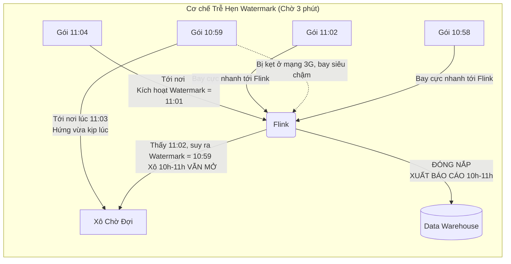

# Bài 3: Xử lý Thời gian thực: Event Time, Watermarks và Windowing

Kiến trúc Flink (Bài 2) đã giải quyết vấn đề RAM rớt điện mất dữ liệu. Nhưng ở môi trường phân tán toàn cầu, có một thế lực ma quỷ tàn khốc hơn phần cứng: **Sự nhiễu loạn của Thời gian Không gian**.

Làm thế nào bạn tính được "Doanh thu trong 1 giờ từ 10h đến 11h" khi mà một tin nhắn giao dịch mua hàng lúc 10h59 bị kẹt trong mạng 3G của rừng núi, và mãi đến 11h05 mới mò đến máy chủ Flink của bạn? 

---

## 1. Nghịch lý Thời gian: Event Time vs Processing Time

Trong Data Engineering truyền thống, người ta thường mắc một sai lầm chết người khi dùng khái niệm **Processing Time (Thời gian Xử lý)**.
- Processing Time là thời gian chỉ trên cái đồng hồ treo tường của cỗ máy Flink. Gói tin giao dịch 10h59 (bị kẹt mạng), lết đến Flink lúc 11h05. Flink nhìn đồng hồ và xếp giao dịch này vào "Doanh thu của khung giờ 11h đến 12h". 
$\rightarrow$ **Kết quả:** Báo cáo doanh thu khung 10h bị thiếu hụt, khung 11h bị đội lên. Sai lệch tài chính nghiêm trọng.

Để chính xác tuyệt đối, mọi hệ thống Streaming đẳng cấp thế giới buộc phải xài **Event Time (Thời gian Sự kiện)**.
- Event Time là con tem thời gian (Timestamp) được in chết vào kiện hàng từ chính chiếc điện thoại của User. Gói tin in mác 10h59, Flink đọc mác và khẳng định chắc nịch: Gói này thuộc về khung giờ 10h, dù cho mày có đến muộn lúc 12h trưa.

---

## 2. Nỗi ám ảnh của Data trễ hẹn và Cứu tinh Watermark

Khi Flink đang tính toán "Khung giờ 10h - 11h". Đồng hồ thực tế đã điểm 11h01. Flink có nên vội vàng kết sổ, đóng gói báo cáo và báo cáo cho sếp không?
Không. Vì Flink biết mạng Internet đầy rẫy sự tắc nghẽn, có những thằng 10h59 vẫn đang lê lết đi tới. Flink phải CHỜ ĐỢI.

Nhưng chờ đến bao giờ? Nếu chờ vĩnh viễn, báo cáo BI sẽ bị treo đứng. Khái niệm **Watermark (Dấu ngấn nước)** được sinh ra để cân bằng ranh giới giữa Sự chờ đợi (Độ chính xác) và Tốc độ.

**Bản chất của Watermark:**
Watermark là một lời hứa, một sự chốt hạ thời gian do chính Flink phát ra.
Ví dụ: Flink cấu hình độ trễ cho phép là 3 phút. 
- Khi Flink nhận được các gói tin có Event Time là 11h02. Nó tự trừ lùi đi 3 phút và thét lên một Watermark: **"Tôi tuyên bố Watermark hiện tại là 10h59. Tôi hứa sẽ không còn gói tin nào cũ hơn 10h59 xuất hiện nữa!"**.
- Lúc này, "Cái xô" chứa dữ liệu khung giờ (10h-11h) vẫn mở miệng để hứng nốt những thằng đến muộn.
- Mãi đến khi gói tin 11h04 xuất hiện. Flink cập nhật Watermark lên thành **11h01**.
- Ngay khoảnh khắc Watermark vượt qua mốc 11h00. Flink lập tức ĐÓNG NẮP cái xô (10h-11h), tính toán tổng tiền và xuất báo cáo. Mọi thằng đến sau khoảnh khắc đóng nắp đó sẽ bị ném vào sọt rác (Late Data Drop).

---

## 3. Nghệ thuật Windowing (Phân mảnh thời gian)

Cái xô hứng dữ liệu ở trên trong Flink được gọi là khái niệm **Window**. Nó chia cắt luồng dữ liệu vô hạn thành các cụm hữu hạn để tính tổng. 

Có 2 mô hình Window xương sống mà mọi Data Engineer phải thiết kế:

### A. Tumbling Window (Cửa sổ Lăn)
- Các khối thời gian vuông vức, không dính líu vào nhau. 
- *Ví dụ:* Cửa sổ 1 giờ. (Từ 10h-11h, từ 11h-12h). 
- *Ứng dụng:* Báo cáo Kế toán, Tổng hợp Doanh thu cuối tháng. Mỗi gói tin chỉ nằm đúng vào 1 cái xô duy nhất.

### B. Sliding Window (Cửa sổ Trượt)
- Các khối thời gian đè chéo lên nhau. Khai báo 2 biến: Kích thước xô và Độ trượt.
- *Ví dụ:* Xô kích thước 1 giờ, Độ trượt 5 phút. 
   - Xô 1: 10h00 - 11h00
   - Xô 2: 10h05 - 11h05
   - Xô 3: 10h10 - 11h10
- *Ứng dụng:* Cấu trúc tối thượng cho Hệ thống Phân tích Bất thường (Fraud/Anomaly Detection) hoặc Xu hướng Twitter (Trending Topics). Vì các xô đè lên nhau, một tin nhắn bùng nổ lúc 10h30 sẽ được tính nằm trọn trong hàng chục cái xô liên tiếp, giúp thuật toán AI dễ dàng bắt được đồ thị biến động nhịp tim liên tục mượt mà.

Sự tổng hòa của Event Time, Watermark và Windowing giúp các kỹ sư xây dựng hệ thống tính toán thời gian thực chính xác bất chấp sự suy thoái tàn khốc của vật lý mạng lưới Internet.

---
**Navigation:**
[⬅️ Previous: Bài 2: Trái tim Apache Flink: Xử lý Trạng thái (Stateful), Chandy-Lamport và RocksDB](./02-apache-flink-and-stateful-processing.md) | [Next: Bài 4: Bất khả xâm phạm: Exactly-Once Semantics, 2PC và Tính Lũy đẳng ➡️](./04-exactly-once-semantics-and-idempotence.md)
