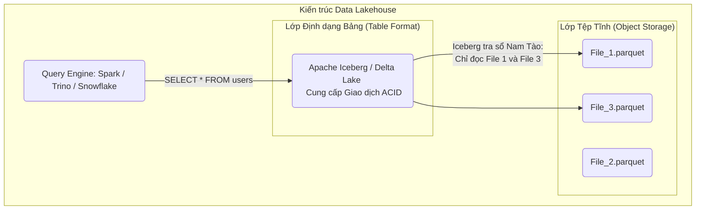

# Bài 5: Data Lakehouse: Mang tính Nhất quán ACID lên Lưu trữ Đám mây

Trong Bài 10 và 11 (Part 3), chúng ta đã phân định ranh giới giữa Data Warehouse (Đóng khung, đắt đỏ, chạy ACID transaction) và Data Lake (Đổ rác tự do, file tĩnh trên S3/HDFS, siêu rẻ). 
Trong 5 năm trở lại đây, ranh giới này đã bị phá vỡ hoàn toàn bởi một kiến trúc lai tạo vĩ đại: **Data Lakehouse**.

---

## 1. Nỗi đau của Data Lake và Tính vô pháp (Lack of ACID)

Khi bạn lưu hàng triệu file Parquet trên Amazon S3 (Data Lake). Amazon S3 là hệ thống Object Storage (lưu trữ tệp phẳng). Nó Không Phải Là Database. 
Nó không có khái niệm B-Tree, không có WAL log (Bài 3, Part 3). Nó cực kỳ ngu ngốc, chỉ biết làm 2 lệnh: GHI (PUT) một file 1GB và ĐỌC (GET) file 1GB đó lên.

**Thảm họa xảy ra khi bạn muốn sửa 1 dòng dữ liệu:**
Bạn muốn đổi tên một khách hàng có ID=5 từ "Alice" thành "Bob". Bạn không thể chạy lệnh `UPDATE set name='Bob' where id=5` trên S3. S3 không hiểu SQL. S3 không cho bạn mở file Parquet 1GB ra và chọc tay sửa 1 dòng.
- Để sửa, bạn phải kéo nguyên cục file 1GB đó về RAM máy chủ Spark. Tìm dòng đó, sửa thành "Bob".
- Sau đó Ghi Đè (Overwrite) nguyên 1 cái file 1GB mới tinh lên S3 xóa cái file cũ đi.

Điều gì xảy ra nếu lúc bạn đang hì hục ghi đè cái file 1GB kia, có một người khác (như Analyst) cắm Tool BI vào đọc dữ liệu? Họ sẽ đọc được một file Đang Ghi Dở Dang (Rách file/Inconsistent Read), chứa 50% dữ liệu cũ và 50% dữ liệu mới. Báo cáo tài chính sụp đổ vì thiếu **Tính Bền vững và Nhất quán ACID**.

---

## 2. Kỷ nguyên Table Formats (Định dạng Bảng Hiện đại)

Để chữa căn bệnh này, Netflix (phát minh ra **Apache Iceberg**) và Uber (phát minh ra **Apache Hudi**) đã tạo ra một lớp Bọc ma thuật nằm kẹp ở giữa Tệp Parquet và Máy chủ Tính toán Spark. Cái lớp mỏng dính này gọi là **Open Table Formats**.

Lakehouse = Sức chứa File Parquet vô tận của Data Lake + Cấu trúc bảo chứng ACID Metadata của Data Warehouse.

### Trí thông minh tách rời (Decoupled Intelligence)
Table Format (như Iceberg) KHÔNG LÀM NHIỆM VỤ TÍNH TOÁN (Đó là việc của Spark/Trino). Nó cũng KHÔNG LƯU FILE (Đó là việc của S3).
Nhiệm vụ duy nhất của Iceberg là **Duy trì một cuốn sổ Nam Tào (Metadata Log)** theo dõi từng sự thay đổi nhỏ nhất của các tệp tĩnh dưới S3, giống hệt cơ chế Git Commit.

Nhờ Sổ Nam Tào của Iceberg, khi Spark A đang ghi đè một file mới xuống S3. Iceberg sẽ không thèm ghi danh file mới đó vào sổ. Các nhà phân tích lúc này vào tra sổ, Iceberg vẫn tự tin chỉ tay về các File cũ (Bảo vệ an toàn Read Isolation). 
Chỉ khi Spark A bắn tín hiệu "Ghi thành công 100% không rách nát", Iceberg mới chốt hạ (Commit) xóa dòng File cũ đi và chép tên File mới vào Sổ Nam Tào. Từ giây phút đó, mọi truy vấn sẽ trỏ về Data mới. 

Sự kết tinh này mang trọn vẹn đặc tính Transactional y hệt PostgreSQL lên một hồ chứa tĩnh khổng lồ, khai sinh ra khái niệm Data Lakehouse. Tại Bài 6, chúng ta sẽ mở bung cái Sổ Nam Tào của Iceberg để xem Netflix cấu trúc nó như thế nào.

---
**Navigation:**
[⬅️ Previous: Bài 4: Bất khả xâm phạm: Exactly-Once Semantics, 2PC và Tính Lũy đẳng](./04-exactly-once-semantics-and-idempotence.md) | [Next: Bài 6: Giải phẫu Lõi Apache Iceberg: Metadata Tree và Time Travel ➡️](./06-apache-iceberg-architecture.md)
