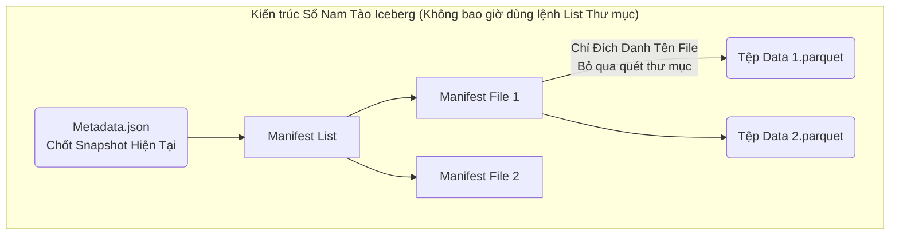

# Bài 6: Giải phẫu Lõi Apache Iceberg: Metadata Tree và Time Travel

Apache Iceberg là chuẩn mực Table Format (Bài 5) tối cao đang được các siêu nền tảng Data như Snowflake, Databricks và BigQuery đua nhau hỗ trợ. Sức mạnh của Iceberg nằm ở kiến trúc Cây Siêu Dữ Liệu (Metadata Tree) cực kỳ chặt chẽ, được thiết kế để vượt qua Nút thắt hiệu năng Liệt Kê File (File Listing Bottleneck) của S3.

---

## 1. Tử huyệt File Listing của Hadoop Hive

Trước thời Iceberg, mọi người dùng Apache Hive để quản lý Data Lake. Hive lưu cái Sổ Nam Tào (Bảng thư mục) trong một cơ sở dữ liệu MySQL trung tâm gọi là Hive Metastore.
- Hive quy định: Dữ liệu chia làm nhiều thư mục Partition. Thư mục `year=2023`, thư mục `year=2024`.
- Khi Lập trình viên gõ: `SELECT * FROM sales WHERE year=2024`.
- Hive Metastore sẽ nói: "Dữ liệu nằm ở thư mục S3 `s3://bucket/sales/year=2024/` đó, chui vào đó mà lấy".

**Vấn đề Sập Mạng:**
Nó chỉ chỉ cái Thư mục, nhưng trong thư mục `2024` lại có chứa 1 triệu file `.parquet` rác rưởi cắt vụn nhỏ xíu (Small Files Problem). Spark sẽ phải gọi một cái API của Amazon S3: `S3.ListObjects("year=2024")`. Việc S3 đi quét lướt qua để liệt kê 1 triệu cái tên file làm tốn mất 15 phút. Query của bạn bị đóng băng 15 phút trước khi Spark bắt đầu chạm vào được byte dữ liệu đầu tiên.

---

## 2. Kiến trúc Cây Phân cấp Metadata của Iceberg

Iceberg khai tử hoàn toàn khái niệm Thư Mục Vật Lý (Physical Directory). Trên S3 của Iceberg, hàng triệu file Parquet bị vứt lộn xộn trong một cái bãi rác phẳng (Object Store Flats).

Thay vì lưu Thư mục, Iceberg theo dõi Từng File cụ thể, và chia sổ thành 3 tầng từ trên xuống dưới (Metadata Tree):

1. **Metadata File (.json):** Gốc của cây. Lưu trạng thái tổng (Table Schema lúc này, Bảng có bao nhiêu Partition). Điểm quan trọng nhất: Nó trỏ đến con trỏ của Snapshot hiện tại (Chốt chặn thời gian).
2. **Manifest List (.avro):** Danh sách các tệp kê khai thuộc về Snapshot đó. Nó đóng vai trò như B-Tree cấp 1 (Chứa Min/Max của các Partition). (Ví dụ: Danh sách này quản lý các file chứa Data từ năm 2023 đến 2024).
3. **Manifest File (.avro):** Sổ kê khai chi tiết. Nó chứa chính xác tên vật lý tuyệt đối của từng file Parquet cụ thể dưới đáy S3 (`s3://.../file-xyz.parquet`). Nó chứa luôn cột Header Max/Min dữ liệu của file Parquet đó (Predicate Pushdown - Bài 11 Part 3).

**Sức mạnh lật đổ của Cấu trúc Cây:**
Khi gọi `SELECT * WHERE year=2024 AND id=15`. Spark chọc thẳng vào cái Manifest List (1 cục tệp bé xíu nhẹ hều). Manifest List nói: "Id 15 chỉ nằm trong Manifest File 1". Spark nhảy thẳng vô File 1, đọc được cái dòng chữ cứng ngắc báo rằng: Dữ liệu nằm ở `s3://bucket/file-xyz.parquet`. Spark bốc đích danh duy nhất cái file đó ra. Tốc độ Planning (Lập kế hoạch truy vấn) từ 15 phút của Hive bị Iceberg đập bẹp xuống còn **0.5 Giây (Zero-Listing O(1))**.

---

## 3. Quyền năng Time Travel và Rollback (Xuyên Không)

Vì Iceberg lưu trạng thái Snapshot ở tệp Metadata gốc (Mỗi lần update Data, nó đẻ ra 1 cái Snapshot mới `V2`, nhưng KHÔNG XÓA cái `V1` cũ). 
Cấu trúc Git-Version Control này cho phép Data Engineer du hành thời gian.

- **Time Travel Query:** Sếp hỏi: "Tại sao doanh thu tháng trước hôm nay báo 5 tỷ, mà tao nhớ hôm tao coi lúc ngày 1/1 nó báo 6 tỷ?". Data Engineer có thể viết lệnh:
  `SELECT * FROM sales TIMESTAMP AS OF '2024-01-01 00:00:00'`
  Iceberg sẽ móc cái Snapshot quá khứ V1 cũ mèm ra, cho phép bạn đọc lại Data chính xác như những gì đang hiển thị vào ngày hôm đó (Dù hiện tại Data đã bị UPDATE nát bét).
  
- **Rollback (Hoàn tác chống Ngu):** Nếu Job Spark chạy đêm qua viết nhầm 1 tỷ dòng Rác vào hệ thống làm ô nhiễm hồ dữ liệu. Lập trình viên chỉ cần gõ 1 lệnh Call Stored Procedure duy nhất lùi con trỏ Snapshot gốc của bảng từ `V2` về lại `V1`. Một tỷ dòng rác lập tức bị "tàng hình" khỏi hệ thống mà không tốn lấy 1 giây CPU để chạy lệnh `DELETE`. Hệ thống phục hồi trong chớp mắt.

---
**Navigation:**
[⬅️ Previous: Bài 5: Data Lakehouse: Mang tính Nhất quán ACID lên Lưu trữ Đám mây](./05-lakehouse-and-acid-on-cloud.md) | [Next: Bài 7: Truy vấn Siêu thanh: Lệnh SIMD và Kiến trúc Vectorized Execution ➡️](./07-vectorized-query-execution-and-simd.md)
