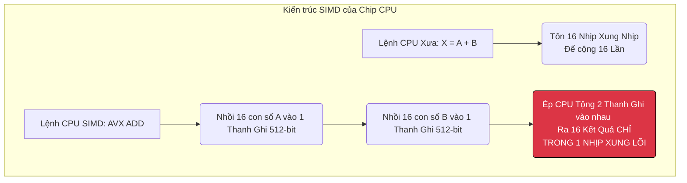

# Bài 7: Truy vấn Siêu thanh: Lệnh SIMD và Kiến trúc Vectorized Execution

Sau khi Apache Iceberg (Bài 6) giúp hệ thống khoanh vùng được đúng tệp tin Parquet 1GB trên S3 mà không cần càn quét. Tệp 1GB đó sẽ được đổ vào RAM của máy chủ tính toán (Spark, Trino/Presto, ClickHouse).
Tại đây, một trận chiến hiệu năng khác bắt đầu: **Làm sao để Lõi CPU cộng dồn (SUM) 100 triệu con số doanh thu trong mảng RAM đó với tốc độ nhanh nhất?**

---

## 1. Nỗi nhục nhã của Volcanic Iterator (Xử lý Từng Dòng)

Xuyên suốt 30 năm, các RDBMS cổ điển (MySQL, PostgreSQL) sử dụng mô hình lập kế hoạch truy vấn **Volcano Iterator Model**.
Kiến trúc này thiết kế mã nguồn theo phong cách Hướng Đối Tượng (OOP). Hàm xử lý của CPU sẽ gọi một lệnh `next()`.
1. CPU xin RAM: "Đưa tao dòng dữ liệu Số 1". CPU nhận về Object Row 1 (Gồm Cột ID, Tên, Số tiền). CPU tách Số Tiền ra, cộng dồn vào Biến Tổng.
2. CPU gọi `next()`: "Đưa tao dòng dữ liệu Số 2".
3. CPU cứ thế lặp lại 100 triệu vòng lặp.

**Tử huyệt phần cứng của mô hình Volcano:**
Mỗi lần gọi hàm `next()` trong ngôn ngữ lập trình (như Java/C++) là một lần ép CPU phải nhảy con trỏ lệnh (Virtual Function Call/Branching).
- Nó tàn phá bộ đệm lệnh siêu nhỏ trong CPU (L1 Instruction Cache Miss).
- Dòng dữ liệu nằm rải rác trên RAM, mỗi lần lóc cóc chạy đi lấy 1 dòng là một độ trễ đắt đỏ.
Kết quả: CPU của máy chủ dù xịn đến mấy cũng chỉ xài được 10% công lực, 90% thời gian rảnh rỗi chờ tráo lệnh.

---

## 2. Kỷ nguyên của Lô (Batch) và Vectorized Processing

Để lấp đầy ống tiêu hóa của CPU, các hệ cơ sở dữ liệu OLAP hiện đại như (ClickHouse, Snowflake) và Engine query tiên tiến (Trino, Photon của Databricks) chuyển sang mô hình **Vectorized Query Execution (Thực thi Truy vấn theo Vector)**.

Thay vì kêu `next()` rặn ra từng dòng. CPU thét lên: "Đưa tao nguyên một Vector chứa 10.000 con số (Cột Tiền) lên đây cùng một lúc!". (Vì dữ liệu lưu dưới dạng Columnar Parquet - Bài 11 Part 3, nên việc bốc nguyên Cột Tiền lên CỰC KỲ DỄ DÀNG vì chúng nằm sát rạt nhau trên ổ đĩa).

CPU nhận nguyên 1 Mảng (Vector/Array) 10.000 phần tử tống thẳng vào Bộ đệm siêu tốc nội bộ (L1 Cache) của nó.
Lúc này, cấu trúc code vòng lặp `for loop` được viết gộp một cục, không có Virtual Function Call cản trở. CPU tính toán 1 lèo xong 10.000 con số chỉ trong 1 nhịp chớp mắt.

---

## 3. Đỉnh cao Vật lý: Lợi dụng tập lệnh SIMD (Single Instruction, Multiple Data)

Chưa dừng lại ở Vectorization phần mềm. Các Data Engineer cấp thấp viết Java/Python, nhưng các kỹ sư làm Database lõi (C++/Rust) vươn tay can thiệp thẳng vào bảng vi mạch của con chip Intel/AMD.
Đó là công nghệ **SIMD (Một Lệnh Chạy Cùng Lúc Nhiều Data)**.

**Sự thật về CPU:**
- Một lõi CPU có những thanh ghi (Registers) dài bình thường chứa được 1 con số 32-bit.
- Nhưng Intel cấu tạo sẵn trong lõi CPU các thanh ghi siêu rộng (AVX-512) dài 512 bit. Nó nhét vừa khít **16 con số 32-bit cùng một lúc**.

**Thành tựu Tốc độ:**
Khi ClickHouse quét qua 10.000 con số Tiền để tính SUM. Nó lợi dụng tập lệnh hợp ngữ SIMD của C++. Nó nhét 16 con số vào thanh ghi, đập 1 phát tính xong cả 16 số. Tốc độ query giảm chiều vật lý được **nhân lên gấp 16 lần hoàn toàn miễn phí** không tốn thêm 1 watt điện năng nào.

Sự trỗi dậy của Vectorized Execution và SIMD lý giải tại sao việc dùng Python Pandas (vốn chạy chậm) đang dần bị thay thế bởi Polars (Viết bằng Rust tích hợp SIMD) đạt tốc độ phân tích siêu hạng trên cùng một máy tính cá nhân nhỏ bé. Mọi công cụ Big Data hiện đại đều đang đua nhau viết lại Engine lõi bằng C++/Rust để bú trọn sức mạnh phần cứng này.

---
**Navigation:**
[⬅️ Previous: Bài 6: Giải phẫu Lõi Apache Iceberg: Metadata Tree và Time Travel](./06-apache-iceberg-architecture.md) | [Next: Bài 8: Não bộ Spark SQL: Tối ưu hóa Chi phí CBO và Broadcast Hash Join ➡️](./08-cost-based-optimizer-cbo.md)
