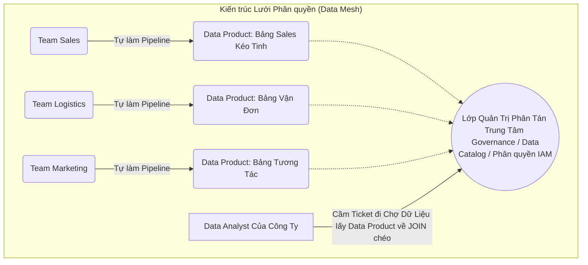

# Bài 10: Quản trị Phân tán: Data Lineage, Catalog và Mô hình Lưới (Data Mesh)

Khi quy mô tập đoàn lên tới 5,000 nhân sự và 500 Data Engineers. Cấu trúc Data Lake / Data Warehouse truyền thống (Centralized - Tập trung) bắt đầu sinh ra một nút thắt cổ chai về Con Người (Human Bottleneck).

Nhóm Data Engineer ở trung tâm (Central Data Team) bị ngập lụt trong hàng triệu yêu cầu. Team Marketing đòi thêm bảng Campaign, Team Sales đòi thêm bảng Đơn hàng. Data Team không hiểu rõ nghiệp vụ Sales, họ làm sai logic, sửa tới sửa lui. Khái niệm **Data Mesh (Lưới Dữ liệu)** và các công cụ Quản trị Khả năng quan sát (Data Observability) ra đời để phân tán quyền lực này.

---

## 1. Nỗi Đau Hộp Đen: Phá băng với Data Lineage và Data Catalog

Nếu có một lỗi kinh hoàng: "Báo cáo Tổng Doanh Thu Tháng 12 bị sai lệch 500 triệu". 
Bạn nhìn vào cái Dashboard BI, nó là đầu ra cuối cùng của một chuỗi Data Pipeline dài dằng dặc 50 bước, được nối qua 30 bảng khác nhau, code viết bởi 15 Kỹ sư (trong đó có 5 người đã nghỉ việc). Hệ thống lúc này là một **Hộp đen (Black Box)** tăm tối. Làm sao truy vết (Troubleshoot) xem dòng code SQL nào làm sai lệch 500 triệu?

**Giải pháp A: Data Catalog (Từ điển Dữ liệu)**
Hệ thống (như Amundsen, Datahub) buộc mọi bảng dữ liệu phải gắn siêu dữ liệu (Tags, Chủ sở hữu là ai, Bảng này ý nghĩa là gì, Mức độ Bảo mật Tối mật hay Công khai). Tránh tình trạng 10.000 cái Table rác nằm ngổn ngang trong Lake không ai biết sinh ra để làm gì.

**Giải pháp B: Data Lineage (Gia phả Dòng chảy Dữ liệu)**
Bằng cách cắm các đoạn code quét tự động (AST Parser) vào tận lõi Engine của Spark SQL hoặc Airflow. Hệ thống Lineage sẽ vẽ ra một Sơ đồ Mạng nhện Vĩ đại.
Nó truy ngược từ: *Dashboard Doanh Thu* $\leftarrow$ *Bảng D_Sales (Iceberg)* $\leftarrow$ *Bảng O_Orders (MySQL)* $\leftarrow$ *Hệ thống CRM gốc*.
Nhờ nhìn vào Lineage, Data Engineer dễ dàng khoanh vùng: À, lỗi bắt nguồn từ cái Step chuyển đổi giữa MySQL sang Bảng Iceberg do anh Kỹ sư A lỡ tay xóa cột Thuế.

---

## 2. Lật đổ Kiến trúc Tập trung: Mô hình Data Mesh

Năm 2019, Zhamak Dehghani đưa ra một tuyên ngôn chấn động phá nát tư duy "Tống tất cả vào 1 Data Lake trung tâm". Cô định nghĩa **Data Mesh (Kiến trúc Lưới Dữ liệu)**.

Data Mesh không phải là phần mềm. Nó là **Sự thiết kế lại Tổ chức (Organizational Architecture)**.

### Triết lý 1: Domain-driven Ownership (Sở hữu theo Miền Nghiệp vụ)
- Thay vì bắt nhóm Central Data Engineer phải hì hục gom Data của toàn công ty. Data Mesh yêu cầu Phân Quyền.
- Nhóm Kỹ sư của Team Sales sẽ **Tự chịu trách nhiệm** làm sạch Data của Team Sales và phơi nó ra (Expose) bằng hệ thống S3/Kafka của riêng họ. 
- Nhóm Kỹ sư của Team Logistics tự làm sạch và quản lý Bảng Vận đơn của riêng họ. 

### Triết lý 2: Data as a Product (Dữ liệu là một Sản phẩm)
- Cái bảng Dữ liệu Sales không còn là 1 cái File vô tri để trong xó. Team Sales phải coi nó là 1 Sản phẩm bán ra ngoài chợ. Họ phải thiết kế Hợp đồng Dữ liệu (Data Contract - SLA). 
- Họ hứa với nội bộ công ty: "Sản phẩm Bảng Sales của team tôi đảm bảo Cập nhật chuẩn lúc 8h sáng mỗi ngày, tỷ lệ trống cột NULL dưới 1%. Nếu sai, team tôi bị phạt KPI".

### Triết lý 3: Lớp Quản trị Liên bang (Federated Governance)
Vì mỗi team tự xài công cụ, tự xây DB riêng, mọi thứ sẽ trở nên hỗn loạn. Lớp Quản trị Trung ương sinh ra chỉ làm đúng 1 việc: Ép tất cả các Team tuân thủ Chuẩn Định Dạng chung (Ví dụ: Phải xài file Parquet, phải mã hóa mật khẩu, phải cập nhật Data Catalog).

Data Mesh trao quyền tự chủ tuyệt đối cho các nhóm phát triển nhỏ lẻ (Micro-teams), đẩy nhanh tốc độ xây dựng báo cáo lên gấp 10 lần, và giải cứu nhóm Central Data Team khỏi thảm họa kẹt xe vĩnh cửu. Đây là đích đến cuối cùng của các tập đoàn công nghệ tỷ đô.

---
**Navigation:**
[⬅️ Previous: Bài 9: Apache Airflow Dưới Góc Độ Kernel: Scheduler, Executor và Giao tiếp XCom](./09-apache-airflow-and-dag-internals.md) | [Next: Bài 11: Case Study - Thiết kế Bộ đếm Lượt Xem Youtube (Heavy-Write) ➡️](./11-design-youtube-view-counter.md)
