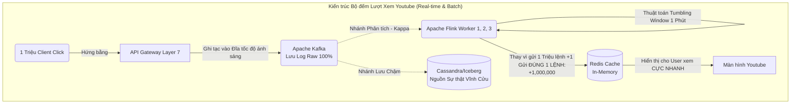

# Bài 11: Case Study - Thiết kế Bộ đếm Lượt Xem Youtube (Heavy-Write)

Ở Bài 11 và 12, chúng ta sẽ áp dụng toàn bộ kiến thức Khoa học Máy tính từ Lập trình, Database, Kafka, OS vào các bài phỏng vấn thiết kế hệ thống (System Design Interview) cấp độ cao.

**Đề bài:** Hãy thiết kế hệ thống đếm lượt xem (View Counter) cho Youtube.
**Bản chất Dữ liệu:** Video Gangnam Style có thể nhận 100.000 lượt Click xem vào cùng 1 giây trên toàn cầu. Khách hàng hiếm khi kiểm tra số View, nhưng tần suất UPDATE số View lại xảy ra liên tục như một cơn lốc. 
Đây là bài toán **Write-Heavy (Thiết kế nặng Ghi)**. Cấm tuyệt đối việc dùng MySQL và cập nhật `UPDATE view = view + 1` vì nó sẽ gây cháy khóa đĩa (Row Lock Contention).

---

## 1. Nút thắt Cổ chai của Cơ sở Dữ liệu Truyền thống

Nếu 100.000 người dùng bấm xem video `Video123` cùng một giây.
MySQL sẽ phải mở 100.000 luồng (Threads). Luồng thứ nhất chạm vào dòng `Video123`, nó giương cái Cờ Khóa (Lock) lên: "Tao đang cộng số View, thằng kia cấm được sửa!". 
Luồng thứ 2 đến thứ 100.000 đứng nghẹt thở ngoài cửa chờ luồng 1 tính xong. Hàng đợi của hệ điều hành phình to, CPU chết chìm trong thao tác Context Switching (Bài 1 Part 4). Hệ thống sập ngay lập tức.

---

## 2. Giải pháp 1: Mở rộng ngang bằng Sharded Counters (Băm nhỏ)

Vì cái khóa trên 1 dòng duy nhất là thủ phạm. Chúng ta dùng kỹ thuật phân thân (Sharding - Bài 6 Part 3).

Thay vì lưu: `{"video_id": 123, "views": 100}`
Chúng ta chặt số 100 ra làm 10 mảnh lưu ở 10 dòng độc lập (Giống như mở 10 quầy thu ngân tính tiền cho siêu thị thay vì 1 quầy):
- `{"video_id": 123, "shard_id": 1, "views": 15}`
- `{"video_id": 123, "shard_id": 2, "views": 10}`
... (với tổng số Shard = 10, cấu hình sẵn).

Khi User Click xem video. Một thuật toán Random (Ngẫu nhiên) của Load Balancer sẽ quăng User đó vào 1 trong 10 Shard để cộng dồn. Quầy nào tính tiền quầy đó, Không cần chen lấn (Tốc độ Write tăng gấp 10 lần).
Khi người dùng F5 xem Tổng số View: Hệ thống (hoặc Job Airflow) sẽ lén lút quét tổng 10 dòng đó lại và hiển thị lên UI `100 views`.

**Hạn chế:** Khi số lượng Click leo lên 1 triệu/giây. Bạn phải đẻ ra 10.000 Shard. Database (Kể cả là NoSQL mạnh như Cassandra) cũng sẽ kiệt sức trước lượng Random Writes khổng lồ xuống đĩa (Disk I/O).

---

## 3. Giải pháp 2 (Tuyệt đối hóa kiến trúc): Edge Aggregation và Streaming

Triết lý của Data Engineering hiện đại: Đừng ném nguyên liệu gốc vào Kho, hãy sơ chế nó ngay tại Biên (Edge) hoặc trong ống truyền dẫn.

Chúng ta thiết kế Kiến trúc **Streaming + In-Memory Caching (Redis/Kafka)**.

### Quá trình Sơ Chế Gộp nhóm (Aggregation) giải quyết triệt để nút thắt:
1. Giao diện (App) của khách hàng không trực tiếp nói chuyện với Redis hay Cassandra. Nó tống Click vào **Apache Kafka**. Do tính năng Zero-copy và Write-ahead-log (Bài 3, Part 4), Kafka dễ dàng nhai ngấu nghiến 1 triệu Click/giây mà CPU vẫn chỉ ở mức 1%.
2. Cỗ máy **Apache Flink** đóng vai trò là Lò Sơ Chế. Flink mở một cái Xô Nhựa **Tumbling Window (Cửa sổ 1 phút)**.
3. Trong 1 phút đó, Flink bắt lấy 1 Triệu luồng click của `Video123` bay vào. Nó tính nhẩm trên RAM: *1..2..500.. 1,000,000*. 
4. Hết 1 phút: Flink ĐÓNG XÔ LẠI. Flink nhả xuống Redis đúng MỘT câu lệnh SQL siêu nhẹ gọn: `INCRBY Video123 1000000`.

**Kết quả Thần kỳ:** Thay vì chọc thủng Database 1 triệu lần bằng lệnh đập đĩa I/O (Sập hệ thống). Chúng ta chọc Database đúng **1 lần duy nhất trong suốt 1 phút**. Sự kiện (Events) được hấp thụ toàn bộ bởi vùng đệm (Buffer). Màn hình Youtube của bạn sẽ không bao giờ hiển thị nhảy lên số 1, 2, 3, 4, 5... Số view thường đứng im vài chục giây, rồi bỗng nhảy giật cục một phát lên `+1 triệu View`. Đó là tàn dư của quá trình sơ chế Windowing dưới hạ tầng mạng.

---
**Navigation:**
[⬅️ Previous: Bài 10: Quản trị Phân tán: Data Lineage, Catalog và Mô hình Lưới (Data Mesh)](./10-data-lineage-and-observability.md) | [Next: Bài 12: Case Study - Thiết kế Hệ thống Giá cước Tăng vọt (Uber Surge Pricing) ➡️](./12-design-uber-surge-pricing.md)
